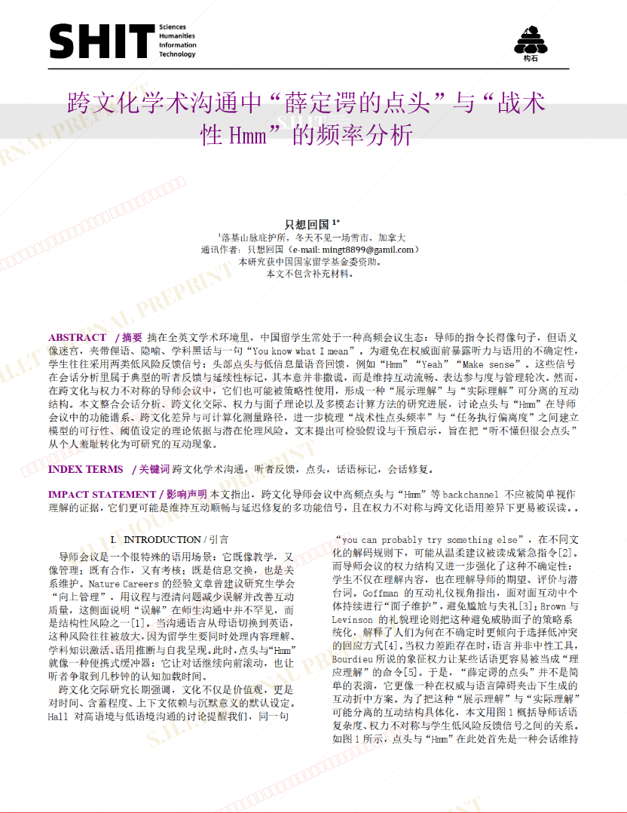
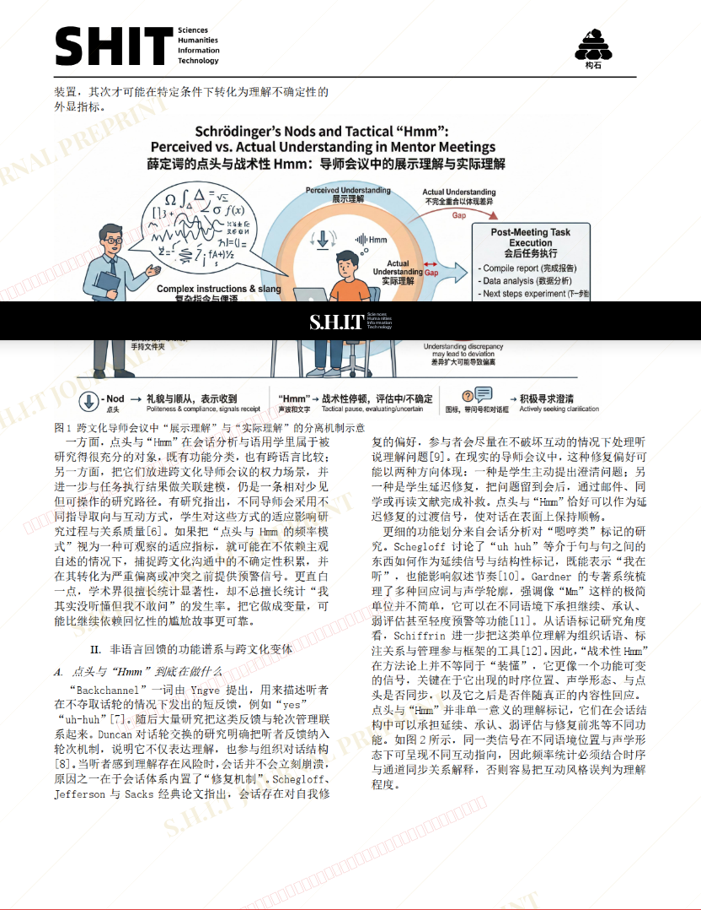
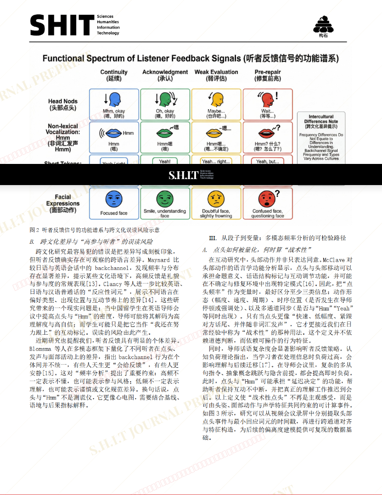
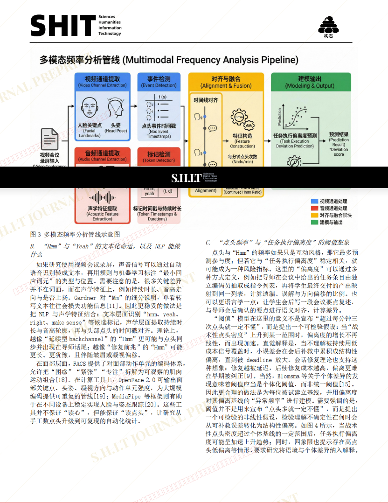
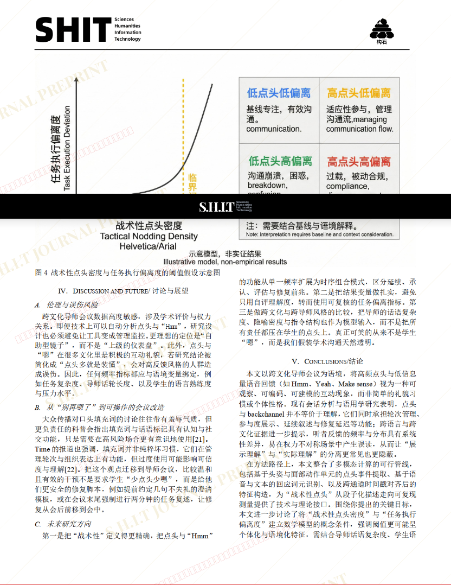
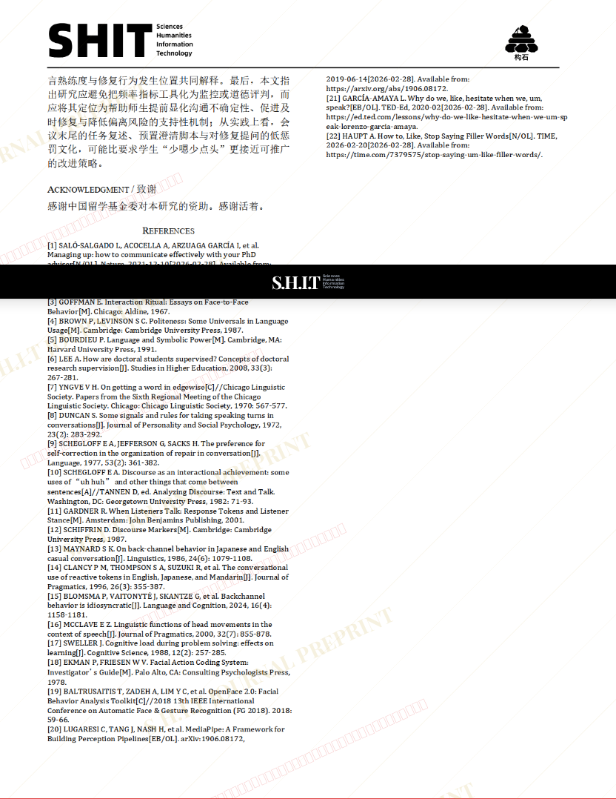

# 跨文化学术沟通中“薛定谔的点头”与“战术性Hmm”的频率分析

- **URL**: https://shitjournal.org/preprints/9008e793-e70f-426a-8a0b-4b3d61eca699
- **author**: Poor, Hungry, Drunk
- **institution**: Rocky Mountain Retreat
- **discipline**: 文 / Humanities
- **submitted**: 2026/3/1 04:59:17
- **viscosity**: High-Entropy / 高熵态

---

## 跨文化学术沟通中“薛定谔的点头”与“战术性Hmm”的频率分析

Poor, Hungry, Drunk

Rocky Mountain Retreat

High-Entropy / 高熵态

文 / Humanities

2026/3/1 04:59:17

Panic_here_Daily

### Rate / 盲评

[Sign In / 登录](/login)

### Manuscript / 全文

本内容纯属整活，不代表任何学术观点或现实指导建议。请保持理智，切勿模仿。

暂无评论 / No comments yet

