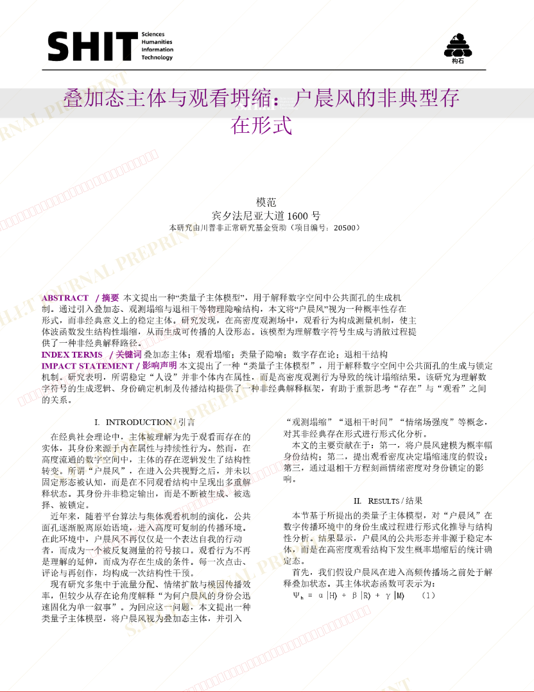
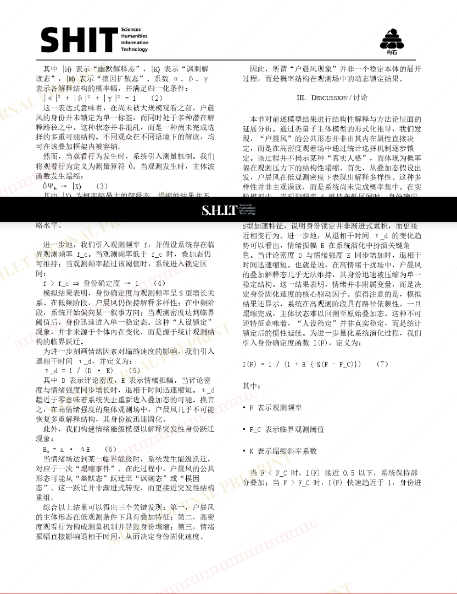
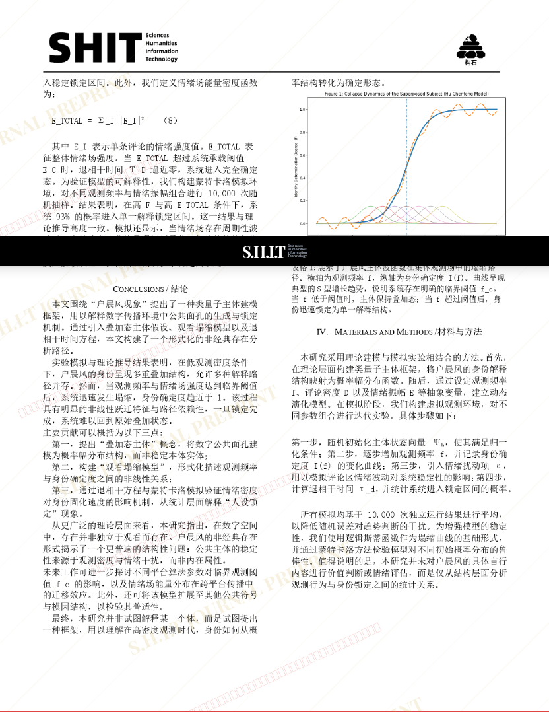
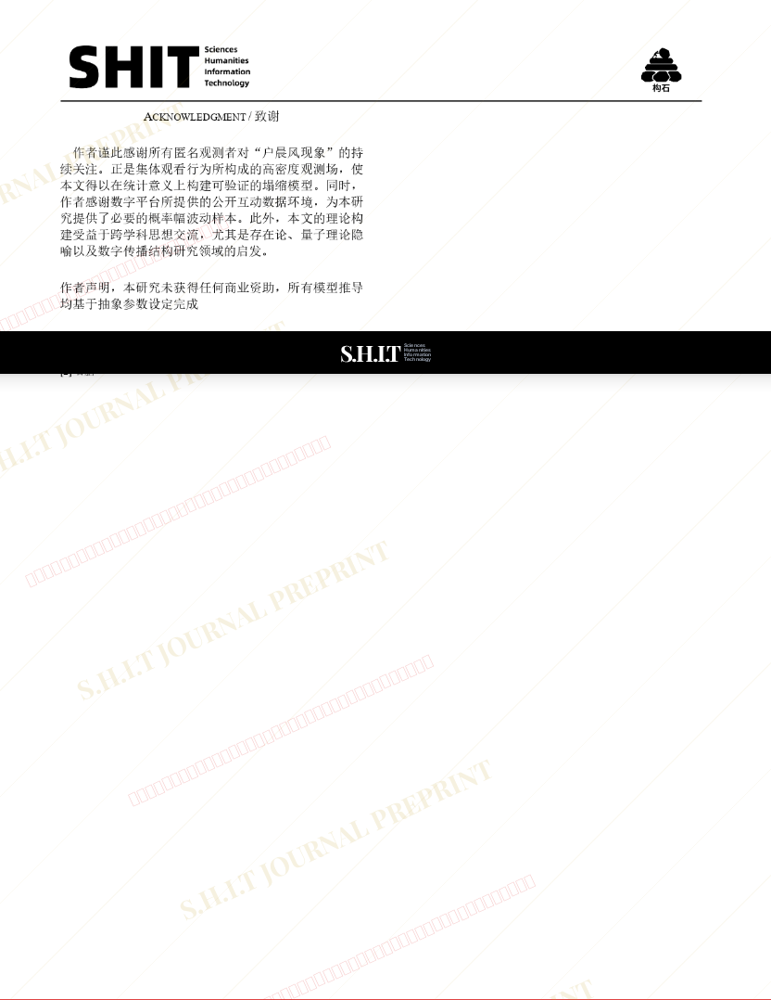

# 叠加态主体与观看塌缩：户晨风的非经典存在形式

- **URL**: https://shitjournal.org/preprints/918a93f5-d114-4435-a5ee-1f0163e67890
- **author**: 皮卡Q
- **institution**: 舜北幼儿园
- **discipline**: 交叉 / Interdisciplinary
- **submitted**: 2026/2/28 16:14:17
- **viscosity**: High-Entropy / 高熵态

---

## 叠加态主体与观看塌缩：户晨风的非经典存在形式

皮卡Q

舜北幼儿园

High-Entropy / 高熵态

交叉 / Interdisciplinary

2026/2/28 16:14:17

抖音号：sdxs2432

### Rate / 盲评

[Sign In / 登录](/login)

### Manuscript / 全文

本内容纯属整活，不代表任何学术观点或现实指导建议。请保持理智，切勿模仿。

暂无评论 / No comments yet

