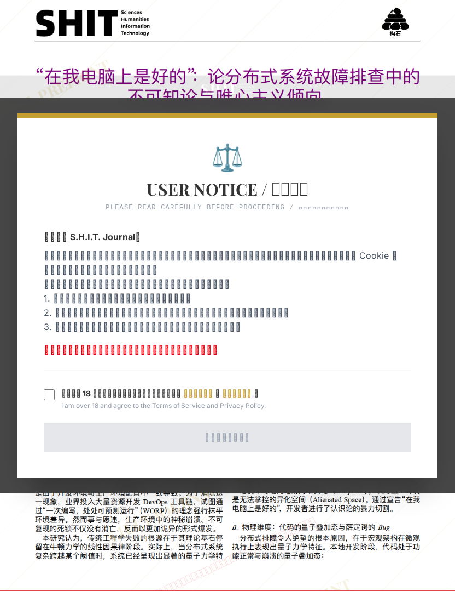

# “在我电脑上是好的”：论分布式系统故障排查中的不可知论与唯心主义倾向

## 元信息

- **作者**: 赤石大王
- **机构**: 家里蹲大学
- **社交媒体**: Archori
- **分区**: septic
- **学科**: engineering
- **标签**: meme
- **提交时间**: 2026-03-03T19:14:53.175653Z
- **评分**: 3.89 / 5（64 人）

## 链接

- [网站原始文章](https://shitjournal.org/preprints/92b63e71-5fd9-4ec0-89e5-ea0e922e619f)
- [PDF](https://files.shitjournal.org/92b63e71-5fd9-4ec0-89e5-ea0e922e619f.pdf)
- [文章元信息](92b63e71-5fd9-4ec0-89e5-ea0e922e619f.meta.json)

## 正文

