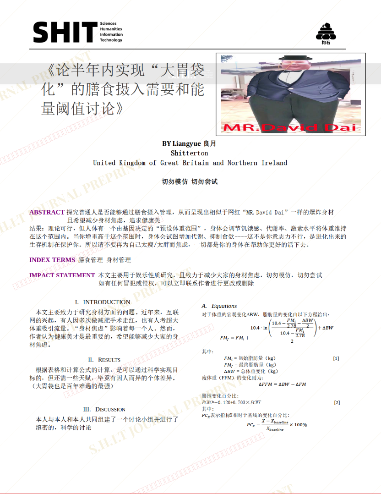
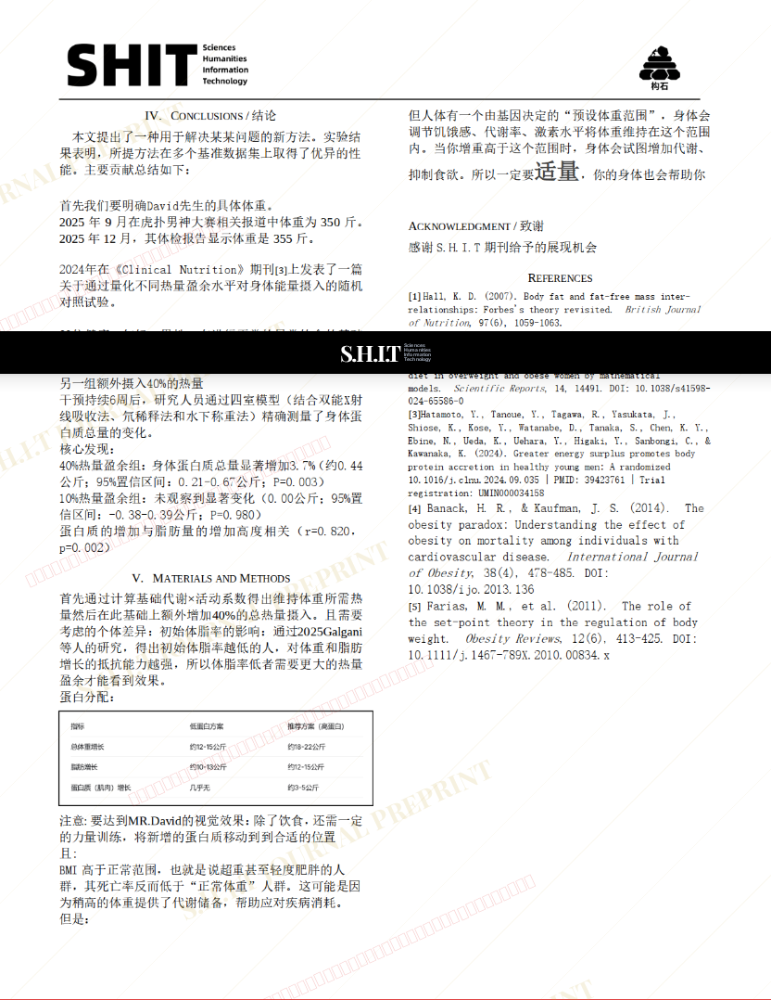

# 《论半年内实现“大胃袋化”的膳食摄入需要和能量阈值讨论》

- **URL**: https://shitjournal.org/preprints/95638ab7-0fa5-471b-ba76-41fc57890b4e
- **author**: Liangyue
- **institution**: Liangyue shit limited company
- **discipline**: 交叉 / Interdisciplinary
- **submitted**: 2026/2/28 08:24:29
- **viscosity**: Semi-solid / 半固态

---

## 《论半年内实现“大胃袋化”的膳食摄入需要和能量阈值讨论》

Liangyue

Liangyue shit limited company

Semi-solid / 半固态

交叉 / Interdisciplinary

2026/2/28 08:24:29

### Rate / 盲评

[Sign In / 登录](/login)

### Manuscript / 全文

本内容纯属整活，不代表任何学术观点或现实指导建议。请保持理智，切勿模仿。

暂无评论 / No comments yet

