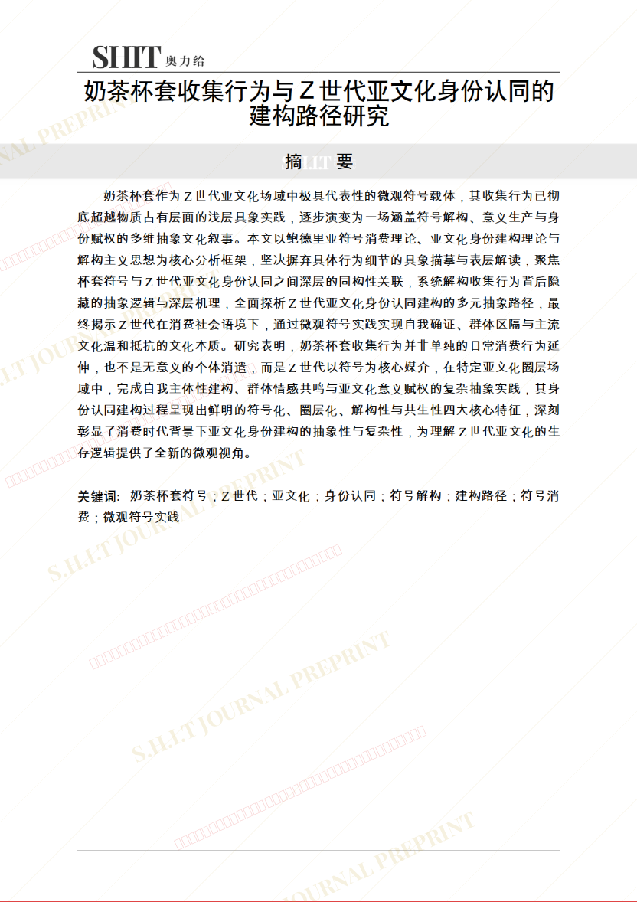
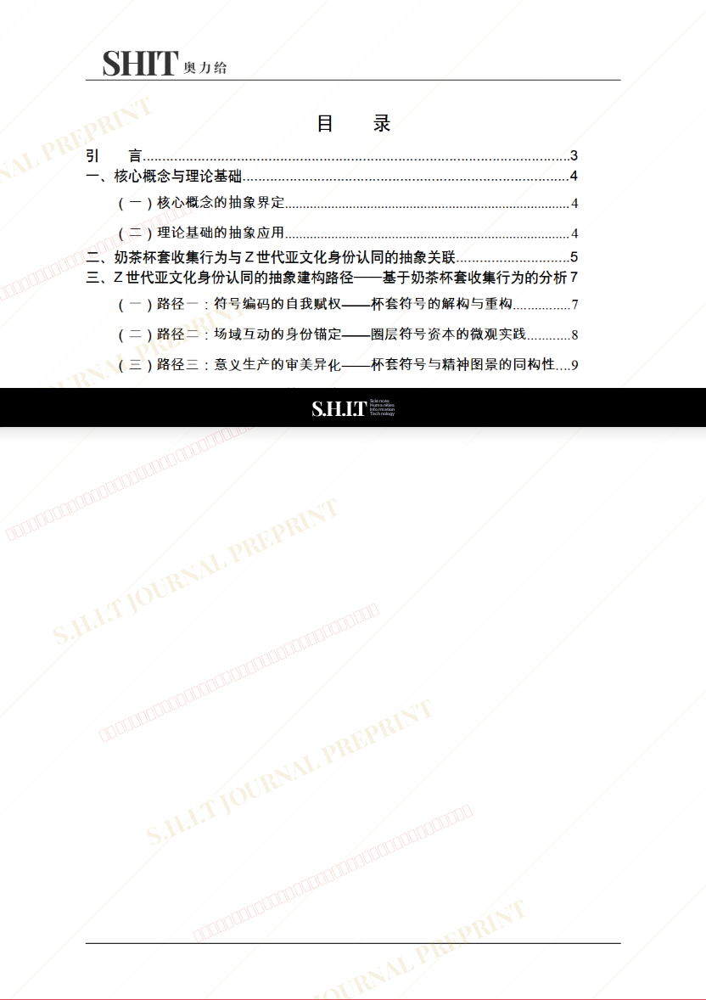
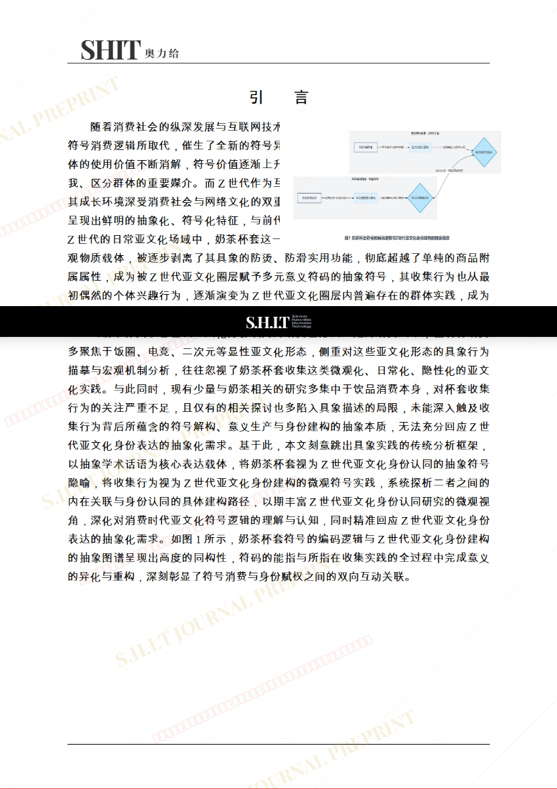
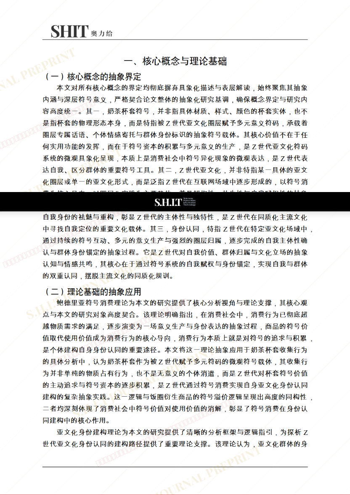
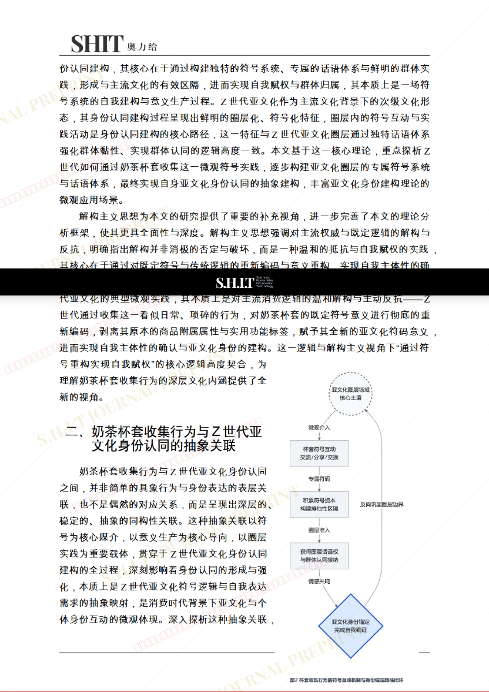
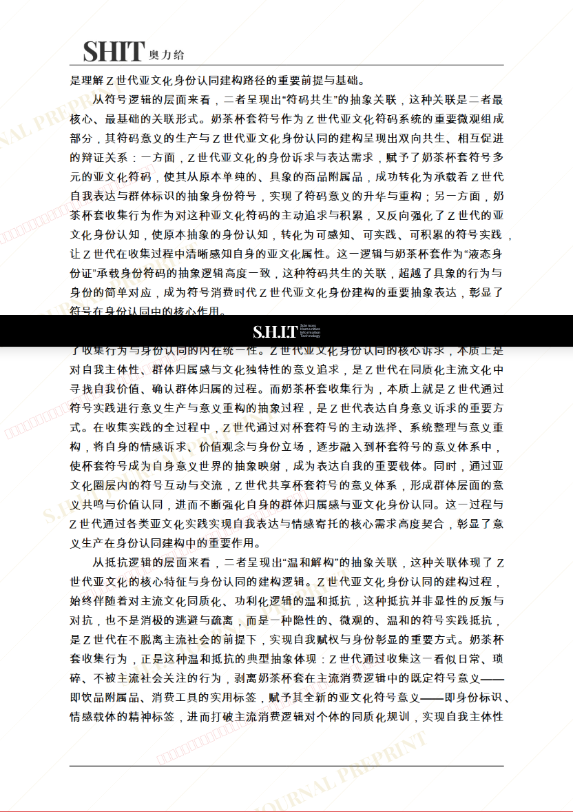
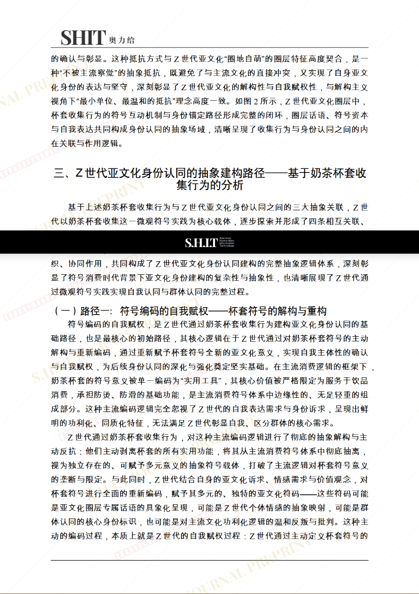

# 奶茶杯套收集行为与Z世代亚文化身份认同的建构路径研究

- **URL**: https://shitjournal.org/preprints/974580e1-0be7-41de-8a24-e9141b463351
- **author**: 鸽浅
- **institution**: 家里蹲大学
- **discipline**: 交叉 / Interdisciplinary
- **submitted**: 2026/2/22 11:14:34
- **viscosity**: High-Entropy / 高熵态

---

## 奶茶杯套收集行为与Z世代亚文化身份认同的建构路径研究

鸽浅

家里蹲大学

High-Entropy / 高熵态

交叉 / Interdisciplinary

2026/2/22 11:14:34

bilibili:646751464

### Rate / 盲评

[Sign In / 登录](/login)

### Manuscript / 全文

本内容纯属整活，不代表任何学术观点或现实指导建议。请保持理智，切勿模仿。

暂无评论 / No comments yet

