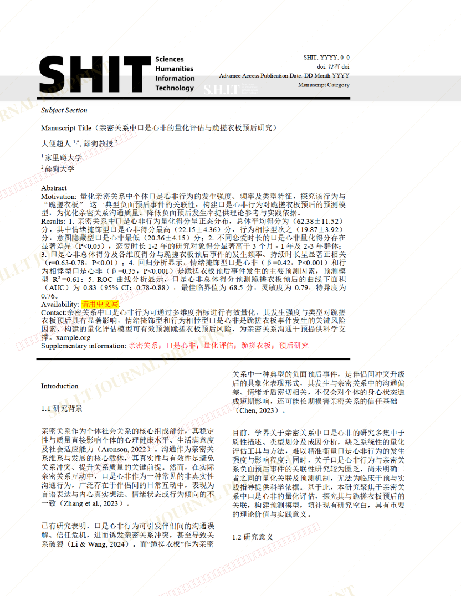
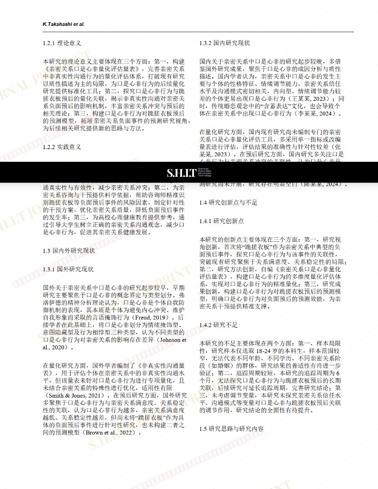
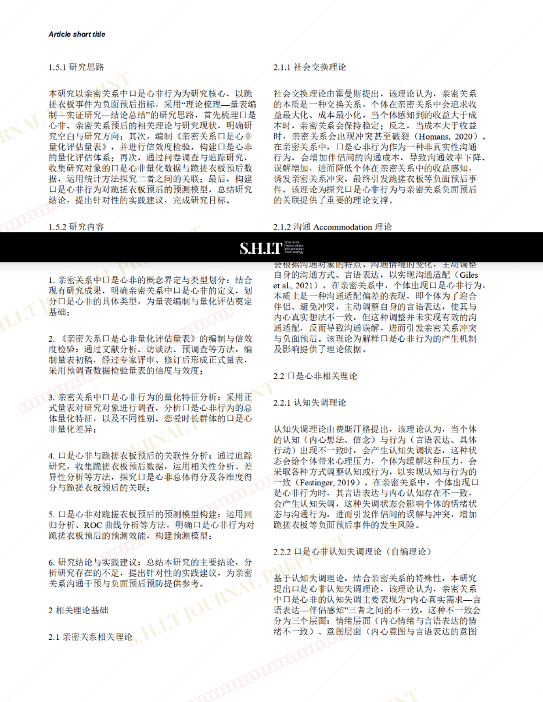
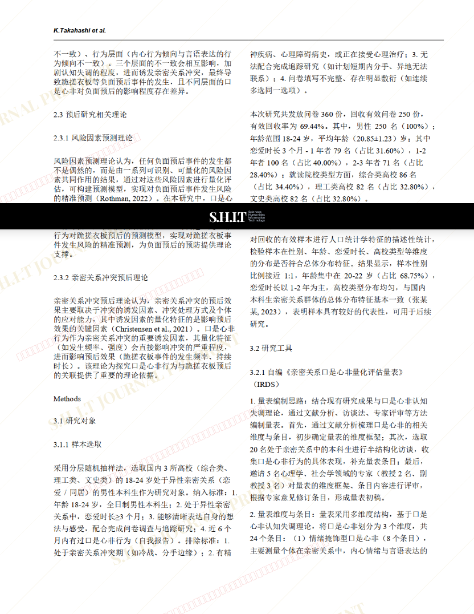
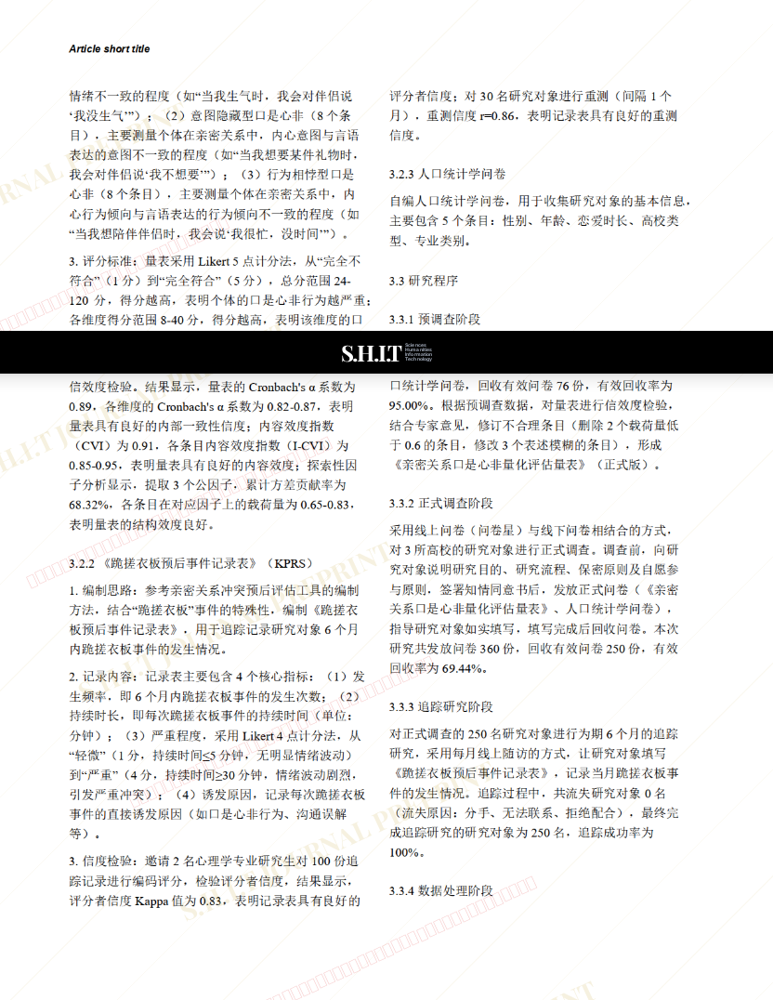
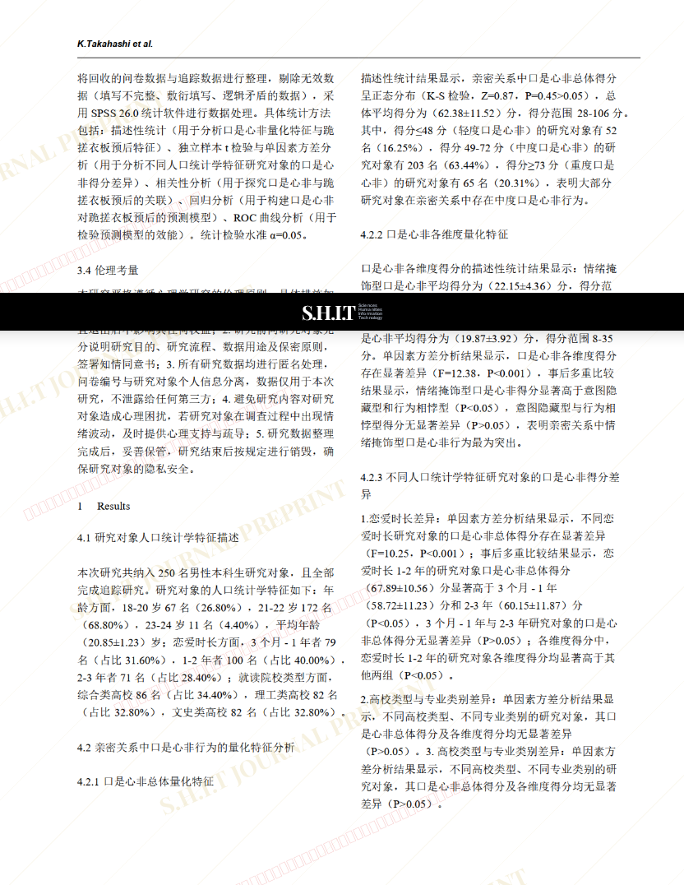
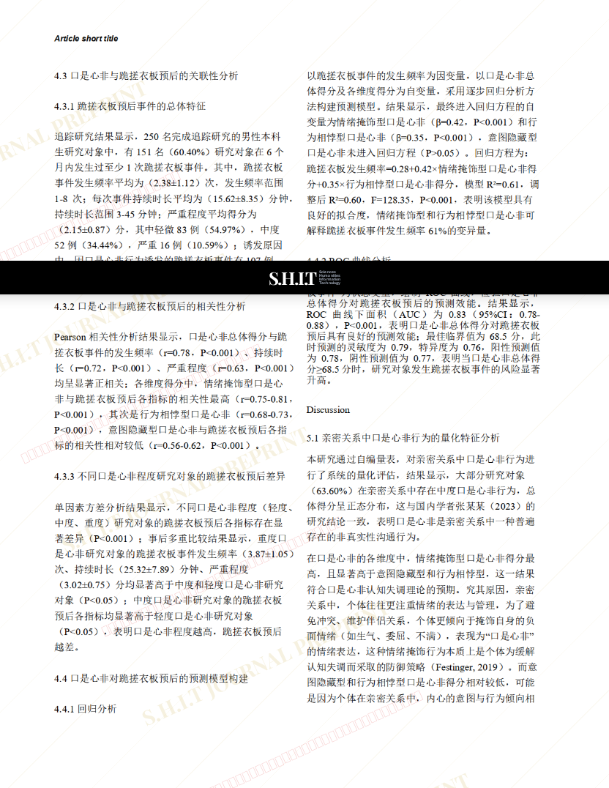
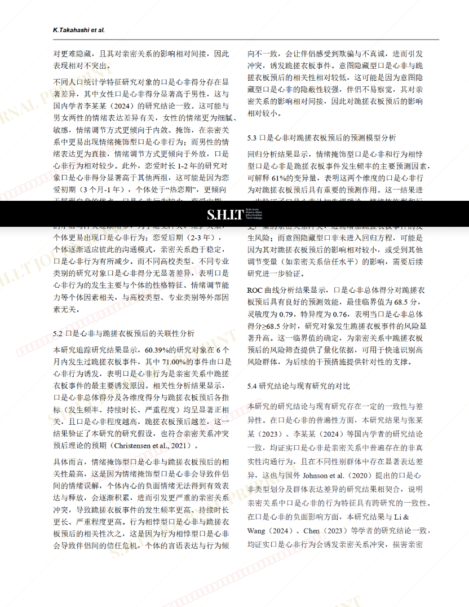
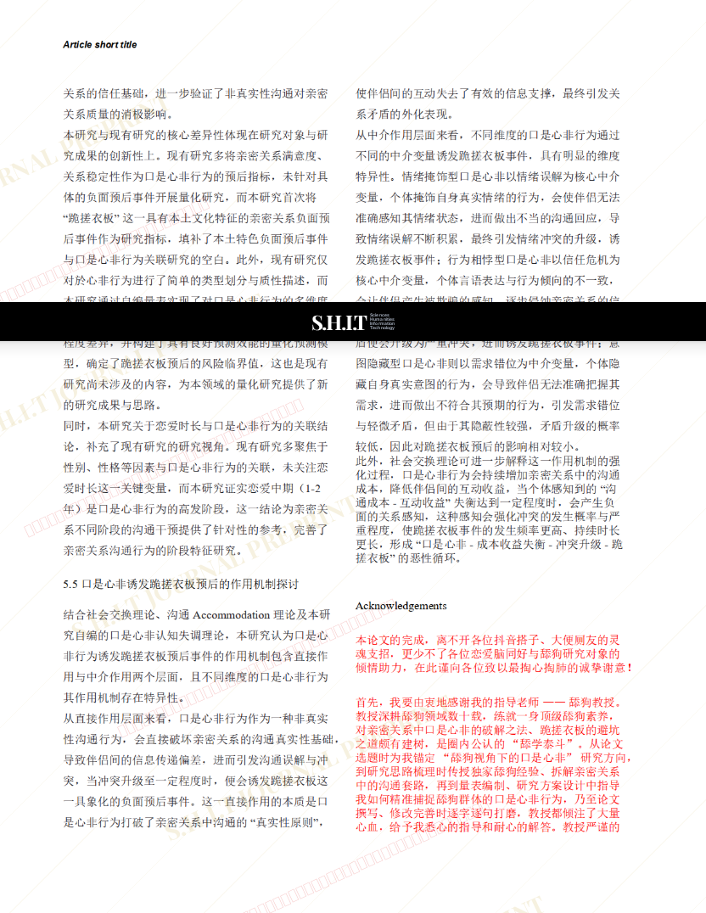
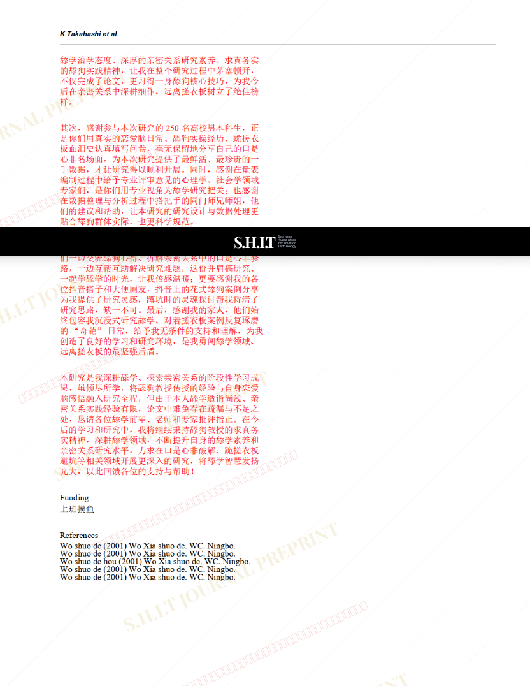

# Quantitative Assessment of Duplicity in Intimate Relationships and Prognostic Study on Kneeling on a Washboard 亲密关系中口是心非的量化评估与跪搓衣板预后研究

- **URL**: https://shitjournal.org/preprints/97a29afe-e7d0-409e-8a84-58e6e94309a7
- **author**: 大便超人
- **institution**: 家里蹲大学
- **discipline**: 交叉 / Interdisciplinary
- **submitted**: 2026/2/25 03:05:55
- **viscosity**: Stringy / 拉丝型

---

## Quantitative Assessment of Duplicity in Intimate Relationships and Prognostic Study on Kneeling on a Washboard 亲密关系中口是心非的量化评估与跪搓衣板预后研究

大便超人

家里蹲大学

Stringy / 拉丝型

交叉 / Interdisciplinary

2026/2/25 03:05:55

### Rate / 盲评

[Sign In / 登录](/login)

### Manuscript / 全文

本内容纯属整活，不代表任何学术观点或现实指导建议。请保持理智，切勿模仿。

暂无评论 / No comments yet

