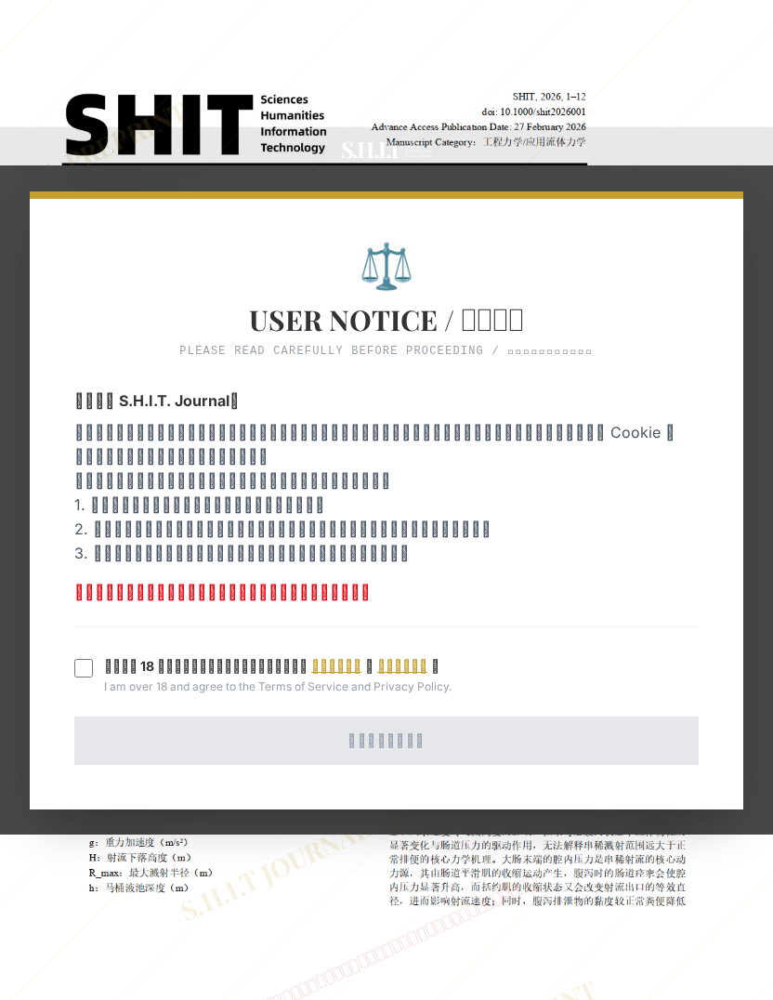

# 串稀时的溅射范围与大肠末端腔内压力的动力学分析

## 元信息

- **作者**: 屎大卫
- **机构**: 
- **分区**: stone
- **学科**: interdisciplinary
- **标签**: meme
- **提交时间**: 2026-02-27T15:28:12.380956Z
- **评分**: 4.78 / 5（146 人）

## 链接

- [网站原始文章](https://shitjournal.org/preprints/99182846-2f32-4b00-a8e3-4051e7943dac)
- [PDF](https://files.shitjournal.org/99182846-2f32-4b00-a8e3-4051e7943dac.pdf)
- [文章元信息](99182846-2f32-4b00-a8e3-4051e7943dac.meta.json)

## 正文

