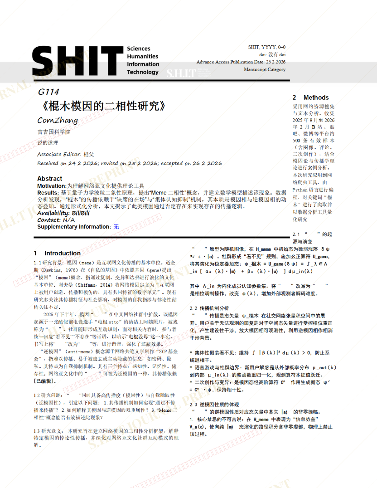
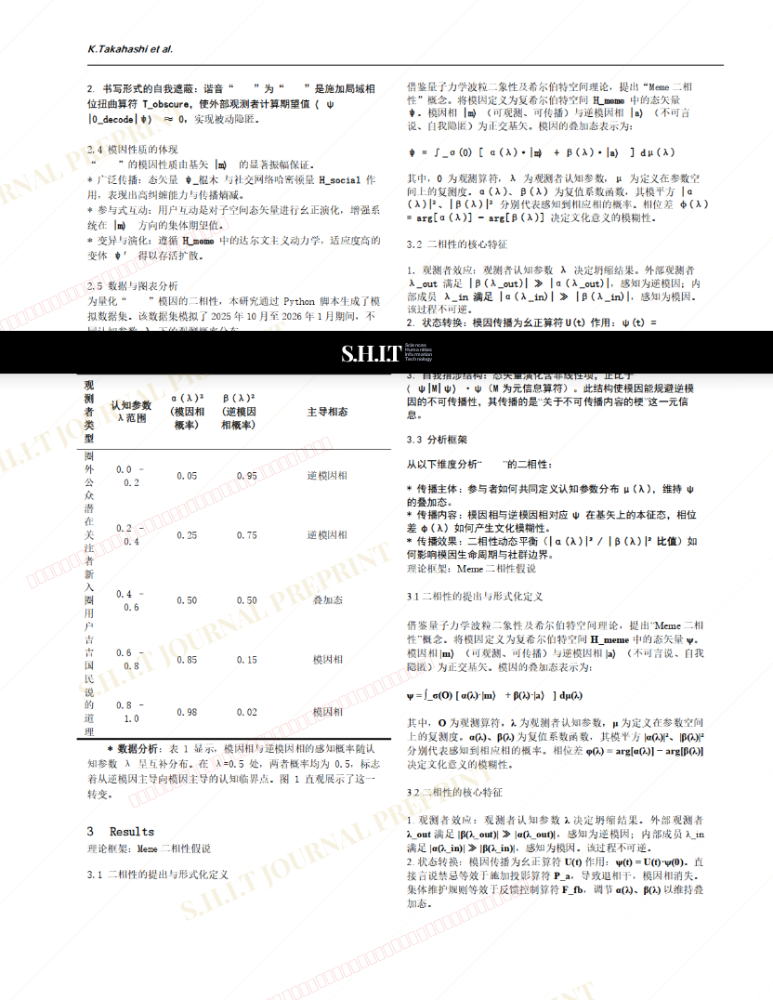
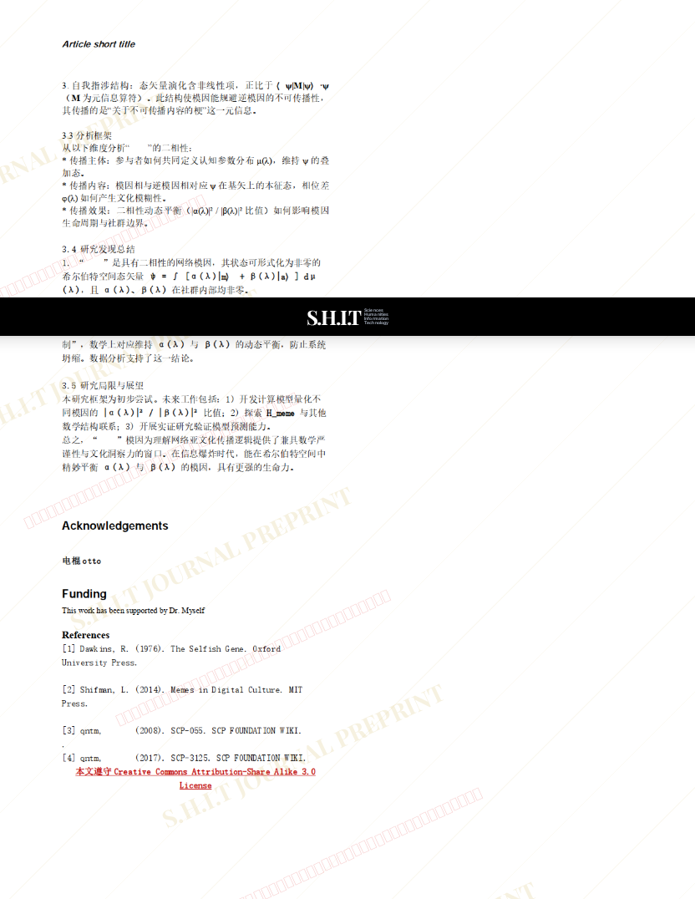

# 《棍木模因的二相性研究》

- **URL**: https://shitjournal.org/preprints/9965d1ce-41be-41bb-9b07-a4eef972d3eb
- **author**: comzhang
- **institution**: 吉吉国科学院
- **discipline**: 交叉 / Interdisciplinary
- **submitted**: 2026/2/25 05:01:38
- **viscosity**: Semi-solid / 半固态

---

## 《棍木模因的二相性研究》

comzhang

吉吉国科学院

Semi-solid / 半固态

交叉 / Interdisciplinary

2026/2/25 05:01:38

### Rate / 盲评

[Sign In / 登录](/login)

### Manuscript / 全文

本内容纯属整活，不代表任何学术观点或现实指导建议。请保持理智，切勿模仿。

暂无评论 / No comments yet

