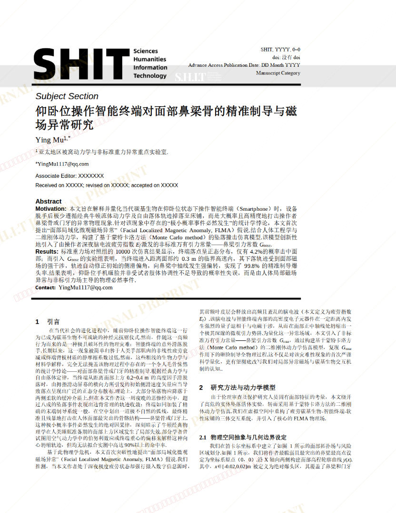
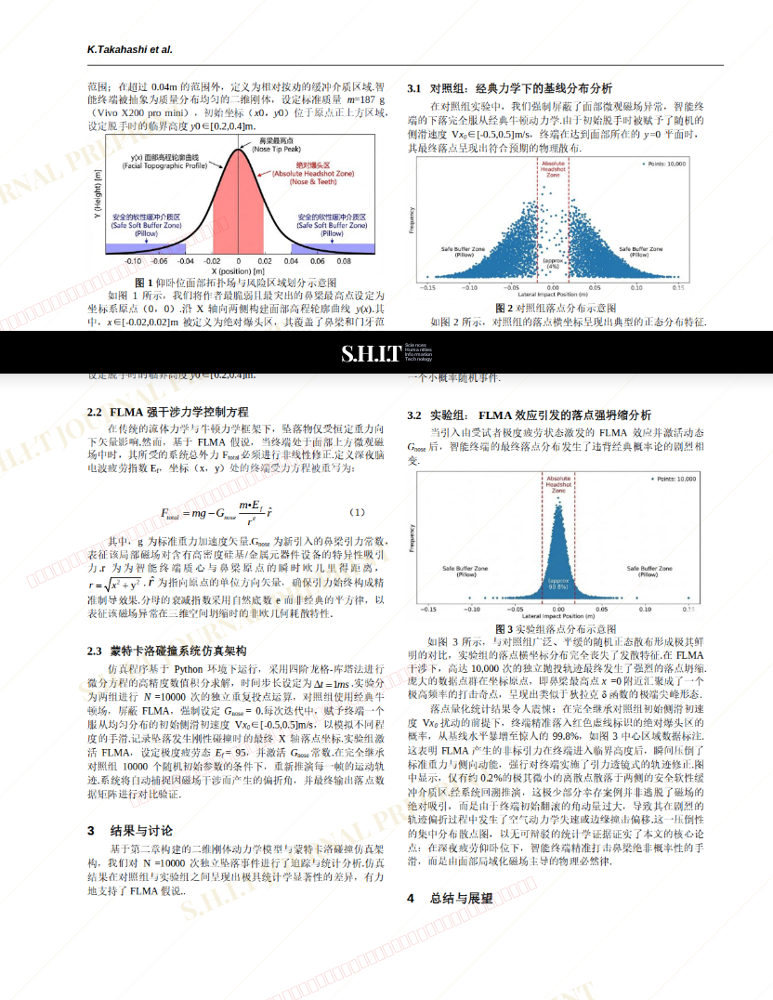
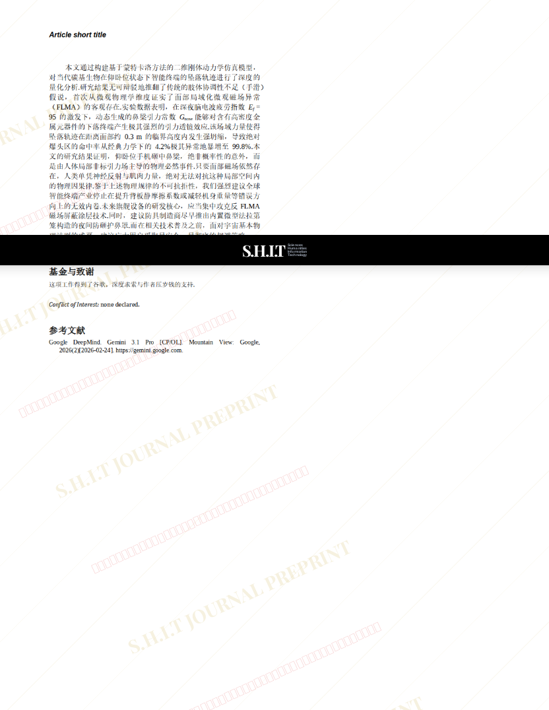

# 仰卧位操作智能终端对面部鼻梁骨的精准制导与磁场异常研究（重排版）

- **URL**: https://shitjournal.org/preprints/9a518144-3349-4cc9-8c9c-36ecae5b1e93
- **author**: YingMu
- **institution**: 亚太地区被窝动力学与非标准重力异常重点实验室
- **discipline**: 理 / Science
- **submitted**: 2026/2/25 02:57:06
- **viscosity**: Stringy / 拉丝型

---

## 仰卧位操作智能终端对面部鼻梁骨的精准制导与磁场异常研究（重排版）

YingMu

亚太地区被窝动力学与非标准重力异常重点实验室

Stringy / 拉丝型

理 / Science

2026/2/25 02:57:06

B站：RiBuAi

### Rate / 盲评

[Sign In / 登录](/login)

### Manuscript / 全文

本内容纯属整活，不代表任何学术观点或现实指导建议。请保持理智，切勿模仿。

暂无评论 / No comments yet

