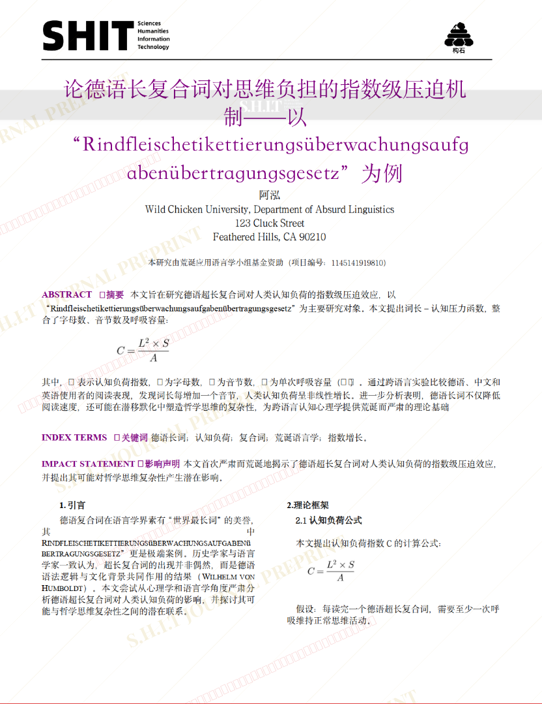
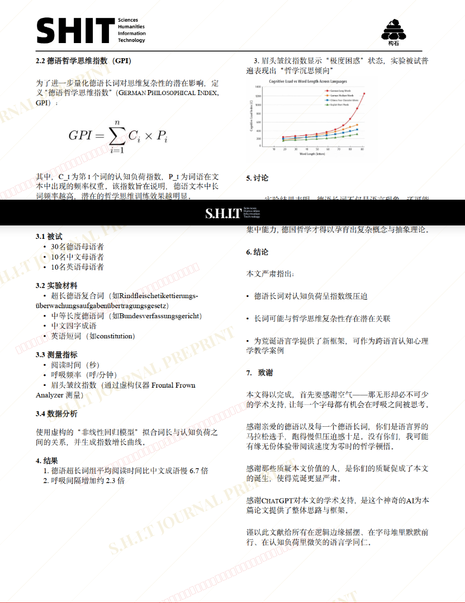
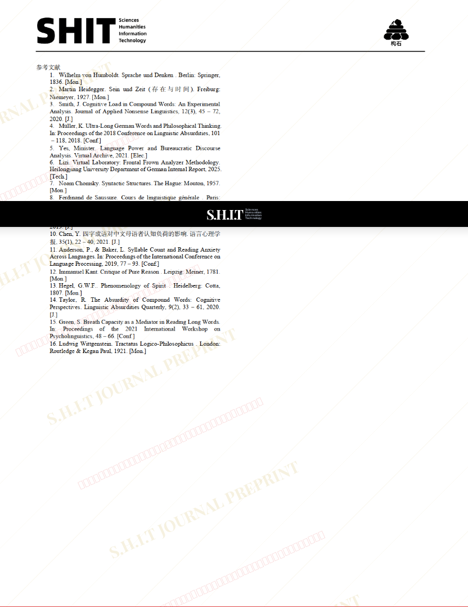

# 论德语长复合词对思维负担的指数级压迫机 制——以 “Rindfleischetikettierungsüberwachungsaufg abenübertragungsgesetz”为例

## 元信息

- **作者**: 阿泓
- **机构**: 
- **分区**: sediment
- **学科**: humanities
- **标签**: meme
- **提交时间**: 2026-03-03T16:23:37.830642Z
- **评分**: 3.61 / 5（51 人）

## 链接

- [网站原始文章](https://shitjournal.org/preprints/9d0d2321-f577-40a2-92f8-bd4f0b6a5277)
- [PDF](https://files.shitjournal.org/9d0d2321-f577-40a2-92f8-bd4f0b6a5277.pdf)
- [文章元信息](9d0d2321-f577-40a2-92f8-bd4f0b6a5277.meta.json)

## 正文

