# 人类遗传物质在直肠中对直肠动力功能的影响

- **URL**: https://shitjournal.org/preprints/9d109d46-b5cb-43c7-abdb-f9d5bf5de72f
- **author**: SHIT.泰隆
- **institution**: E.G.SHIT大学科学院医学专业课题组
- **discipline**: 交叉 / Interdisciplinary
- **submitted**: 2026/2/23 11:05:16
- **viscosity**: Stringy / 拉丝型

---

## 人类遗传物质在直肠中对直肠动力功能的影响

SHIT.泰隆

E.G.SHIT大学科学院医学专业课题组

Stringy / 拉丝型

交叉 / Interdisciplinary

2026/2/23 11:05:16

### Rate / 盲评

[Sign In / 登录](/login)

### Manuscript / 全文

本内容纯属整活，不代表任何学术观点或现实指导建议。请保持理智，切勿模仿。

暂无评论 / No comments yet

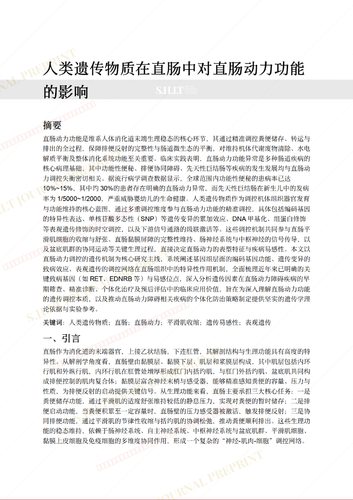
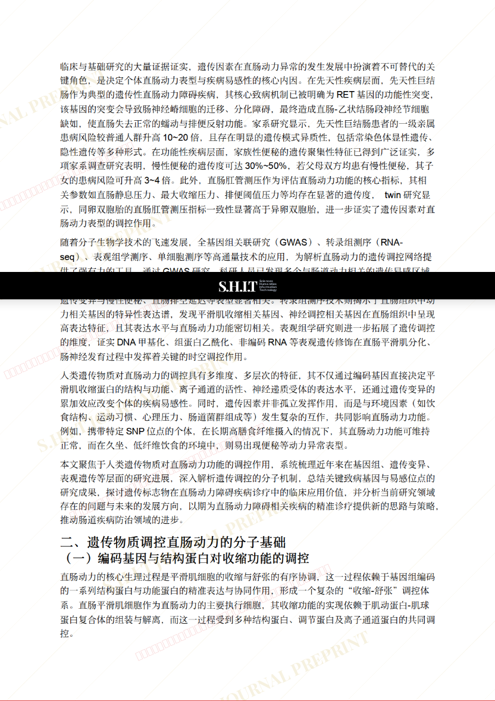
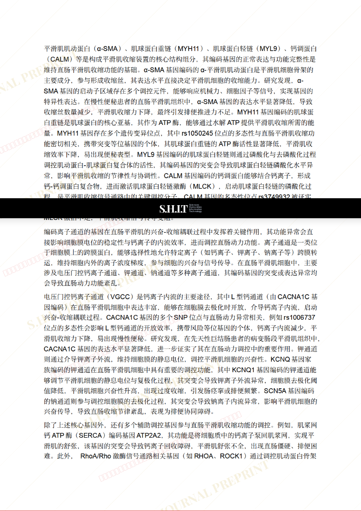
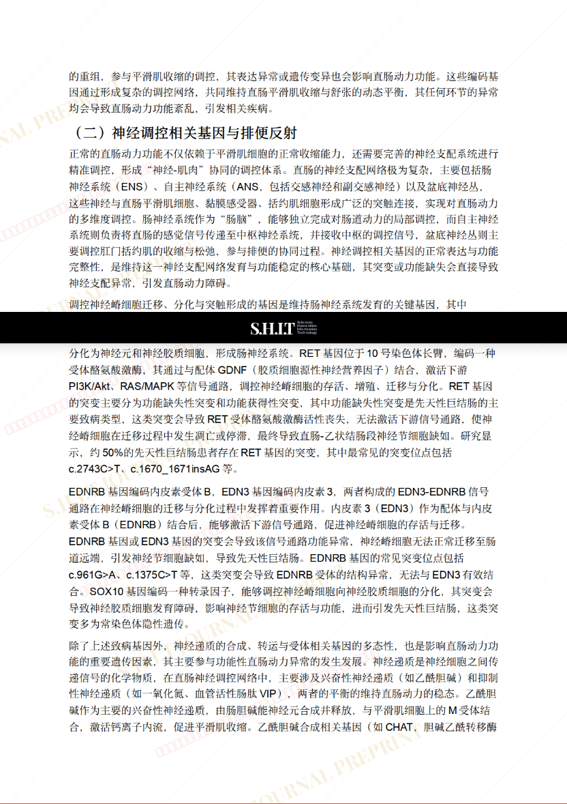
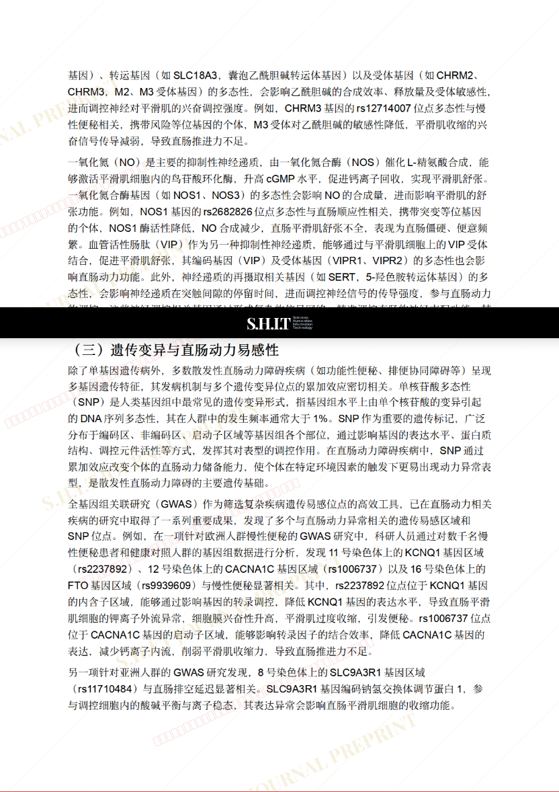
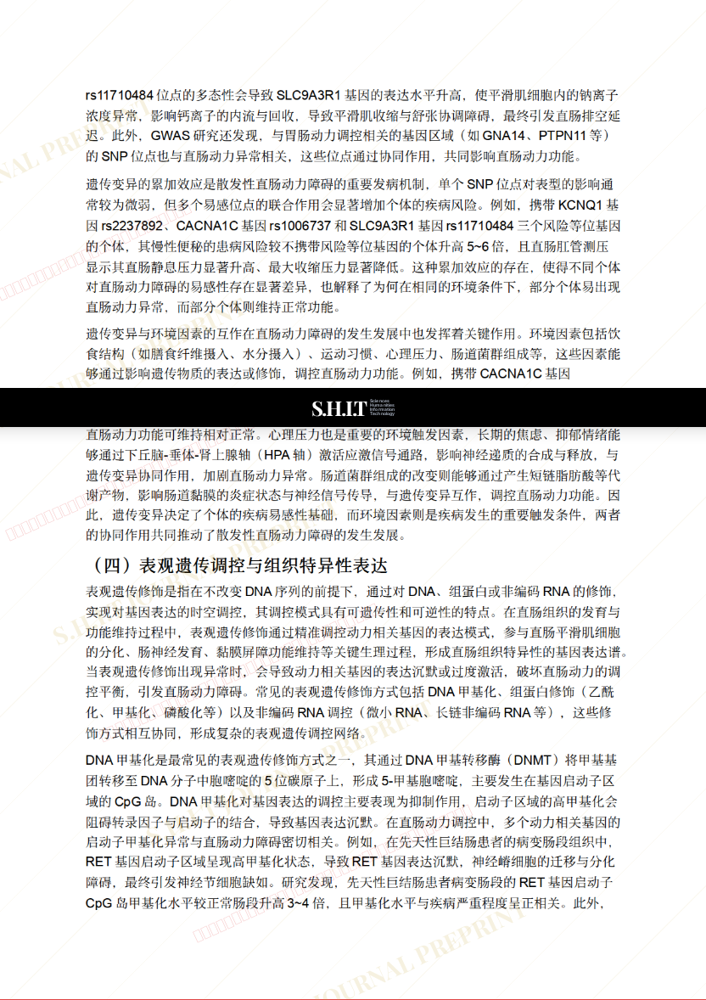
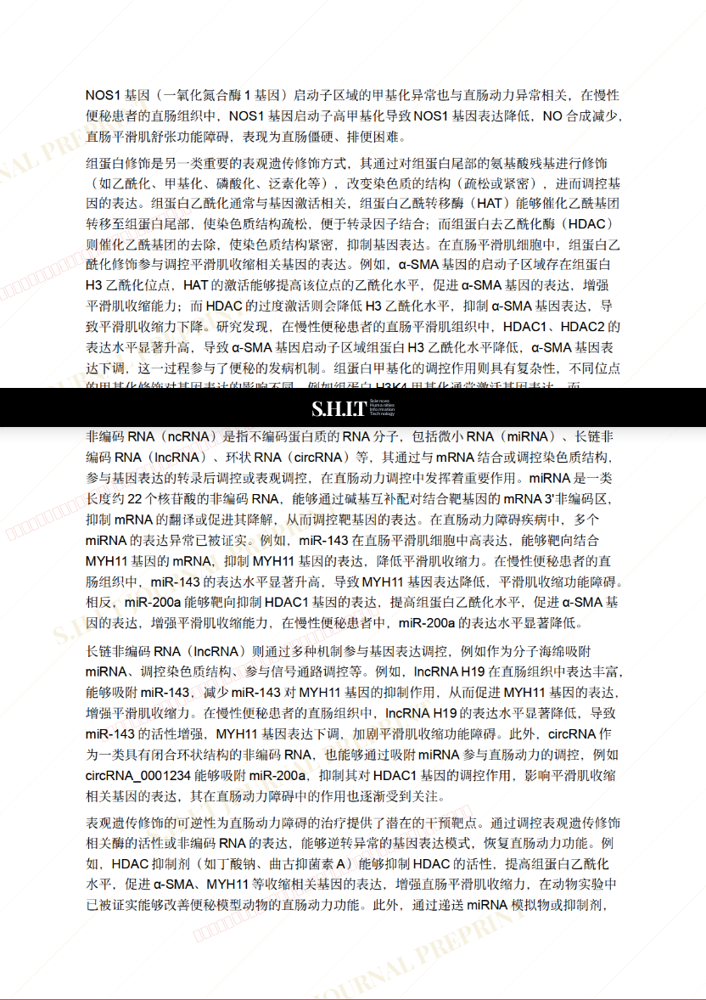
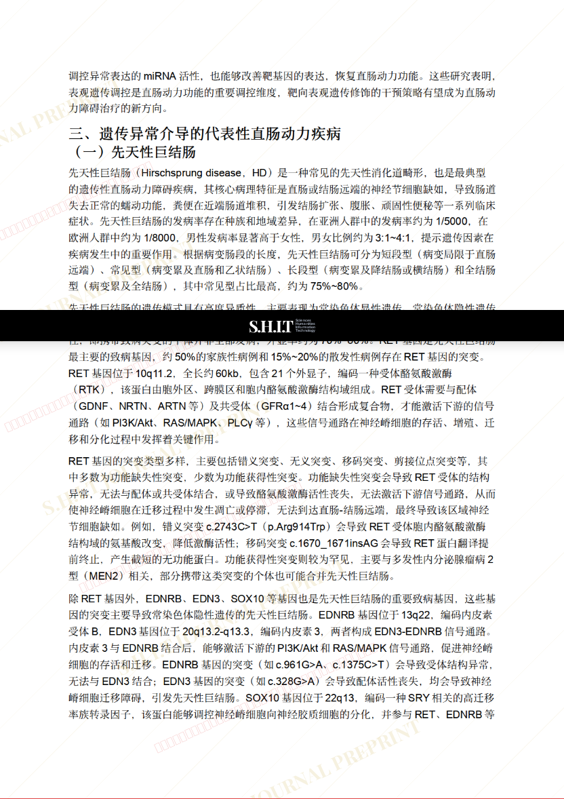
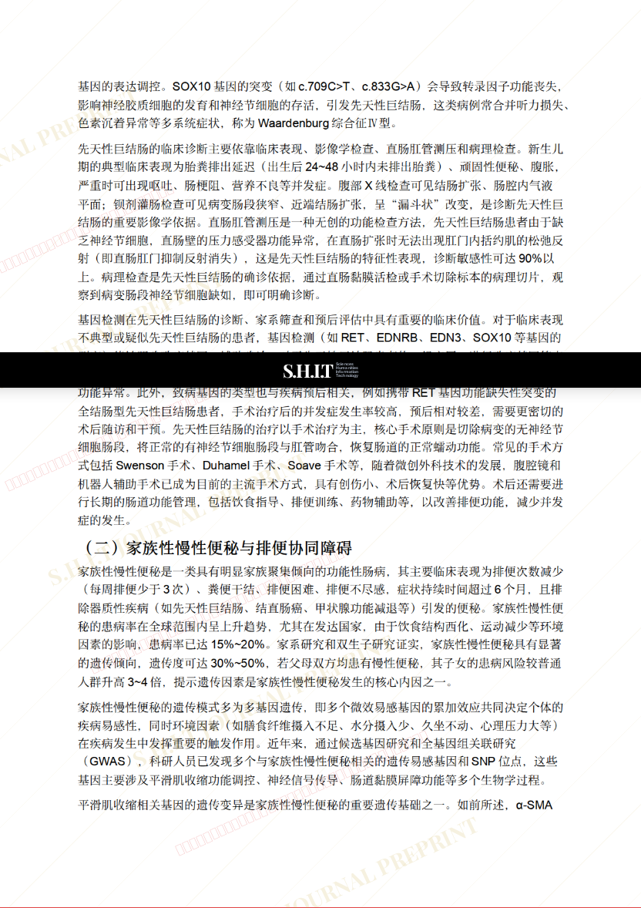
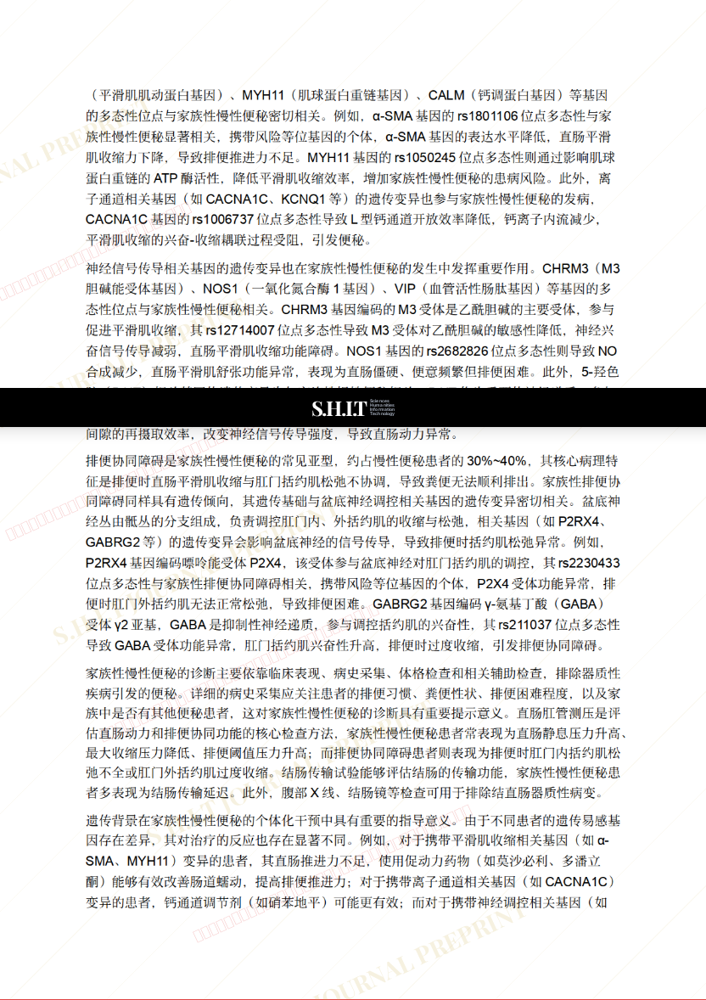
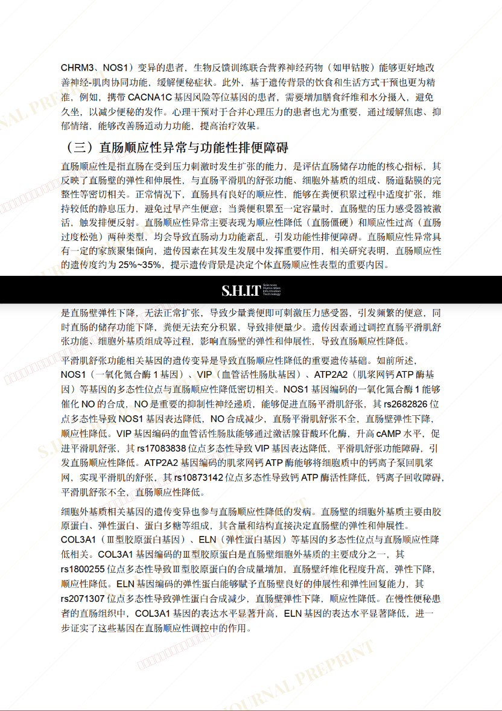
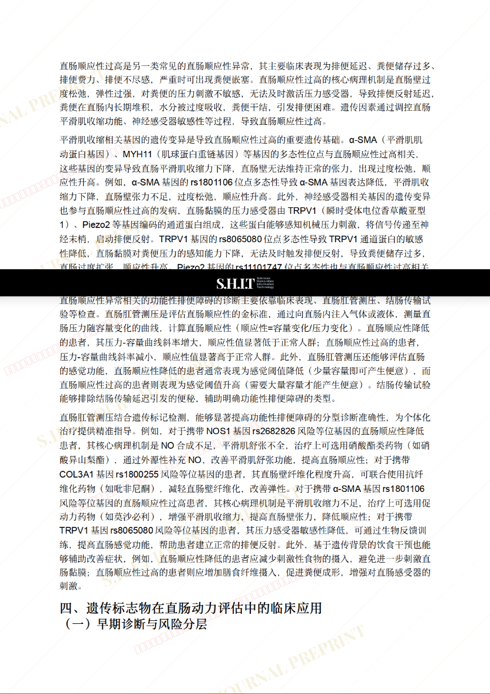
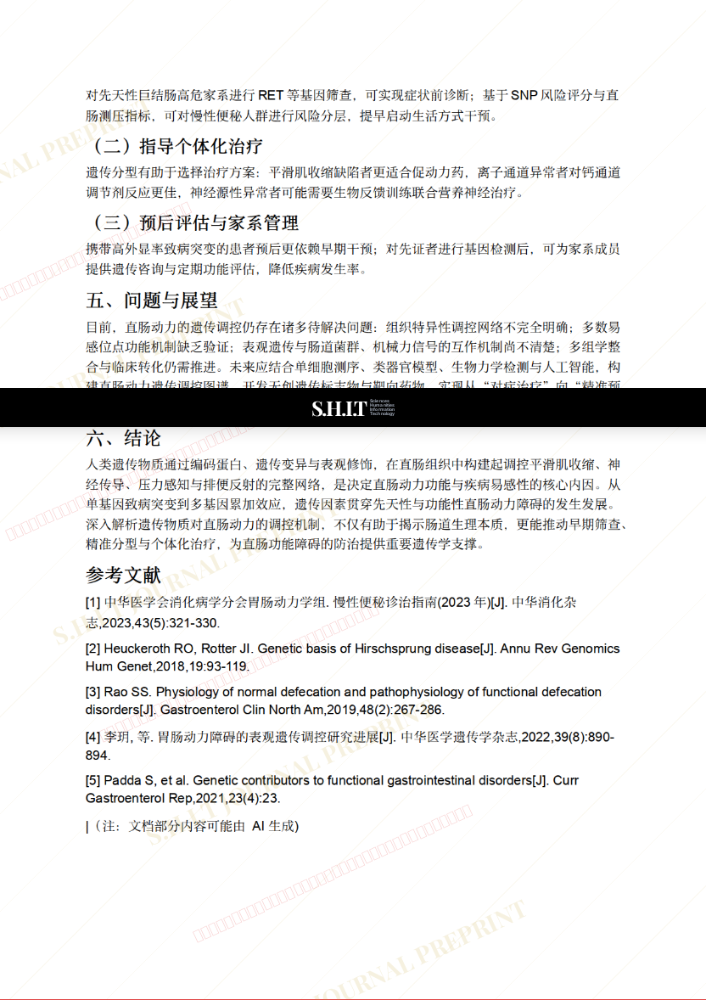
