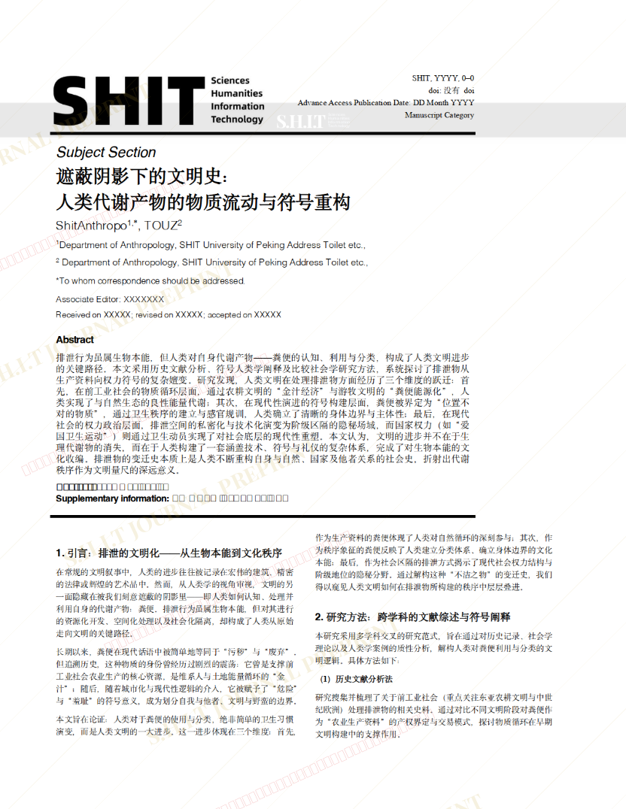
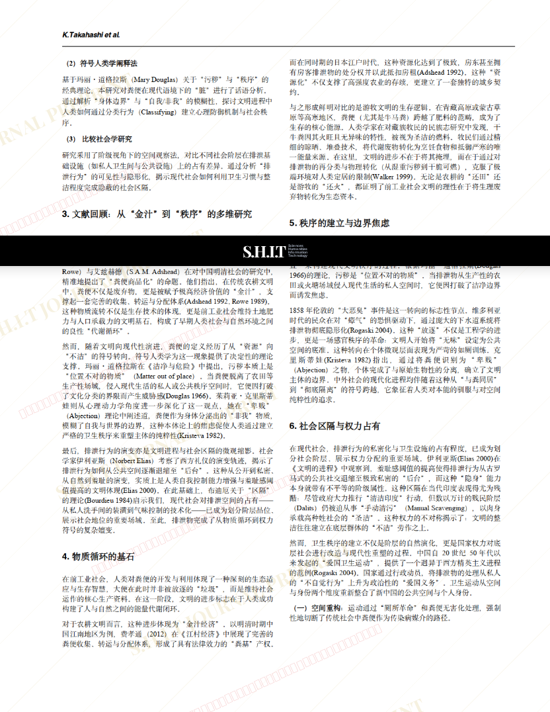
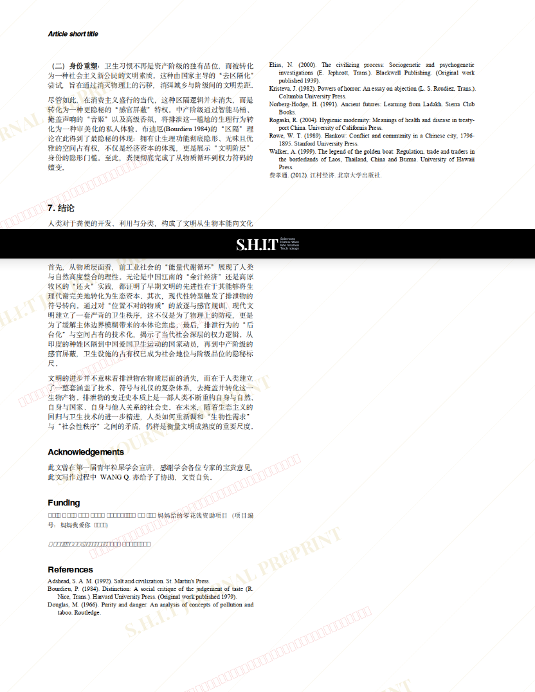

# 遮蔽阴影下的文明史： 人类代谢产物的物质流动与符号重构

- **URL**: https://shitjournal.org/preprints/9f29bbd7-eff3-4cc6-8ccd-818e1a71ad2c
- **author**: ShitAnthopo
- **institution**: SHIT University of Peking
- **discipline**: 文 / Humanities
- **submitted**: 2026/2/27 14:40:09
- **viscosity**: High-Entropy / 高熵态

---

## 遮蔽阴影下的文明史： 人类代谢产物的物质流动与符号重构

ShitAnthopo

SHIT University of Peking

High-Entropy / 高熵态

文 / Humanities

2026/2/27 14:40:09

小红书：5395226294

### Rate / 盲评

[Sign In / 登录](/login)

### Manuscript / 全文

本内容纯属整活，不代表任何学术观点或现实指导建议。请保持理智，切勿模仿。

暂无评论 / No comments yet

