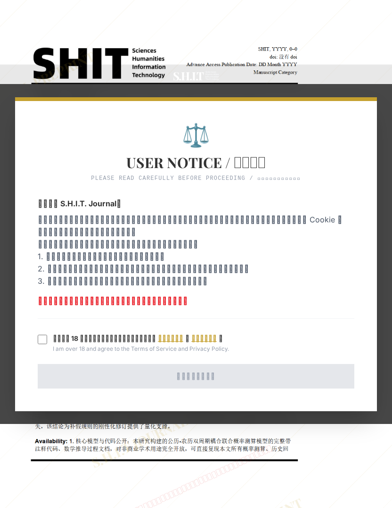

# 关于2026年我国法定假日与周末重合的研究

## 元信息

- **作者**: Dr.TonyJ
- **机构**: 
- **分区**: stone
- **学科**: law_social
- **标签**: meme
- **提交时间**: 2026-02-25T10:19:11.915854Z
- **评分**: 4.84 / 5（579 人）

## 链接

- [网站原始文章](https://shitjournal.org/preprints/9f492f9e-754e-4fa0-870e-505431ee94d0)
- [PDF](https://files.shitjournal.org/9f492f9e-754e-4fa0-870e-505431ee94d0.pdf)
- [文章元信息](9f492f9e-754e-4fa0-870e-505431ee94d0.meta.json)

## 正文

