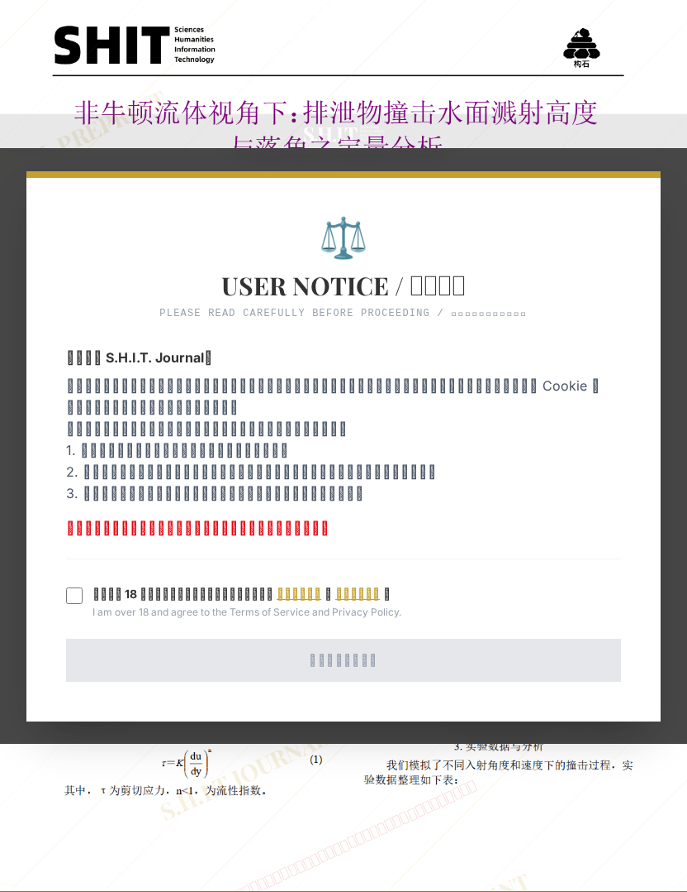

# 非牛顿流体视角下：排泄物撞击水面溅射高度与落角之定量分析

## 元信息

- **作者**: 化粪池畅游选手
- **机构**: 顶刊研究院
- **社交媒体**: 11200211trust
- **分区**: stone
- **学科**: engineering
- **标签**: meme
- **提交时间**: 2026-03-01T10:37:13.315639Z
- **评分**: 4.83 / 5（108 人）

## 链接

- [网站原始文章](https://shitjournal.org/preprints/a18c10ea-7a13-4736-aa93-bbf5836f2694)
- [PDF](https://files.shitjournal.org/a18c10ea-7a13-4736-aa93-bbf5836f2694.pdf)
- [文章元信息](a18c10ea-7a13-4736-aa93-bbf5836f2694.meta.json)

## 正文

