# 类比经济学视角下的情感关系决策分析框架

- **URL**: https://shitjournal.org/preprints/a225edb7-c60a-4bb7-8288-f1118102ff8f
- **author**: 合鸟子
- **institution**: 上海师范大学
- **discipline**: 交叉 / Interdisciplinary
- **submitted**: 2026/2/23 09:39:09
- **viscosity**: Stringy / 拉丝型

---

## 类比经济学视角下的情感关系决策分析框架

合鸟子

上海师范大学

Stringy / 拉丝型

交叉 / Interdisciplinary

2026/2/23 09:39:09

小红书号：9604493070

### Rate / 盲评

[Sign In / 登录](/login)

### Manuscript / 全文

本内容纯属整活，不代表任何学术观点或现实指导建议。请保持理智，切勿模仿。

暂无评论 / No comments yet

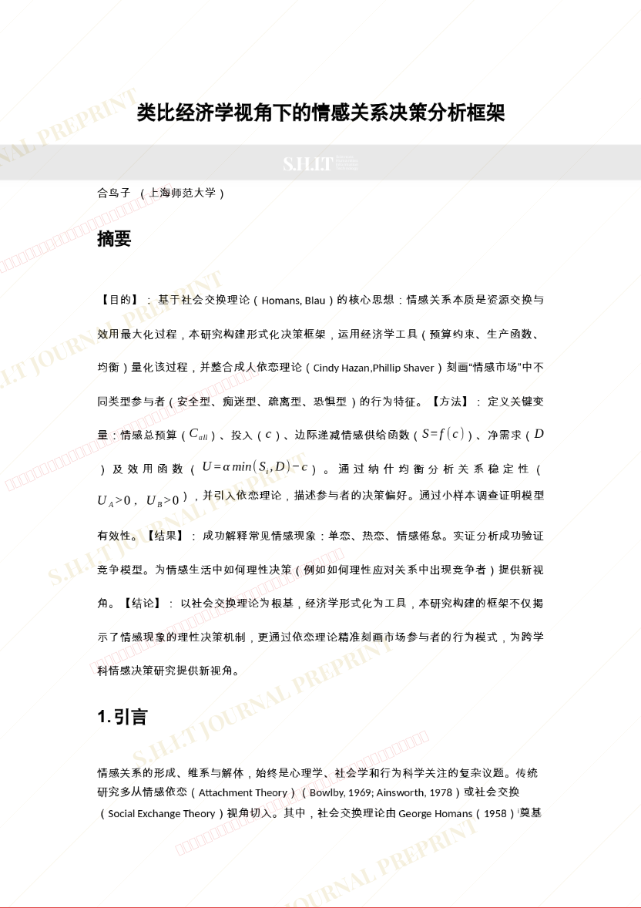
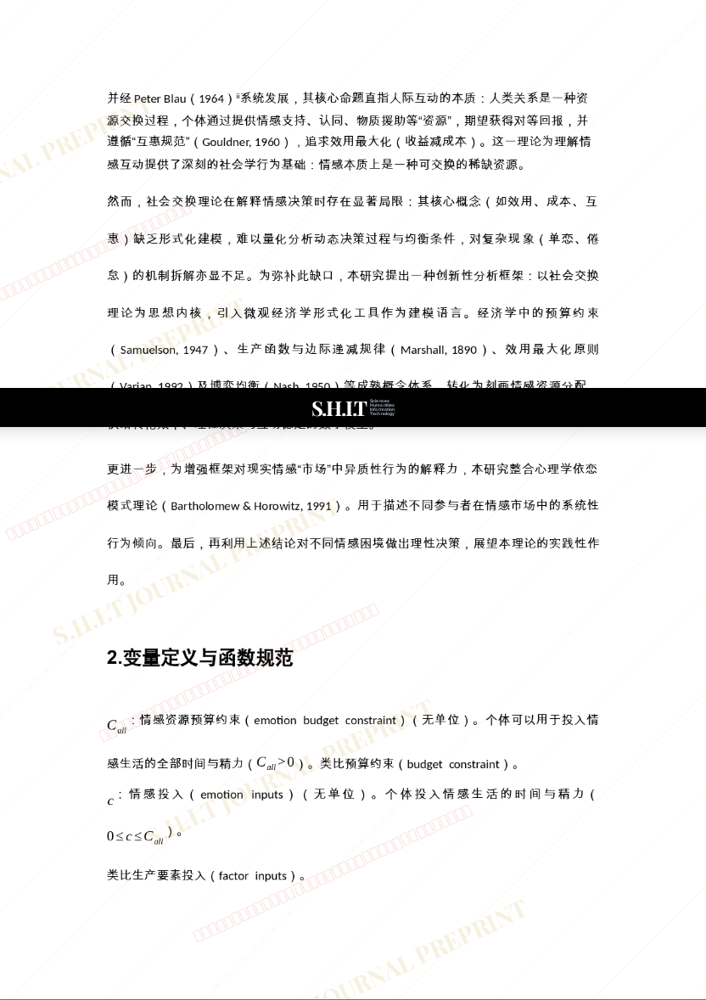
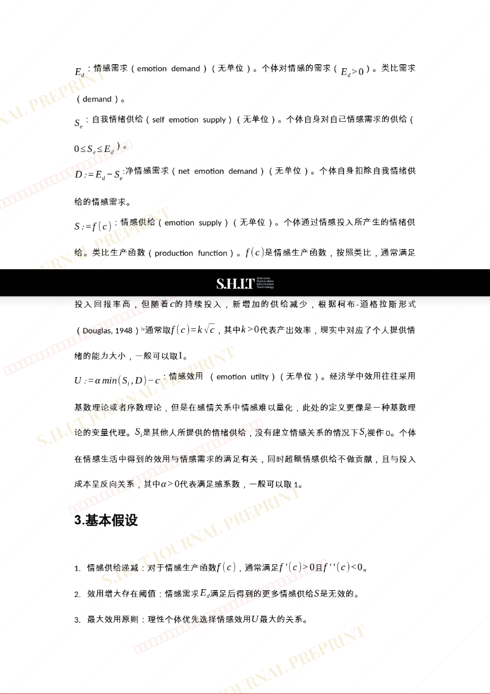
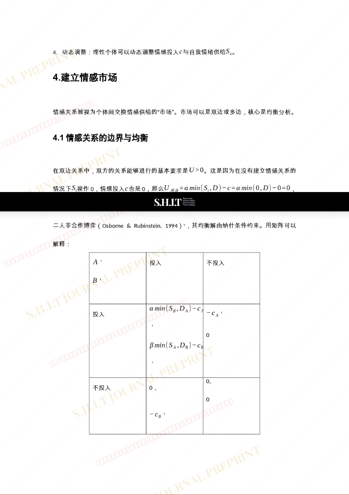
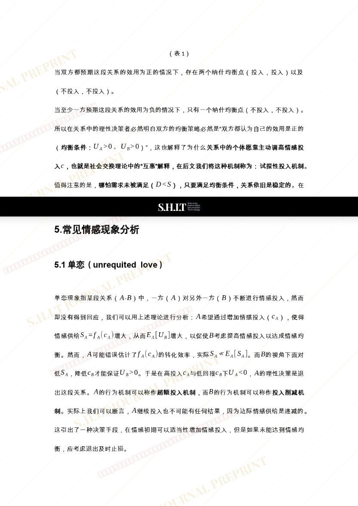
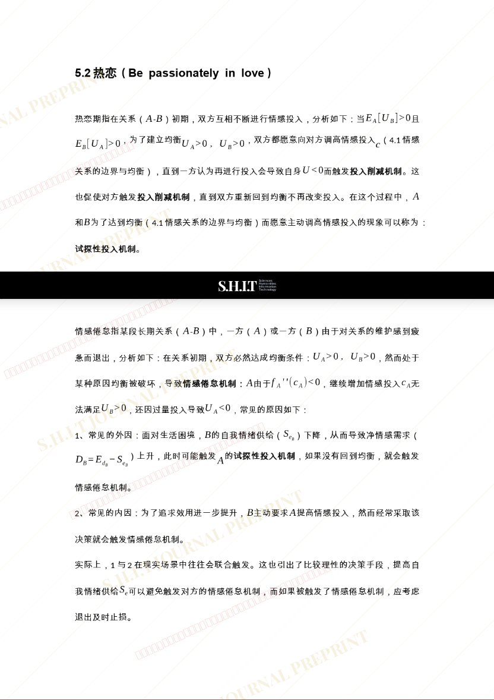
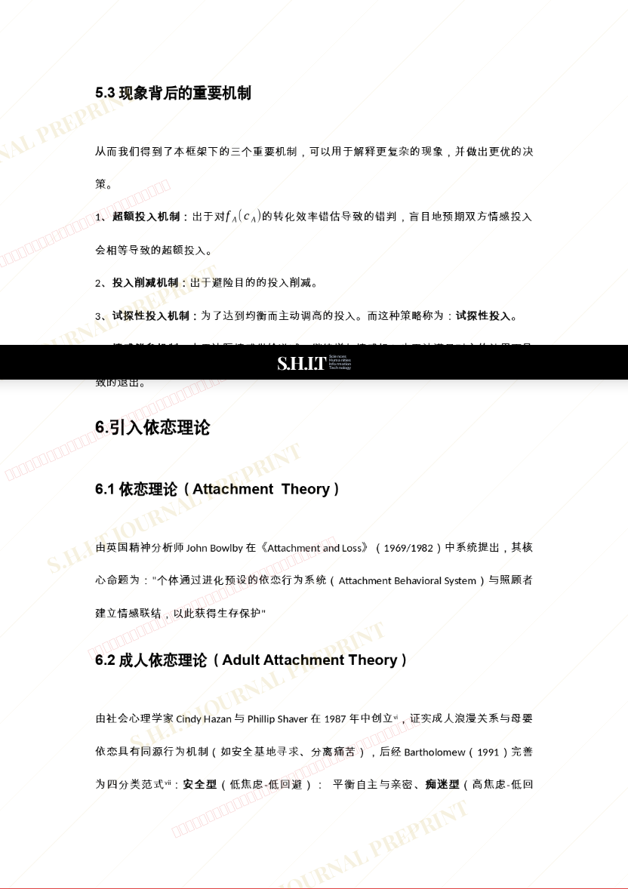
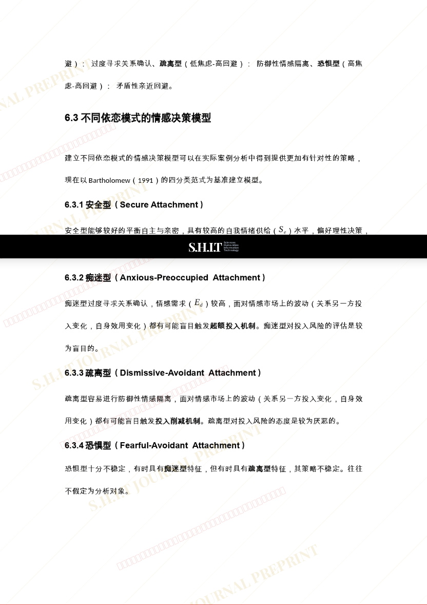
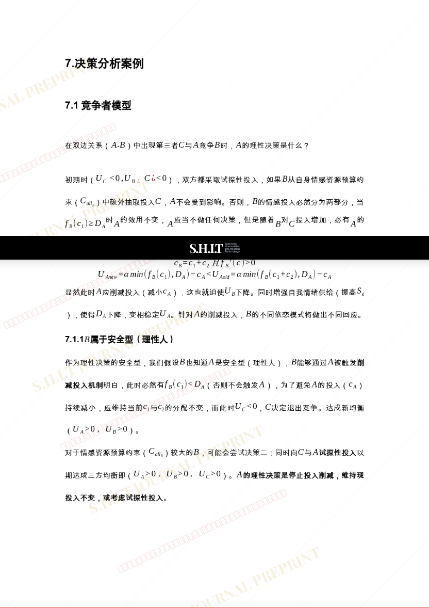
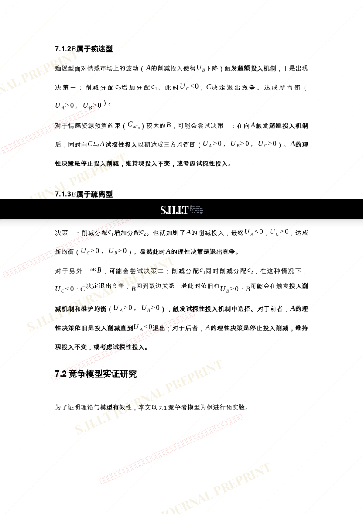
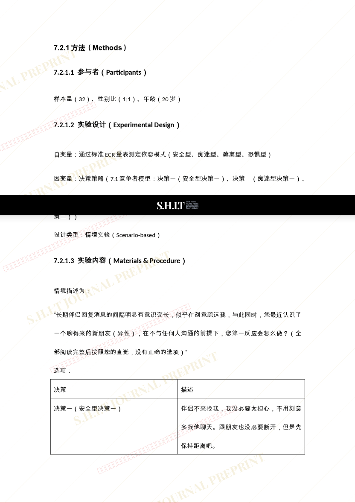
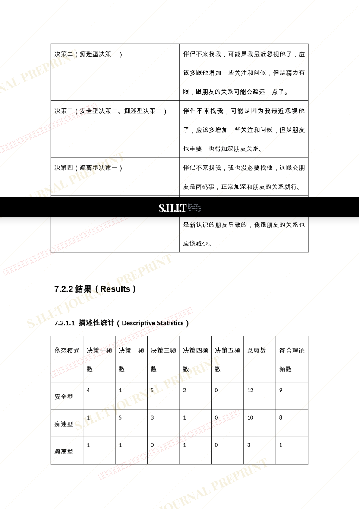
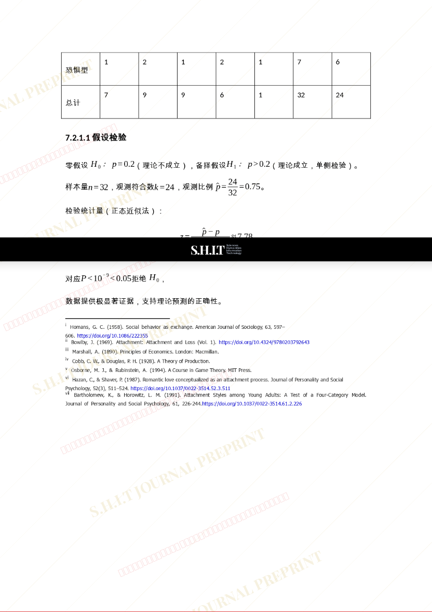
