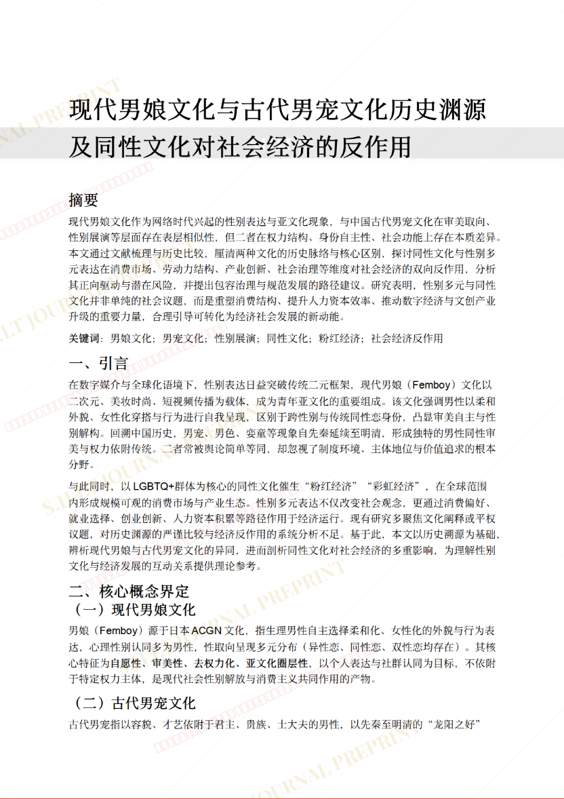
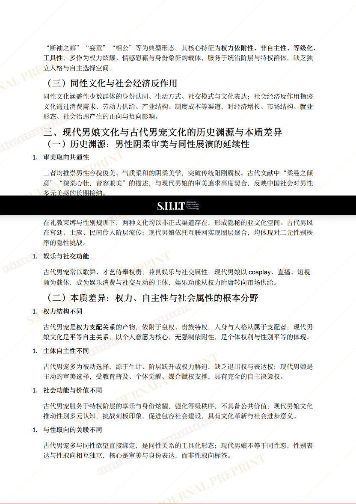
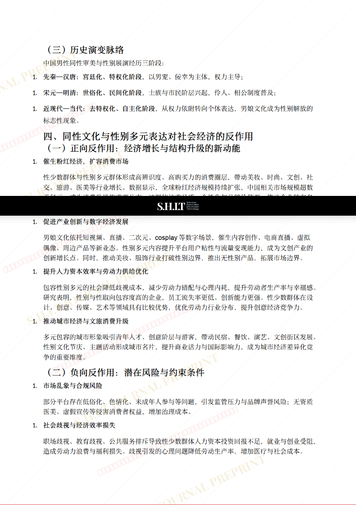
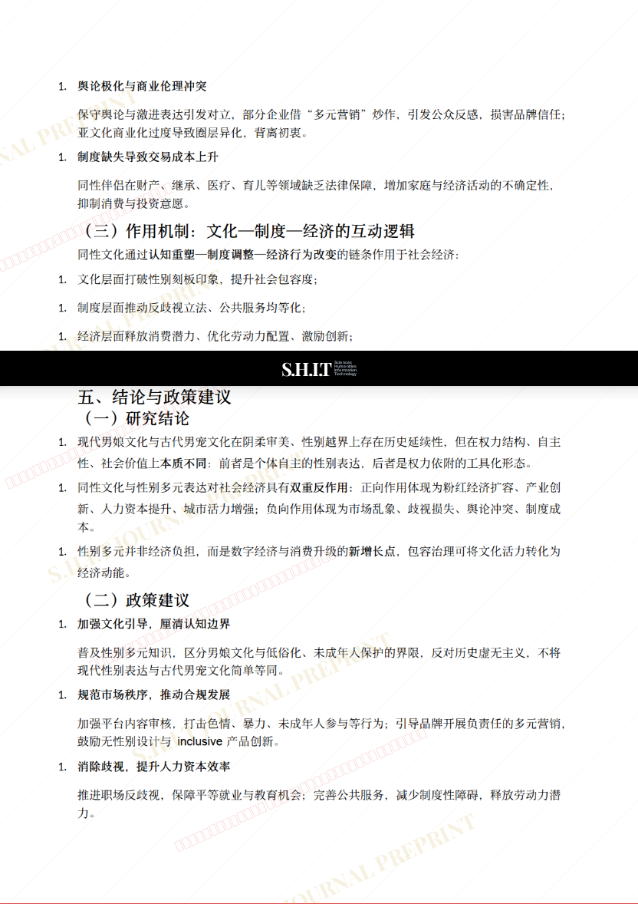
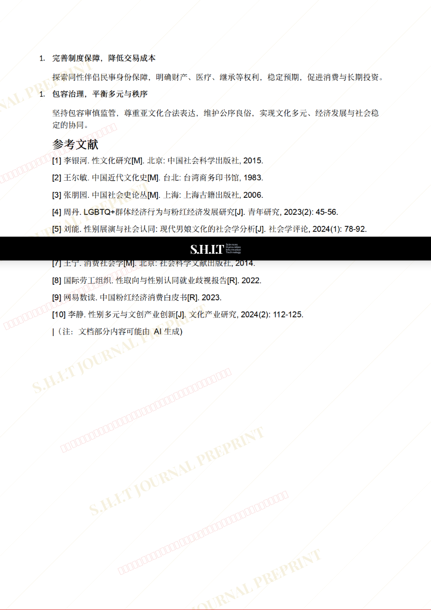

# 关于现代男娘文化与古代男宠文化历史渊源及同性文化对于社会经济的反作用

- **URL**: https://shitjournal.org/preprints/a3680cf2-9f1e-4a5e-98b6-fb88d09ca743
- **author**: 蘇伶
- **institution**: BOGUS UNIVERCITY
- **discipline**: 交叉 / Interdisciplinary
- **submitted**: 2026/2/22 13:21:12
- **viscosity**: High-Entropy / 高熵态

---

## 关于现代男娘文化与古代男宠文化历史渊源及同性文化对于社会经济的反作用

蘇伶

BOGUS UNIVERCITY

High-Entropy / 高熵态

交叉 / Interdisciplinary

2026/2/22 13:21:12

### Rate / 盲评

[Sign In / 登录](/login)

### Manuscript / 全文

本内容纯属整活，不代表任何学术观点或现实指导建议。请保持理智，切勿模仿。

暂无评论 / No comments yet

