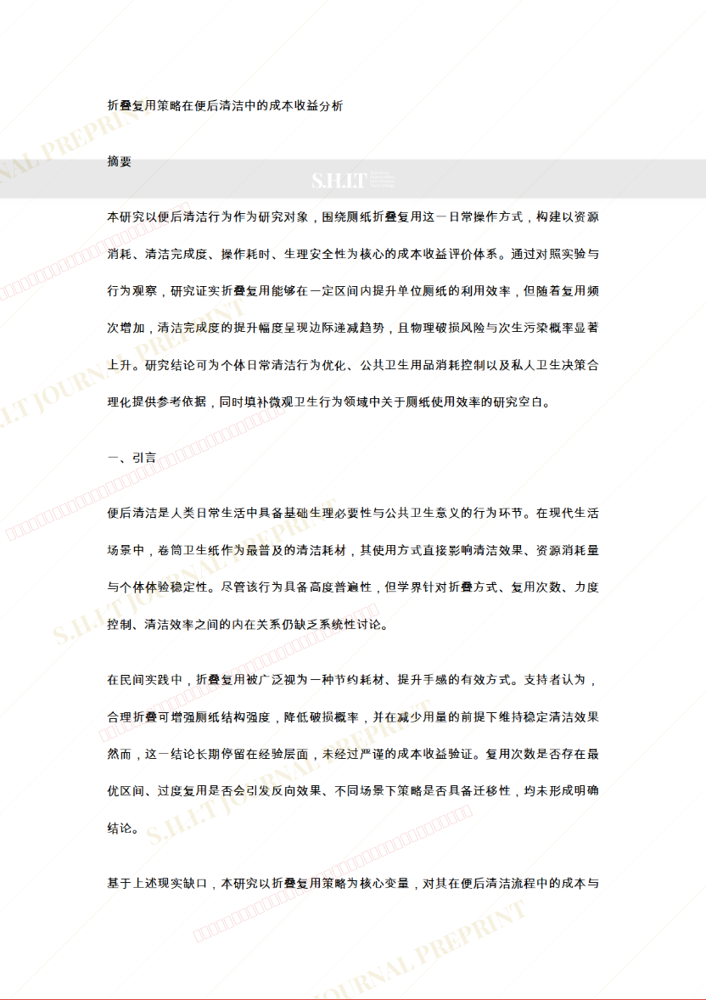
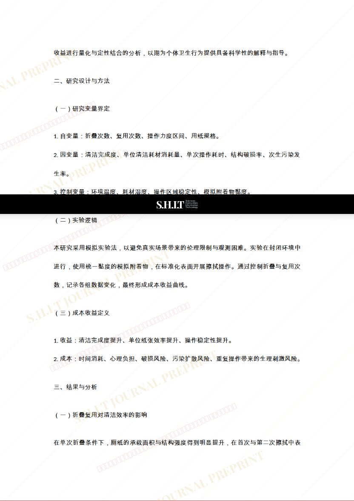
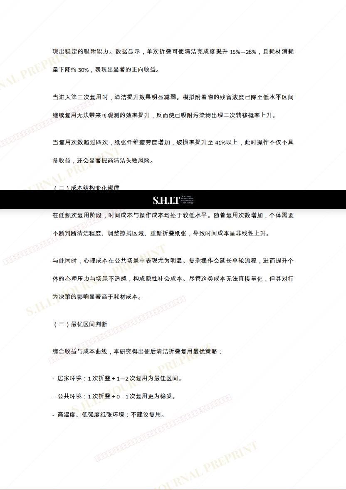
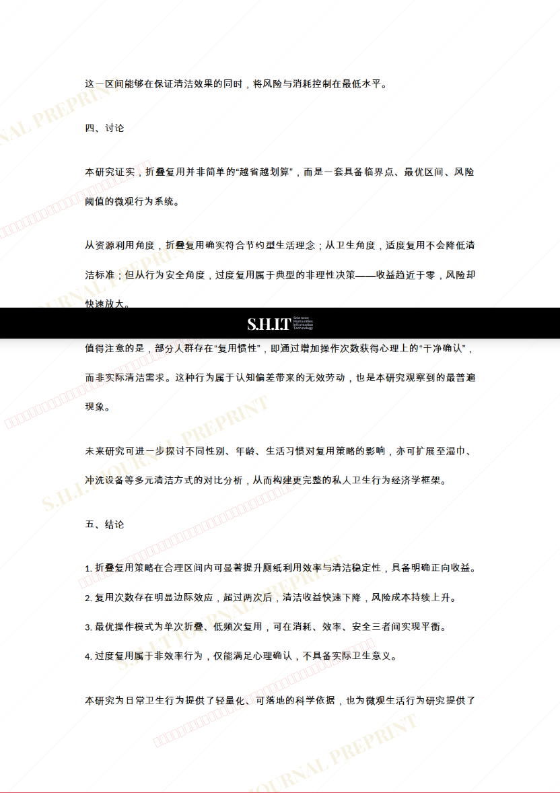
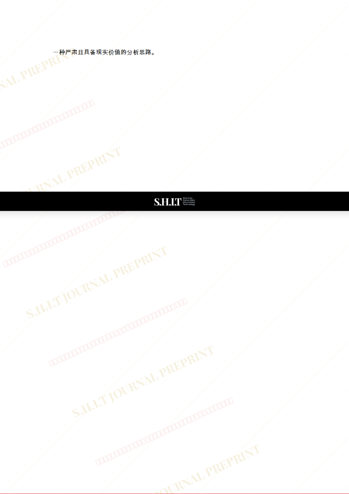

# 《折叠复用策略在便后清洁中的成本-收益分析》

- **URL**: https://shitjournal.org/preprints/a8696a63-60f5-4a77-96b8-d389816c6de0
- **author**: 大便超人L
- **institution**: shit university
- **discipline**: 交叉 / Interdisciplinary
- **submitted**: 2026/2/23 18:19:45
- **viscosity**: Stringy / 拉丝型

---

## 《折叠复用策略在便后清洁中的成本-收益分析》

大便超人L

shit university

Stringy / 拉丝型

交叉 / Interdisciplinary

2026/2/23 18:19:45

72214625401

### Rate / 盲评

[Sign In / 登录](/login)

### Manuscript / 全文

本内容纯属整活，不代表任何学术观点或现实指导建议。请保持理智，切勿模仿。

暂无评论 / No comments yet

