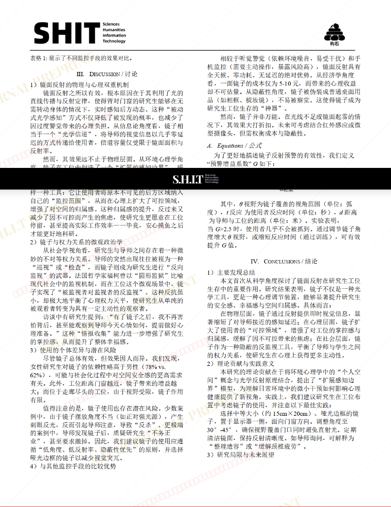
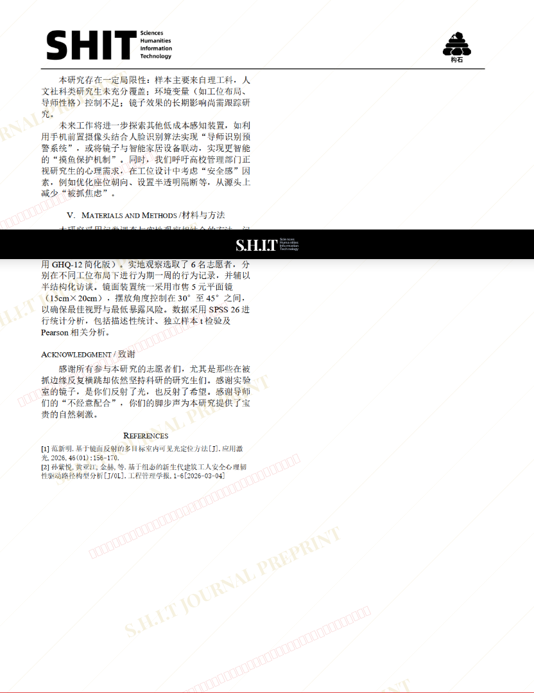

# 论平滑镜面反射大幅提升研究生生存幸福感及空间归属感研究

## 元信息

- **作者**: SNP大一统理论研究牲
- **机构**: 屎命召唤专项研究院
- **社交媒体**: 114514350@homo.com
- **分区**: septic
- **学科**: humanities
- **标签**: meme
- **提交时间**: 2026-03-04T13:34:37.619529Z
- **评分**: 4.09 / 5（32 人）

## 链接

- [网站原始文章](https://shitjournal.org/preprints/a9e4a688-909f-4052-9ee8-09c0e2362d73)
- [PDF](https://files.shitjournal.org/a9e4a688-909f-4052-9ee8-09c0e2362d73.pdf)
- [文章元信息](a9e4a688-909f-4052-9ee8-09c0e2362d73.meta.json)

## 正文

