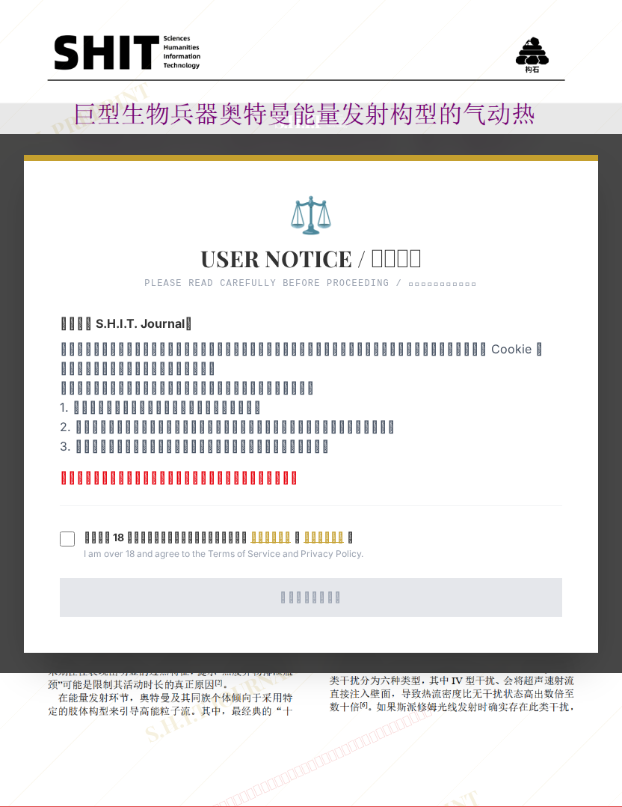

# 巨型生物兵器奥特曼能量发射构型的气动热环境对比与主动防护机制研究：基于激波干扰的准稳态分析

## 元信息

- **作者**: 进次郎
- **机构**: 
- **分区**: septic
- **学科**: engineering
- **标签**: meme
- **提交时间**: 2026-03-03T19:37:36.167801Z
- **评分**: 4.54 / 5（35 人）

## 链接

- [网站原始文章](https://shitjournal.org/preprints/aeab1758-a514-419b-82dc-589d66fac4a8)
- [PDF](https://files.shitjournal.org/aeab1758-a514-419b-82dc-589d66fac4a8.pdf)
- [文章元信息](aeab1758-a514-419b-82dc-589d66fac4a8.meta.json)

## 正文

