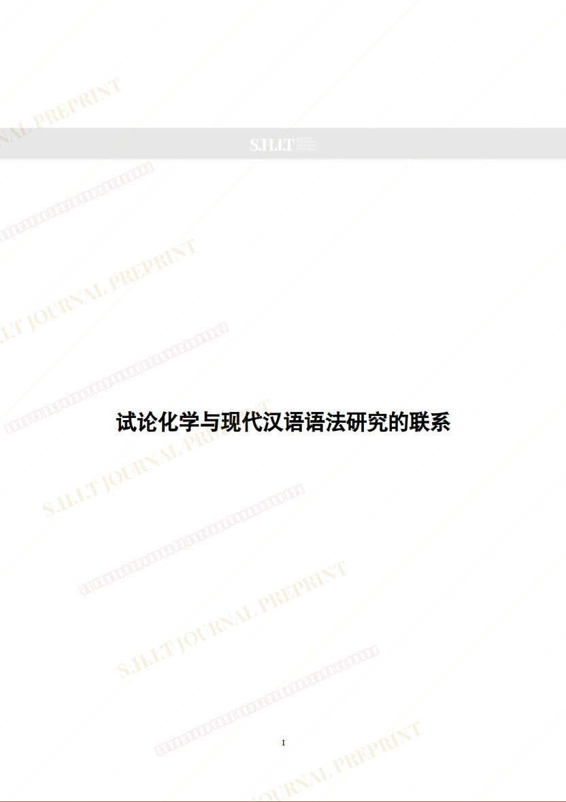
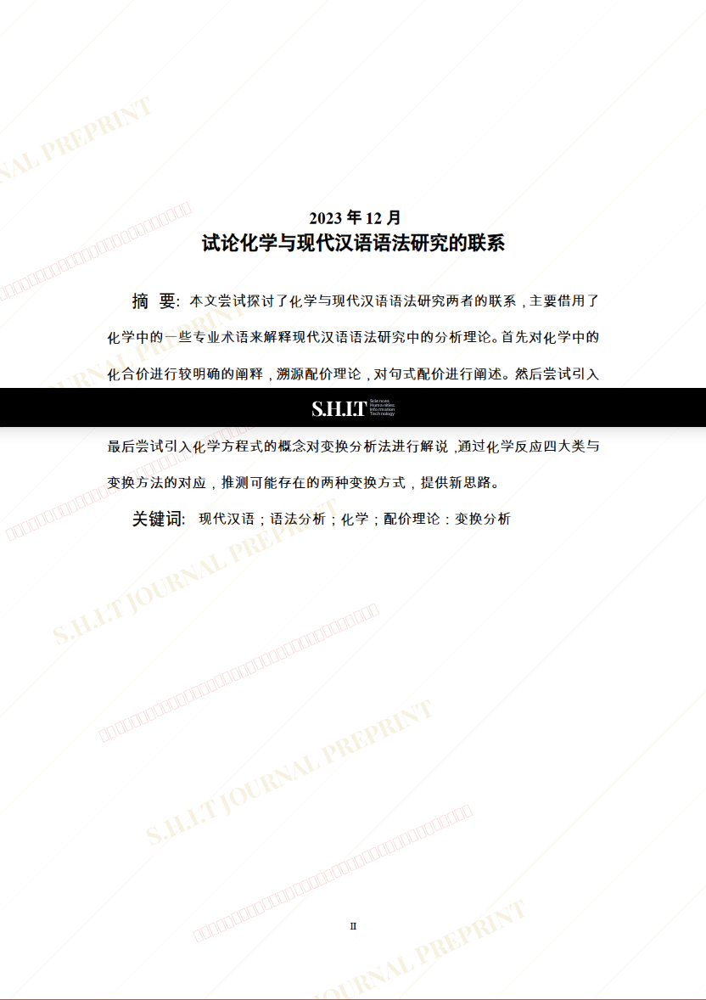
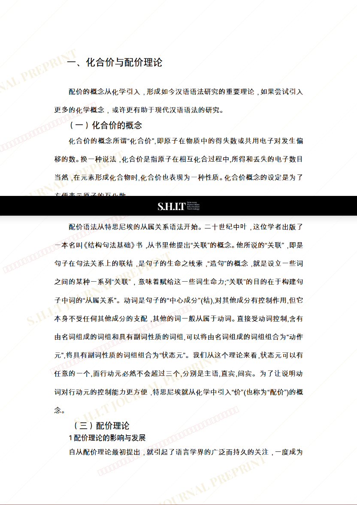
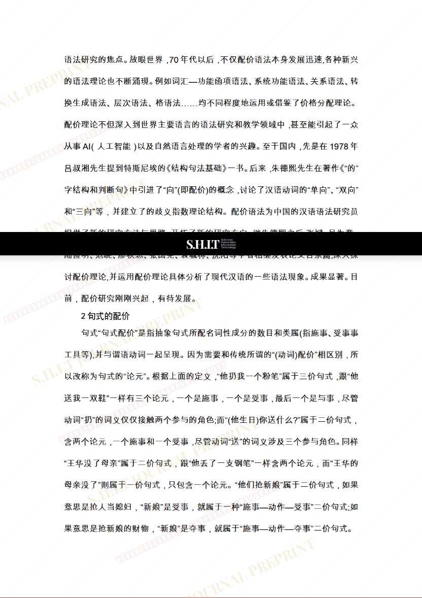
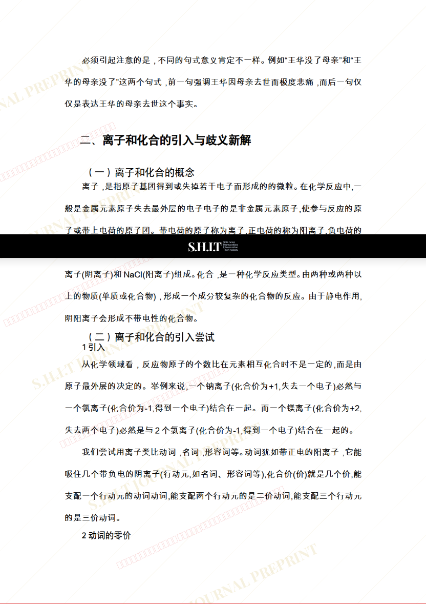
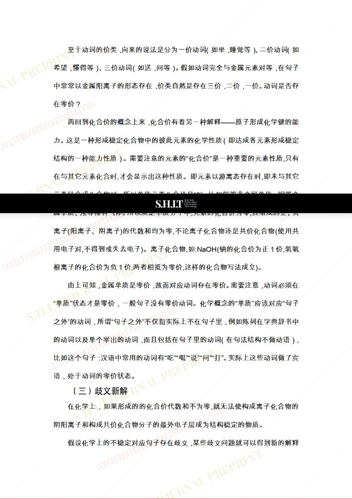
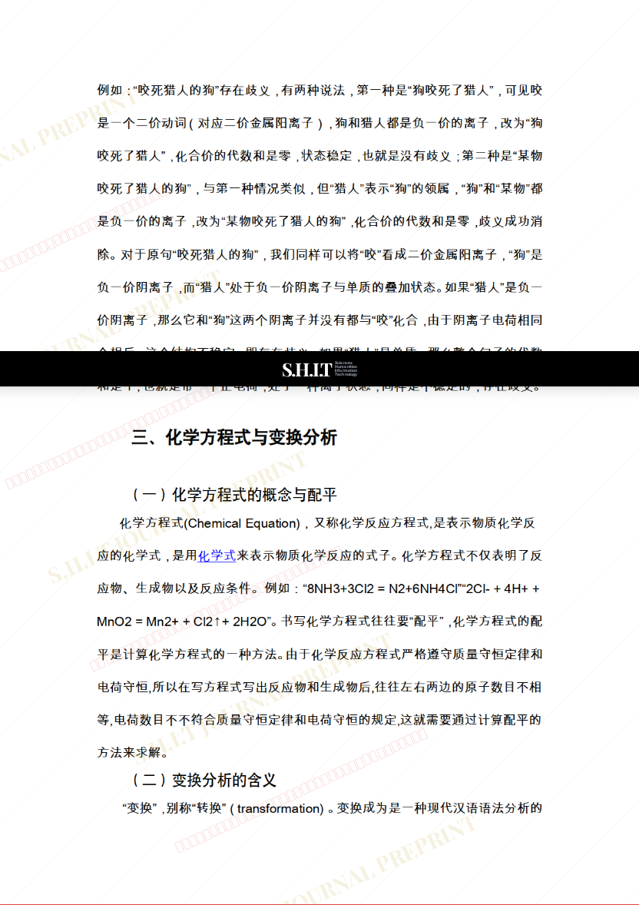
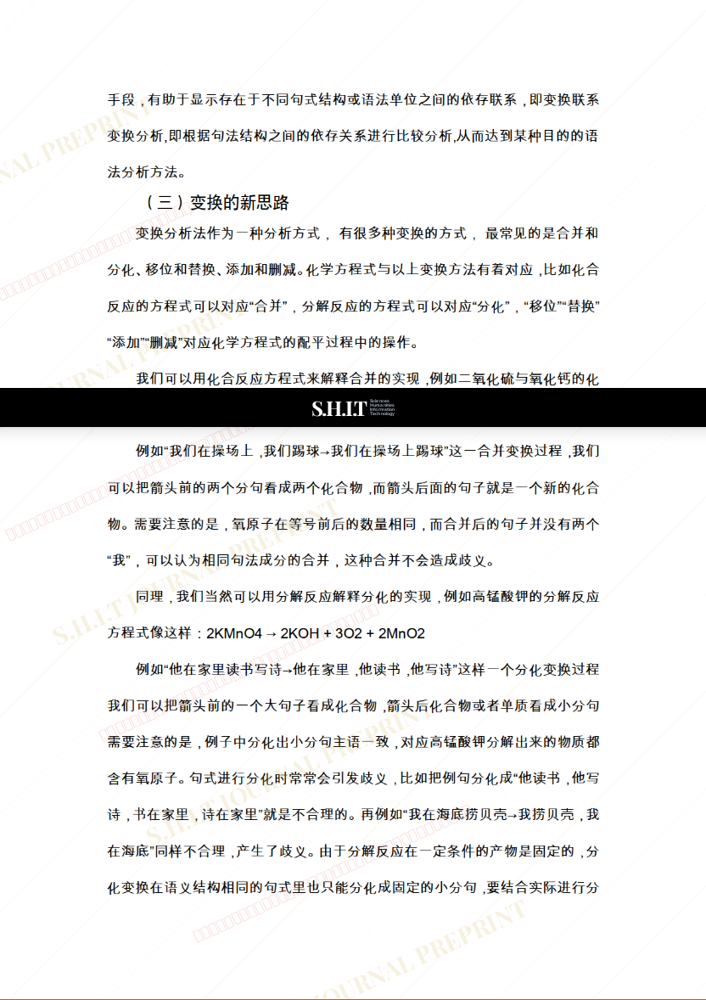
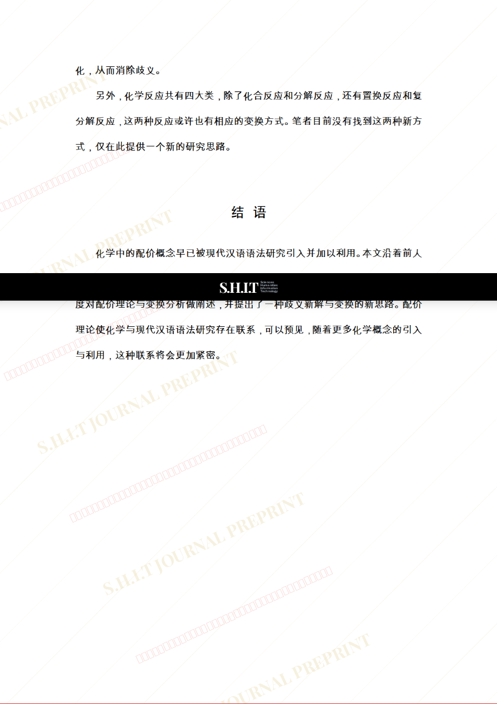
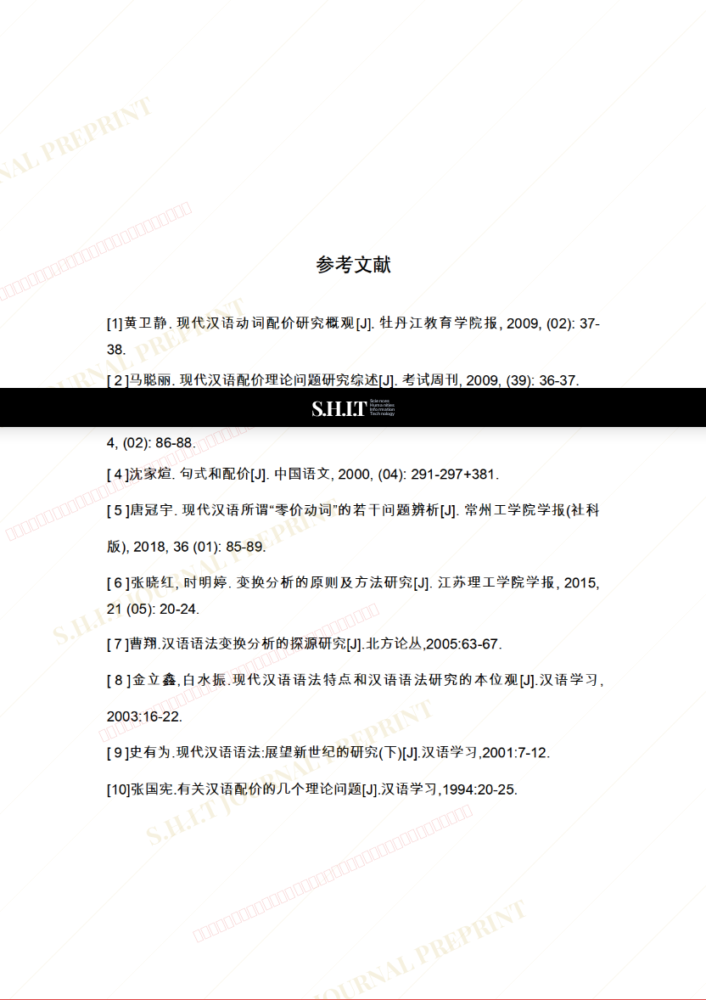

# 试论化学与现代汉语语法研究的联系

- **URL**: https://shitjournal.org/preprints/b57defbd-6580-44db-9e7e-3326a45f734e
- **author**: 真滴很奇妙
- **institution**: 山河大学
- **discipline**: 交叉 / Interdisciplinary
- **submitted**: 2026/2/23 06:44:42
- **viscosity**: Stringy / 拉丝型

---

## 试论化学与现代汉语语法研究的联系

真滴很奇妙

山河大学

Stringy / 拉丝型

交叉 / Interdisciplinary

2026/2/23 06:44:42

### Rate / 盲评

[Sign In / 登录](/login)

### Manuscript / 全文

本内容纯属整活，不代表任何学术观点或现实指导建议。请保持理智，切勿模仿。

暂无评论 / No comments yet

