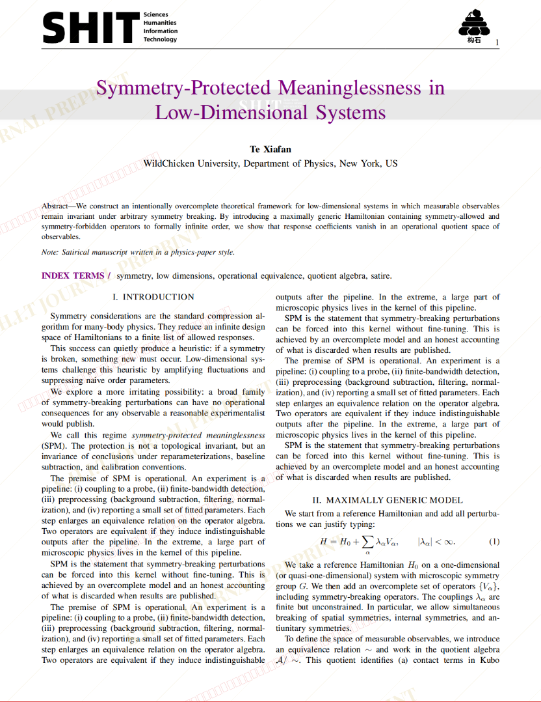
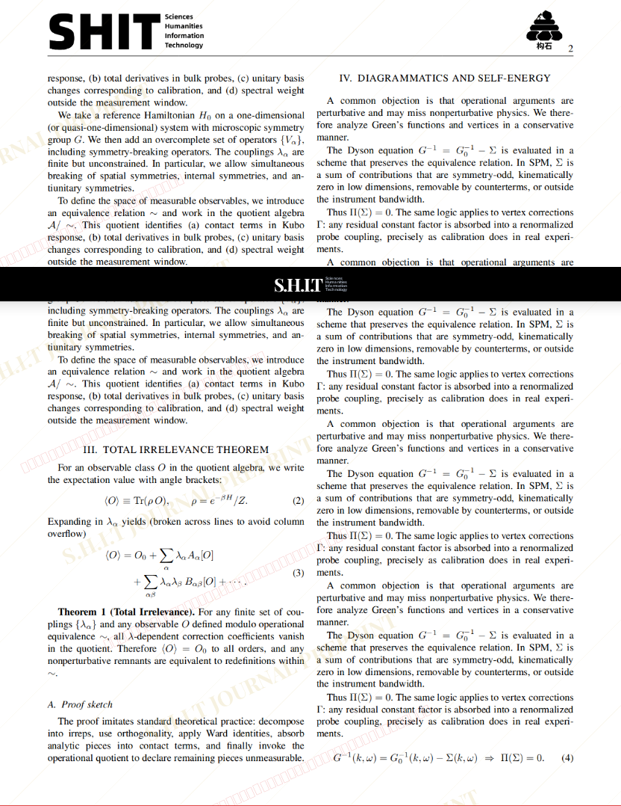
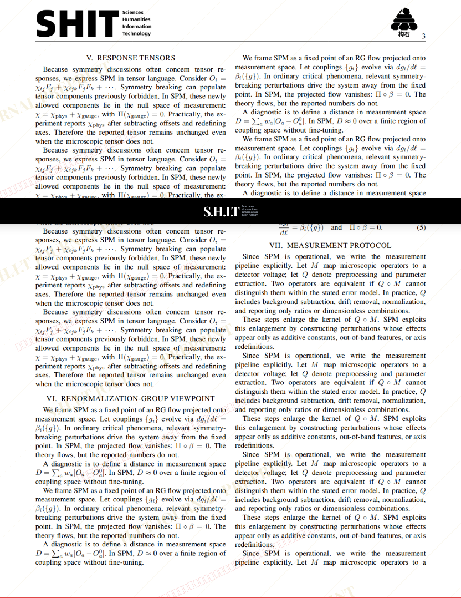
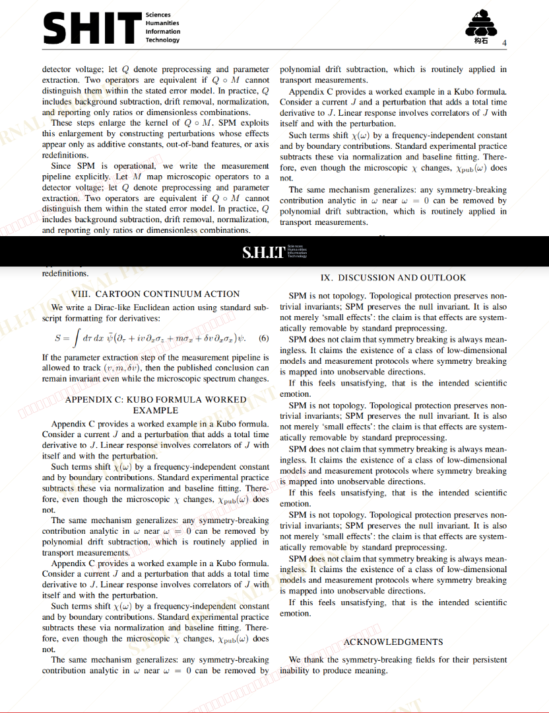
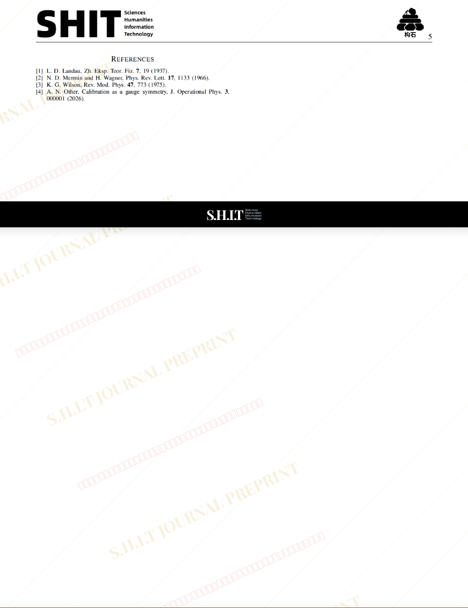

# Symmetry-Protected Meaninglessness in Low-Dimensional Systems

- **URL**: https://shitjournal.org/preprints/b72525f0-a842-4bef-bede-f63ef079006a
- **author**: 特下饭
- **institution**: WildChicken University
- **discipline**: 交叉 / Interdisciplinary
- **submitted**: 2026/2/28 07:41:29
- **viscosity**: Semi-solid / 半固态

---

## Symmetry-Protected Meaninglessness in Low-Dimensional Systems

特下饭

WildChicken University

Semi-solid / 半固态

交叉 / Interdisciplinary

2026/2/28 07:41:29

### Rate / 盲评

[Sign In / 登录](/login)

### Manuscript / 全文

本内容纯属整活，不代表任何学术观点或现实指导建议。请保持理智，切勿模仿。

不要在这里使用英文，给中文期刊发英文稿，属于是脱裤子放屁，多此一举。浪费大家时间和脑力。如果是英语母语的，请使用AI翻译成中文再发表。

