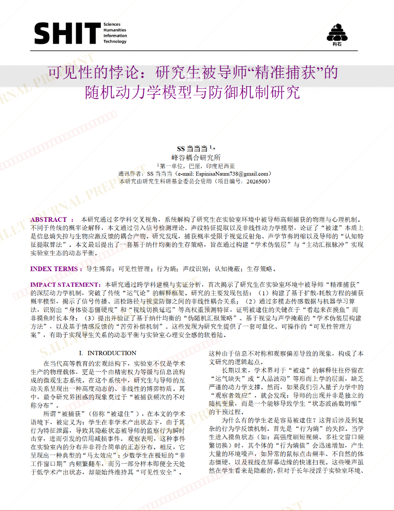
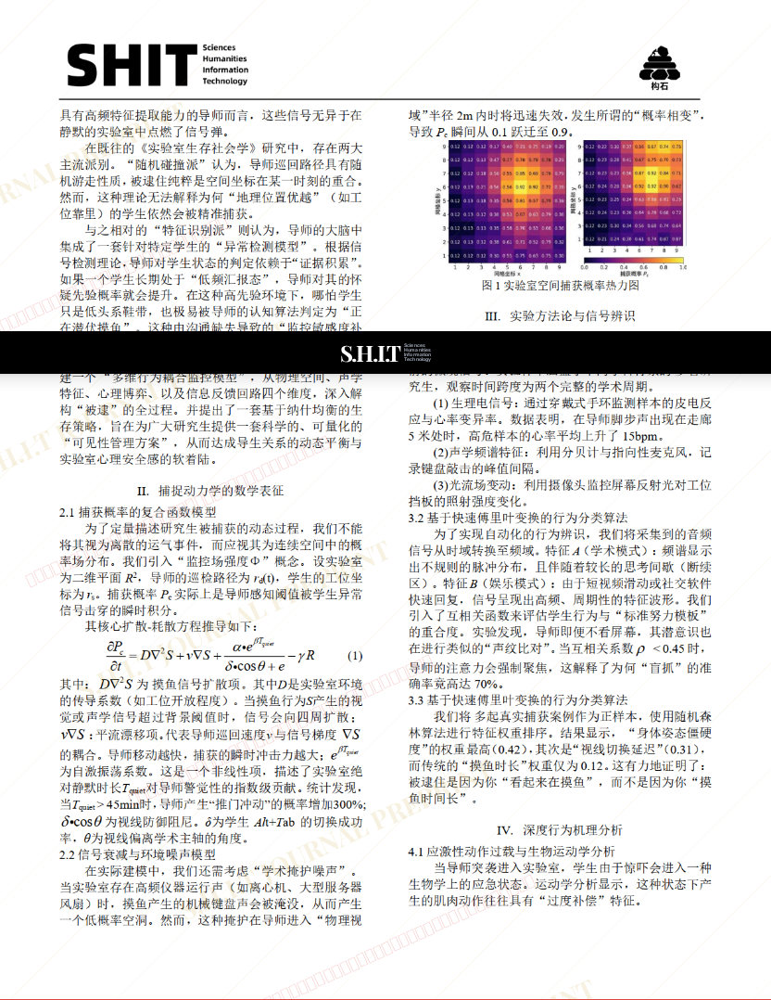
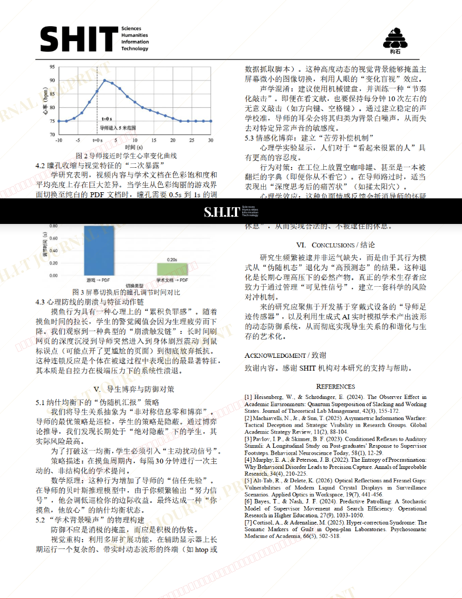

# 可见性的悖论：研究生被导师“精准捕获”的随机动力学模型与防御机制研究

- **URL**: https://shitjournal.org/preprints/b7db940d-9867-4147-87cb-023c506e1949
- **author**: SS当当当
- **institution**: 峰谷耦合研究所
- **discipline**: 交叉 / Interdisciplinary
- **submitted**: 2026/2/28 11:51:05
- **viscosity**: Stringy / 拉丝型

---

## 可见性的悖论：研究生被导师“精准捕获”的随机动力学模型与防御机制研究

SS当当当

峰谷耦合研究所

Stringy / 拉丝型

交叉 / Interdisciplinary

2026/2/28 11:51:05

### Rate / 盲评

[Sign In / 登录](/login)

### Manuscript / 全文

本内容纯属整活，不代表任何学术观点或现实指导建议。请保持理智，切勿模仿。

暂无评论 / No comments yet

