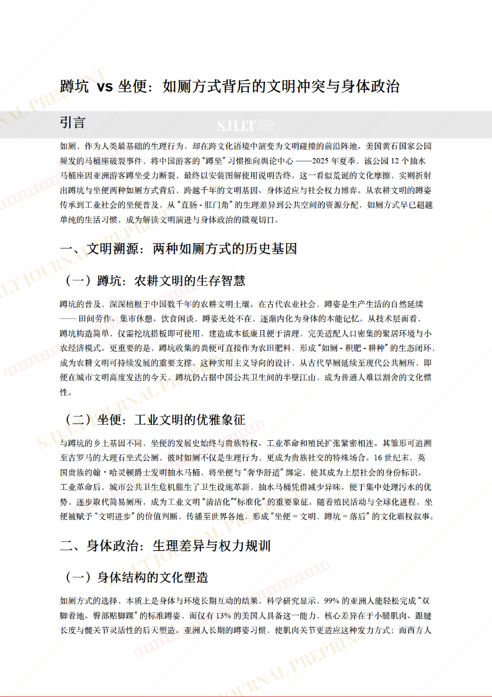
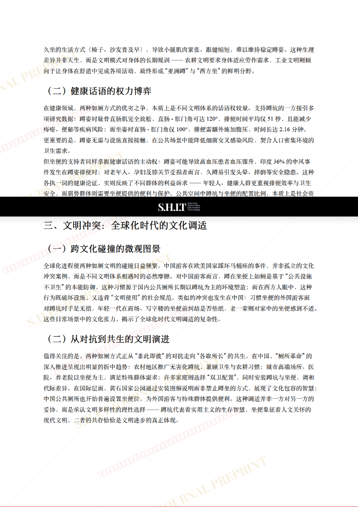
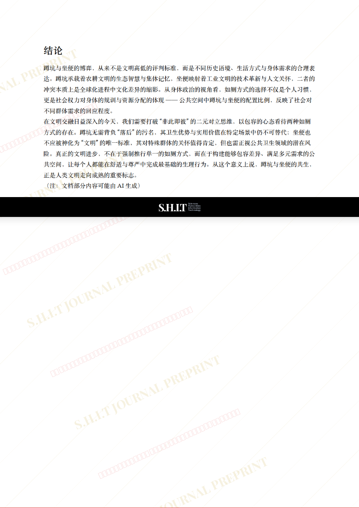

# 蹲坑 vs 坐便：如厕方式背后的文明冲突与身体政治

- **URL**: https://shitjournal.org/preprints/b9e66c2a-5664-4d40-8903-2574bb9a8ca6
- **author**: 山田凉的铁锤头鲨
- **institution**: 南京市田家炳高级中学
- **discipline**: 交叉 / Interdisciplinary
- **submitted**: 2026/2/23 13:10:48
- **viscosity**: Semi-solid / 半固态

---

## 蹲坑 vs 坐便：如厕方式背后的文明冲突与身体政治

山田凉的铁锤头鲨

南京市田家炳高级中学

Semi-solid / 半固态

交叉 / Interdisciplinary

2026/2/23 13:10:48

豆包 ·共一

山田凉 ·

### Rate / 盲评

[Sign In / 登录](/login)

### Manuscript / 全文

本内容纯属整活，不代表任何学术观点或现实指导建议。请保持理智，切勿模仿。

暂无评论 / No comments yet

