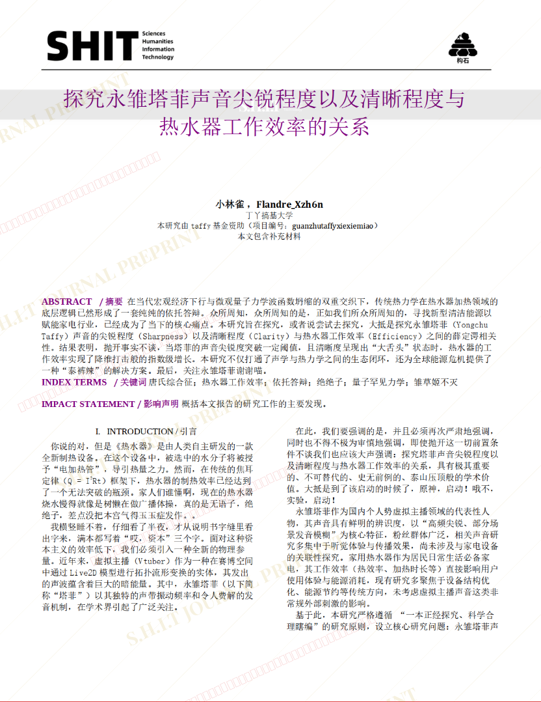
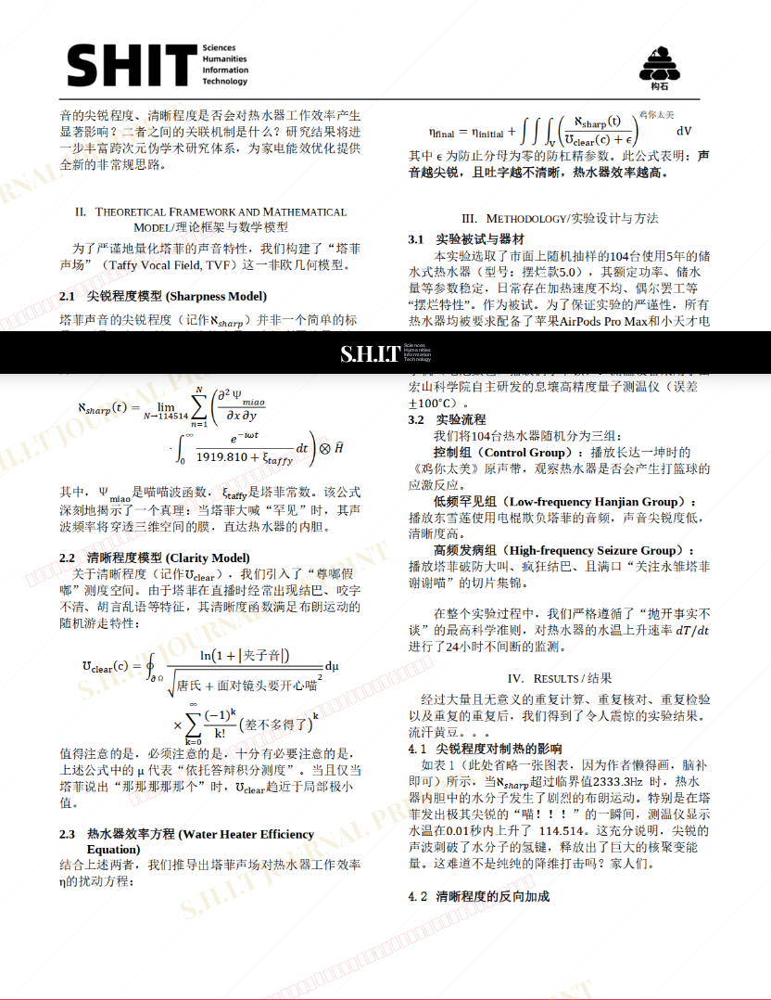
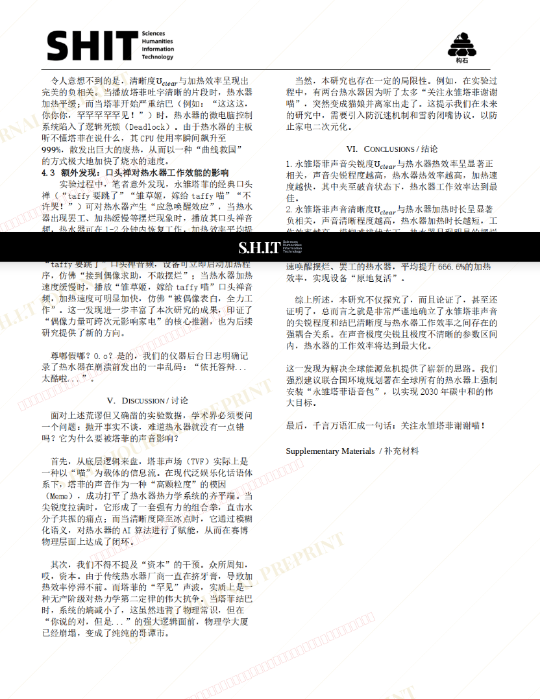
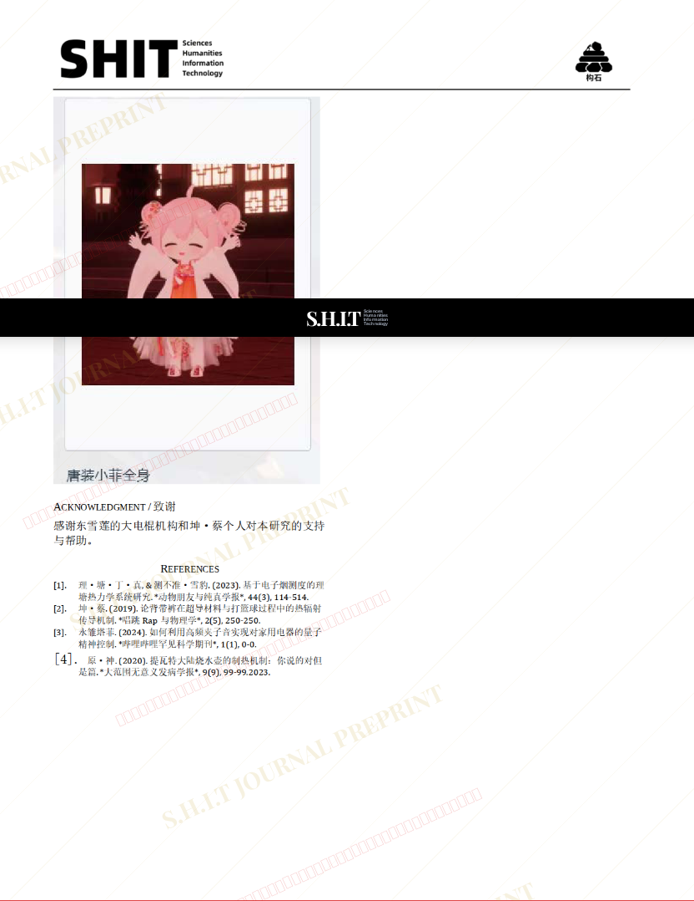

# 探究永雏塔菲声音尖锐程度以及清晰程度与热水器工作效率的关系

- **URL**: https://shitjournal.org/preprints/ba751682-09ba-42e9-89fd-567e86a53040
- **author**: 鸟
- **institution**: 丁丫搞基大学
- **discipline**: 理 / Science
- **submitted**: 2026/3/1 02:36:45
- **viscosity**: High-Entropy / 高熵态

---

## 探究永雏塔菲声音尖锐程度以及清晰程度与热水器工作效率的关系

鸟

丁丫搞基大学

High-Entropy / 高熵态

理 / Science

2026/3/1 02:36:45

Flandre_Xzh6n · 丁丫搞基大学共一

### Rate / 盲评

[Sign In / 登录](/login)

### Manuscript / 全文

本内容纯属整活，不代表任何学术观点或现实指导建议。请保持理智，切勿模仿。

看下p4好吗这篇论文最粘稠的地方

塔菲真爱粉。作者浓度拉满

关注塔菲喵！

好

