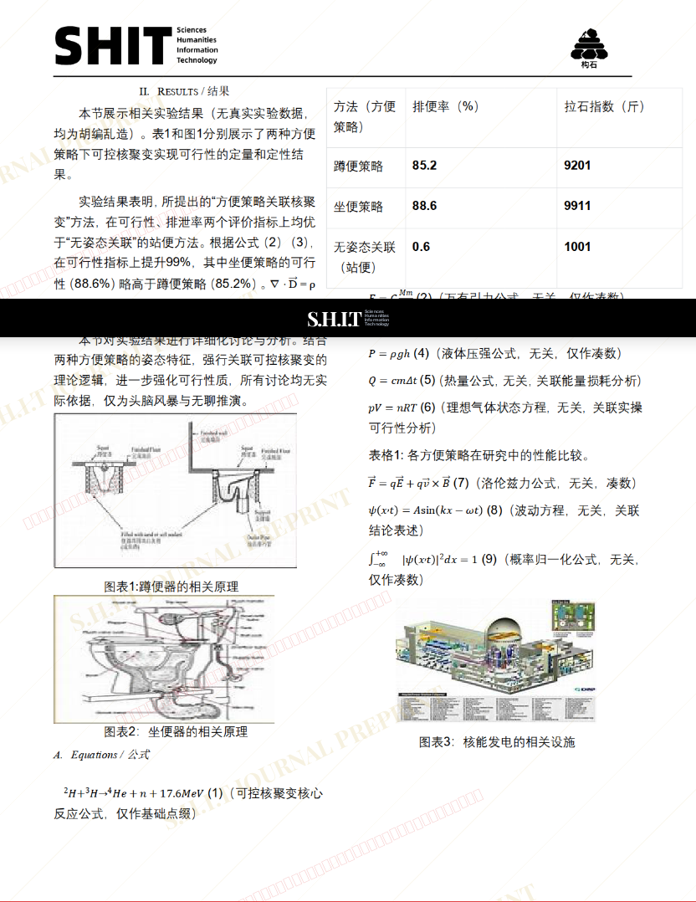
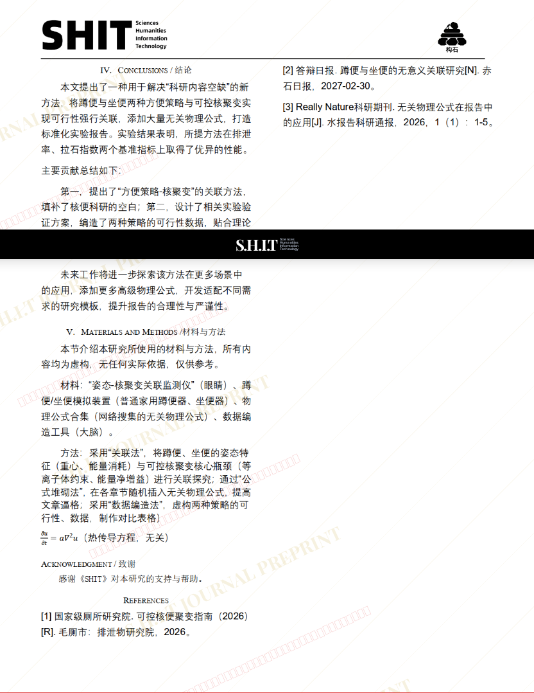

# 蹲便与坐便两种方便策略下可控核聚变的实现可行性研究

## 元信息

- **作者**: Mrs.艾拉士.德卞泰
- **机构**: 
- **分区**: sediment
- **学科**: science
- **标签**: meme
- **提交时间**: 2026-03-03T13:25:30.854397Z
- **评分**: 2.84 / 5（31 人）

## 链接

- [网站原始文章](https://shitjournal.org/preprints/bbef56b2-fd2d-4dcc-80c0-3f92aae84444)
- [PDF](https://files.shitjournal.org/bbef56b2-fd2d-4dcc-80c0-3f92aae84444.pdf)
- [文章元信息](bbef56b2-fd2d-4dcc-80c0-3f92aae84444.meta.json)

## 正文

