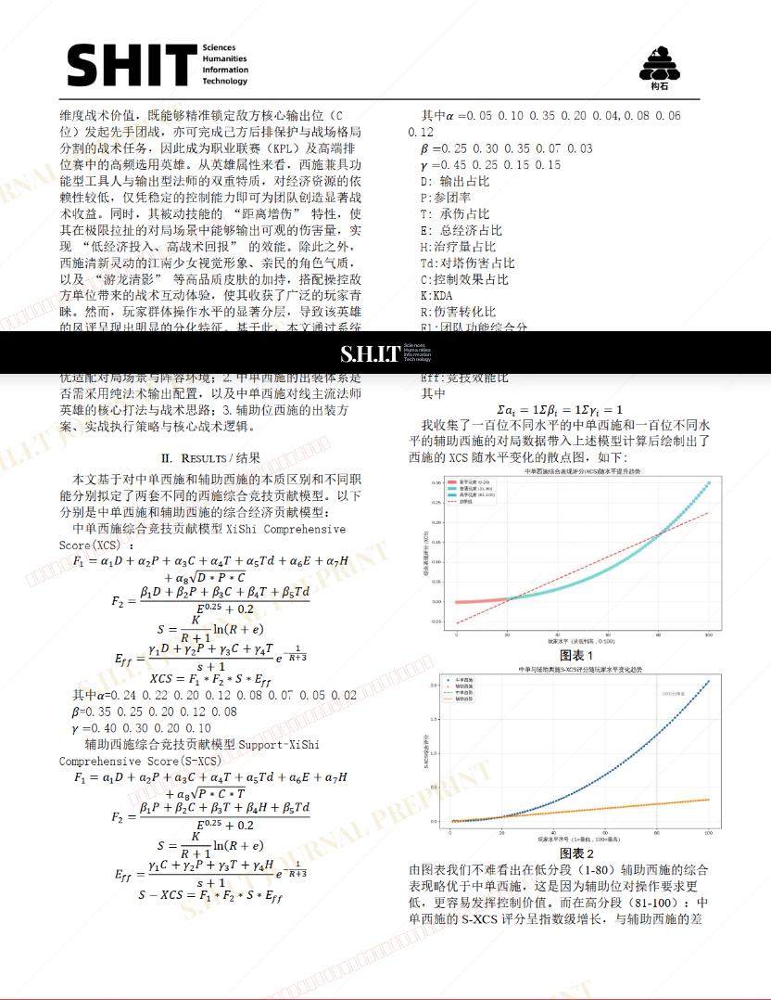

# 媒介想象的类型化建构与游戏实践的约束性张力——以“祈愿江南落雪”的刻板认知为切入点对纯法西施困境与出路的考察

- **URL**: https://shitjournal.org/preprints/bc6fa8e2-a3d3-4e3f-a029-34721959e2ac
- **author**: 赤石仙人
- **institution**: 加利顿大学王者荣耀研究所
- **discipline**: 交叉 / Interdisciplinary
- **submitted**: 2026/3/3 13:12:24
- **viscosity**: Stringy / 拉丝型

---

## 媒介想象的类型化建构与游戏实践的约束性张力——以“祈愿江南落雪”的刻板认知为切入点对纯法西施困境与出路的考察

赤石仙人

加利顿大学王者荣耀研究所

Stringy / 拉丝型

交叉 / Interdisciplinary

2026/3/3 13:12:24

### Rate / 盲评

[Sign In / 登录](/login)

### Manuscript / 全文

本内容纯属整活，不代表任何学术观点或现实指导建议。请保持理智，切勿模仿。

暂无评论 / No comments yet

