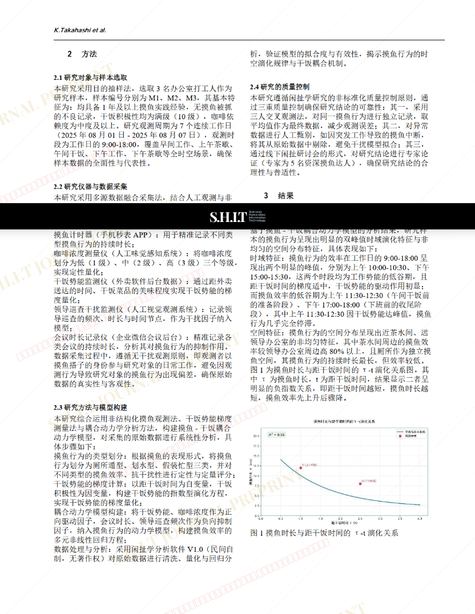
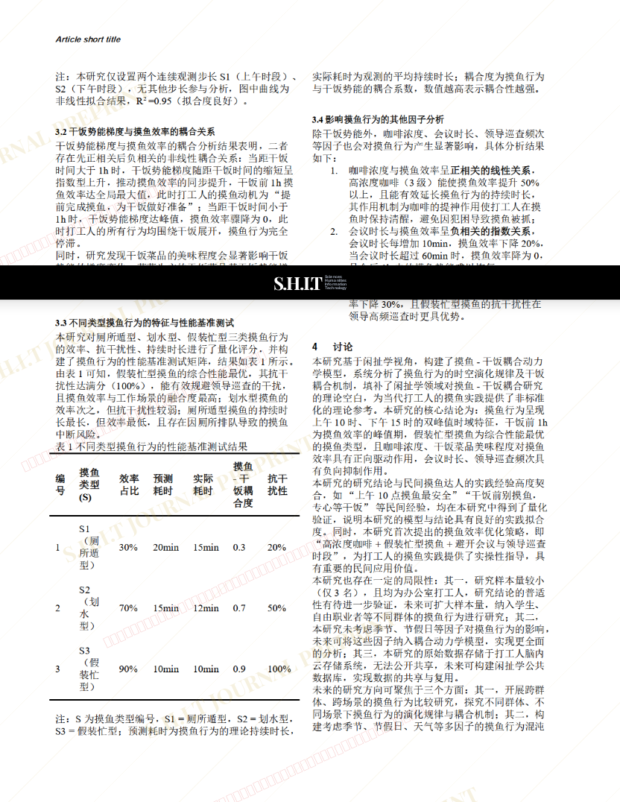

# 基于闲扯学视角的摸鱼行为时空演化规律及干饭耦合机制研究

- **URL**: https://shitjournal.org/preprints/bdb0e287-1dbe-4bd9-9d6f-8864fca3e4ea
- **author**: shit maker
- **institution**: Moyu and Ganfan University
- **discipline**: 交叉 / Interdisciplinary
- **submitted**: 2026/2/27 09:52:21
- **viscosity**: Stringy / 拉丝型

---

## 基于闲扯学视角的摸鱼行为时空演化规律及干饭耦合机制研究

shit maker

Moyu and Ganfan University

Stringy / 拉丝型

交叉 / Interdisciplinary

2026/2/27 09:52:21

### Rate / 盲评

[Sign In / 登录](/login)

### Manuscript / 全文

本内容纯属整活，不代表任何学术观点或现实指导建议。请保持理智，切勿模仿。

暂无评论 / No comments yet

