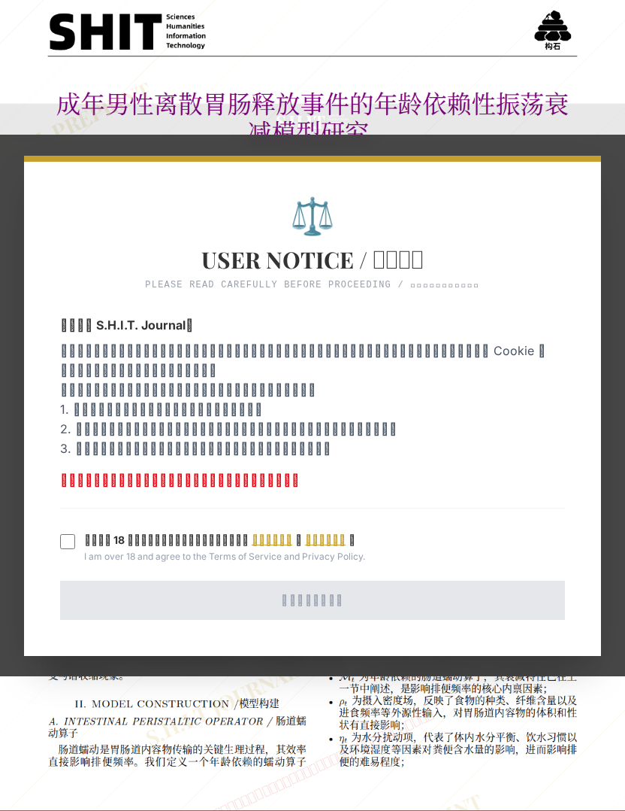

# 成年男性离散胃肠释放事件的年龄依赖衰减模型研究

## 元信息

- **作者**: 战斗吧
- **机构**: 召唤师峡谷红方野区
- **社交媒体**: 抖音号：20260630l
- **分区**: septic
- **学科**: engineering
- **标签**: meme
- **提交时间**: 2026-03-03T18:12:05.375084Z
- **评分**: 3.98 / 5（42 人）

## 链接

- [网站原始文章](https://shitjournal.org/preprints/bde4fabb-773f-4371-a7c0-d4c8fa17c68c)
- [PDF](https://files.shitjournal.org/bde4fabb-773f-4371-a7c0-d4c8fa17c68c.pdf)
- [文章元信息](bde4fabb-773f-4371-a7c0-d4c8fa17c68c.meta.json)

## 正文

