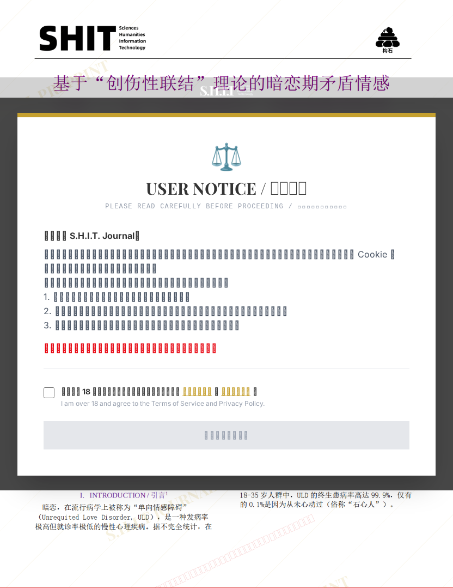

# 基于“创伤性联结”理论的暗恋期矛盾情感分析——以“火鸡面效应”为隐喻模型的单案例phenomenological 研究

## 元信息

- **作者**: 汐見螢
- **机构**: 
- **分区**: septic
- **学科**: interdisciplinary
- **标签**: meme
- **提交时间**: 2026-03-03T22:26:52.392722Z
- **评分**: 4.68 / 5（47 人）

## 链接

- [网站原始文章](https://shitjournal.org/preprints/bee4d62e-14c9-4663-a8fc-a87215094320)
- [PDF](https://files.shitjournal.org/bee4d62e-14c9-4663-a8fc-a87215094320.pdf)
- [文章元信息](bee4d62e-14c9-4663-a8fc-a87215094320.meta.json)

## 正文

