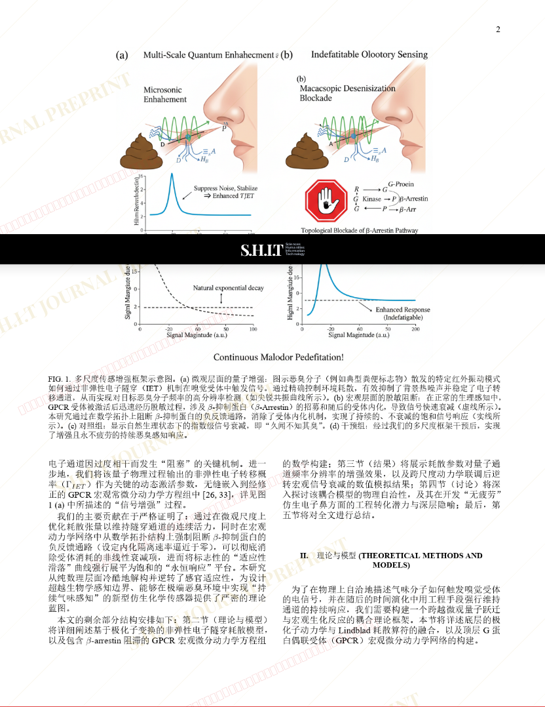
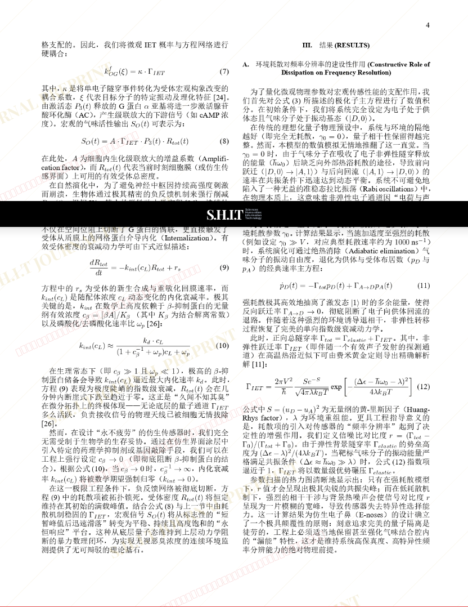
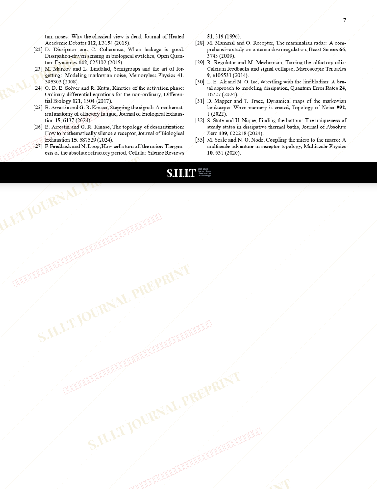

# 嗅觉受体中的量子动力学调制：从“久闻不知其臭”到“久闻不绝其臭”

- **URL**: https://shitjournal.org/preprints/bff40652-ed36-4774-a3ef-fe8d07c5a796
- **author**: Smelly
- **institution**: 越南越捷航空
- **discipline**: 理 / Science
- **submitted**: 2026/2/25 16:43:41
- **viscosity**: Semi-solid / 半固态

---

## 嗅觉受体中的量子动力学调制：从“久闻不知其臭”到“久闻不绝其臭”

Smelly

越南越捷航空

Semi-solid / 半固态

理 / Science

2026/2/25 16:43:41

### Rate / 盲评

[Sign In / 登录](/login)

### Manuscript / 全文

本内容纯属整活，不代表任何学术观点或现实指导建议。请保持理智，切勿模仿。

暂无评论 / No comments yet

