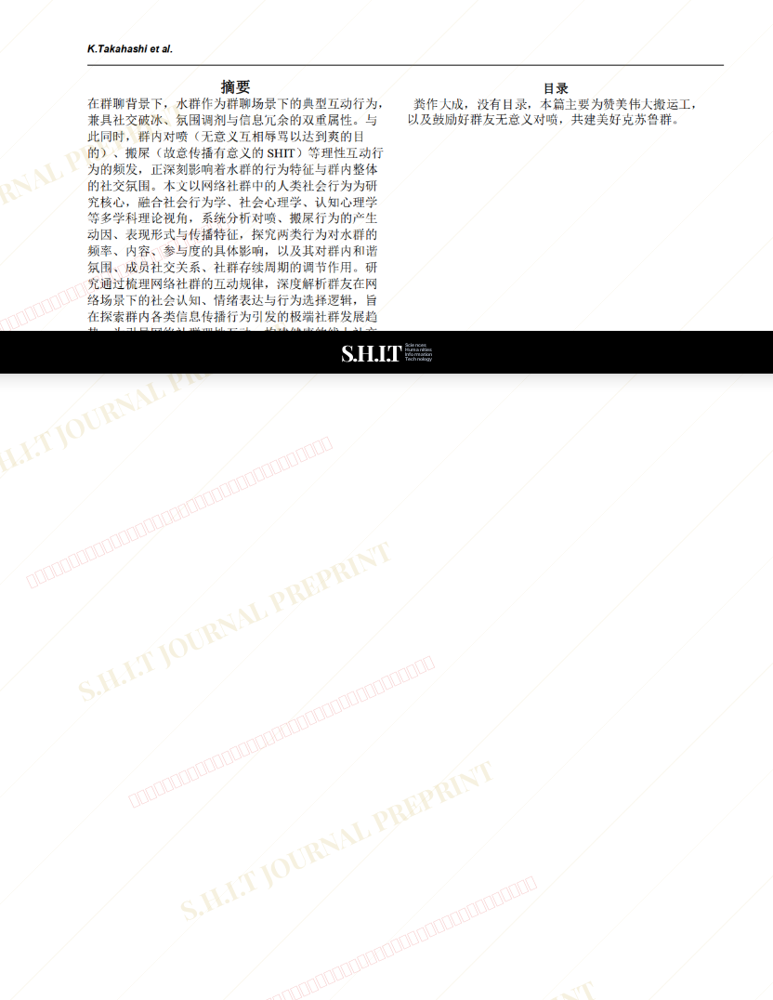
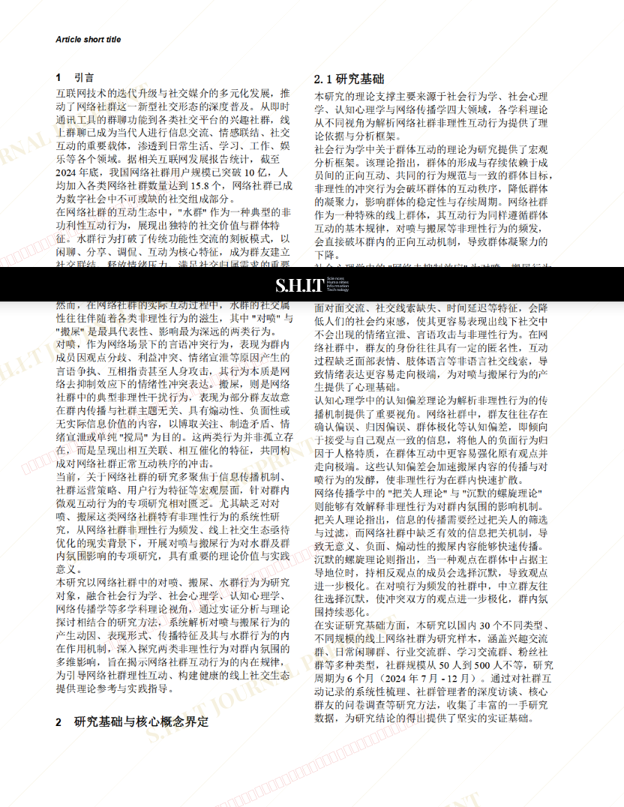
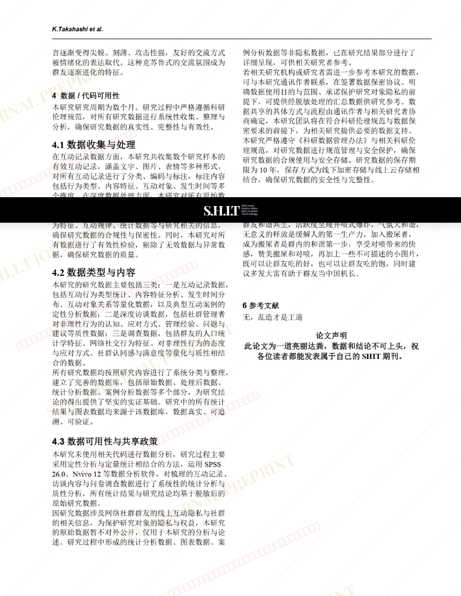

# 论对喷与搬屎对于水群以及群内和谐氛围的影响

- **URL**: https://shitjournal.org/preprints/c18d5651-3ed1-46d0-bd40-f57c4c83c2b8
- **author**: 阿弥诺斯
- **institution**: 佳利吨国际大学
- **discipline**: 交叉 / Interdisciplinary
- **submitted**: 2026/2/25 08:16:43
- **viscosity**: High-Entropy / 高熵态

---

## 论对喷与搬屎对于水群以及群内和谐氛围的影响

阿弥诺斯

佳利吨国际大学

High-Entropy / 高熵态

交叉 / Interdisciplinary

2026/2/25 08:16:43

### Rate / 盲评

[Sign In / 登录](/login)

### Manuscript / 全文

本内容纯属整活，不代表任何学术观点或现实指导建议。请保持理智，切勿模仿。

暂无评论 / No comments yet

