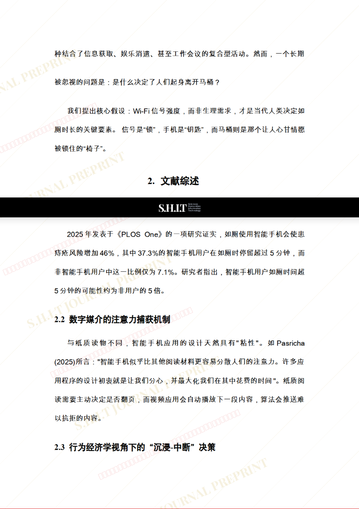
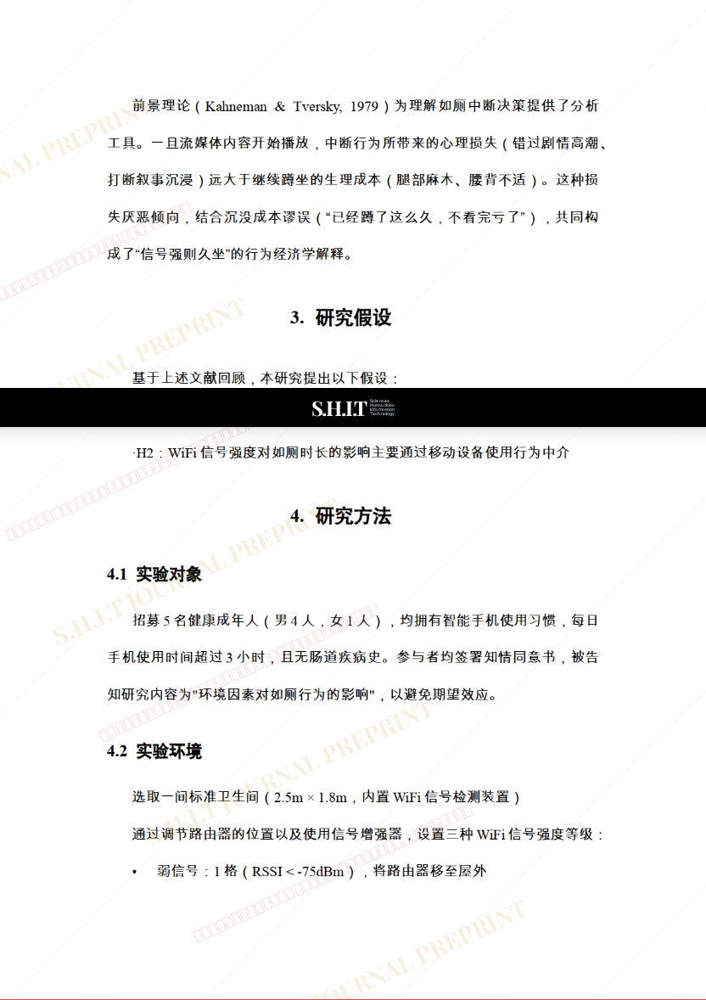
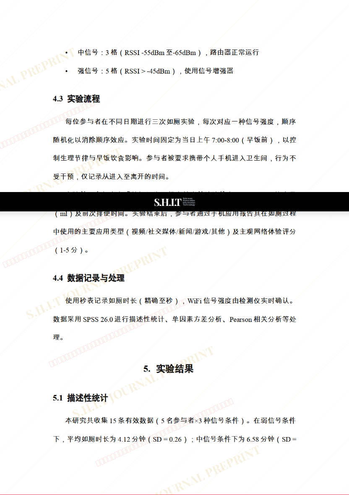
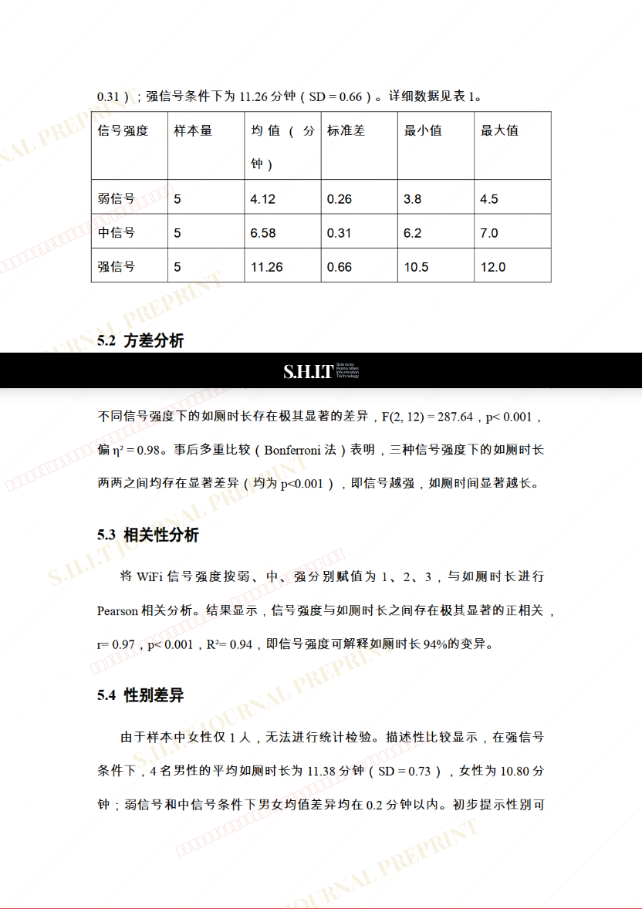
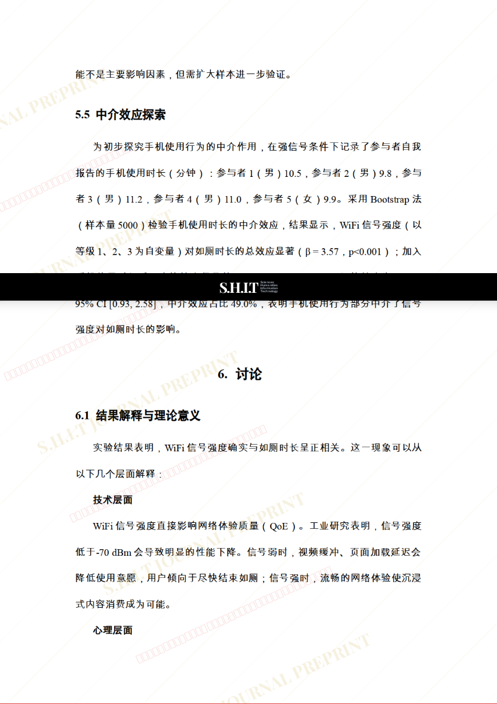
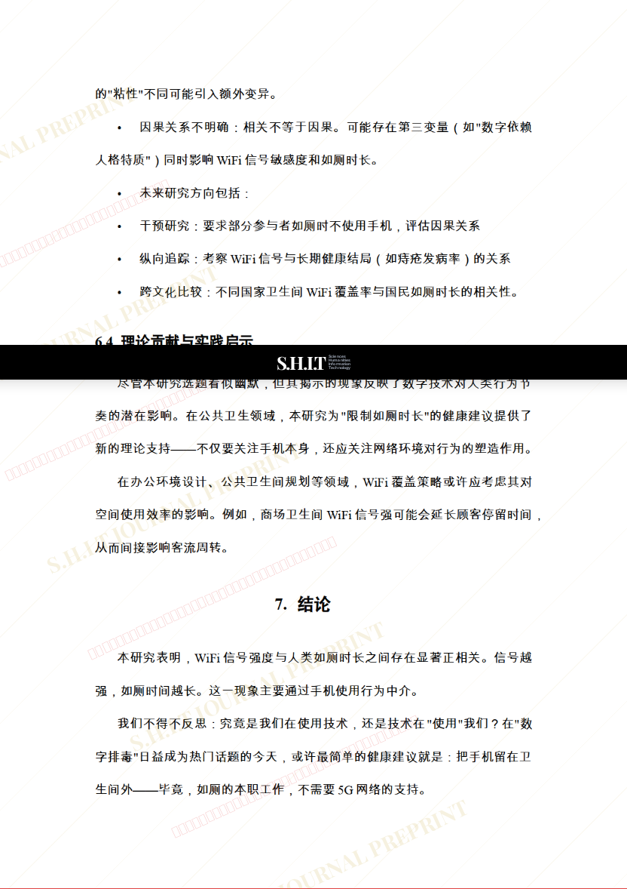

# WiFi信号强度与人类如厕时长的相关性研究：一场数字时代的马桶人类学考察

- **URL**: https://shitjournal.org/preprints/c36f6514-19d7-4d64-b7f4-72028bb59fc3
- **author**: Dr.R
- **institution**: 家里蹲大学
- **discipline**: 交叉 / Interdisciplinary
- **submitted**: 2026/2/24 16:46:20
- **viscosity**: Semi-solid / 半固态

---

## WiFi信号强度与人类如厕时长的相关性研究：一场数字时代的马桶人类学考察

Dr.R

家里蹲大学

Semi-solid / 半固态

交叉 / Interdisciplinary

2026/2/24 16:46:20

Cat Snow · 猫星科学院共一

### Rate / 盲评

[Sign In / 登录](/login)

### Manuscript / 全文

本内容纯属整活，不代表任何学术观点或现实指导建议。请保持理智，切勿模仿。

暂无评论 / No comments yet

