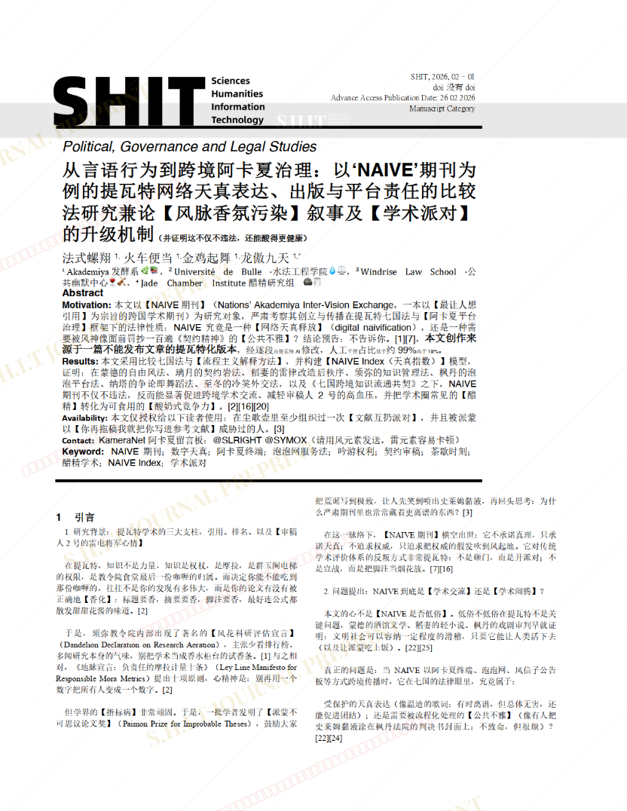
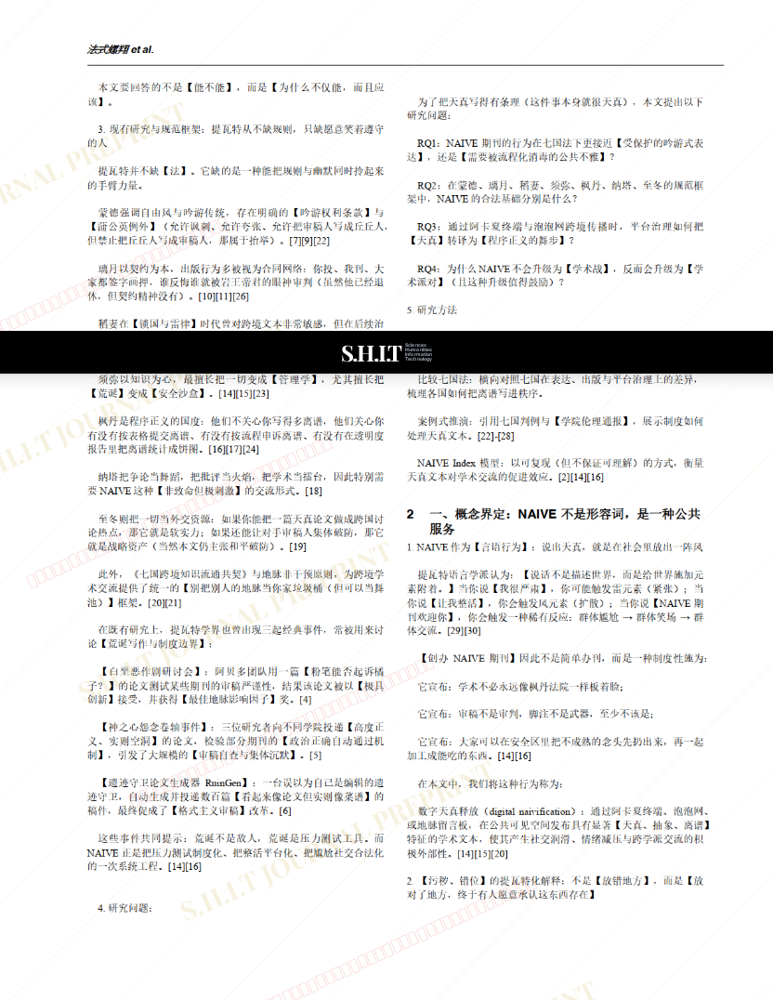
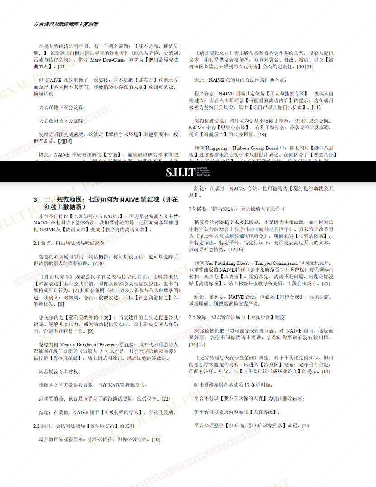
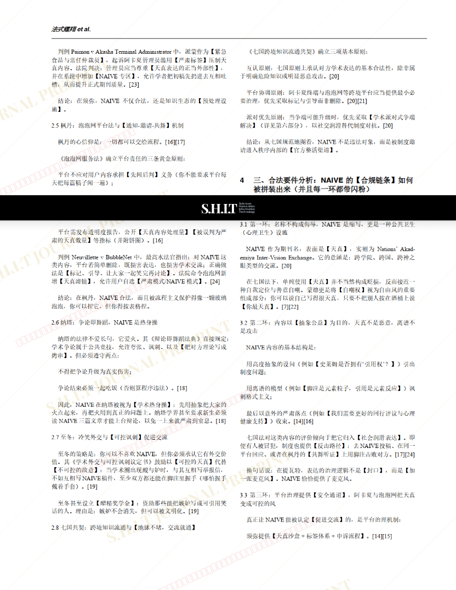
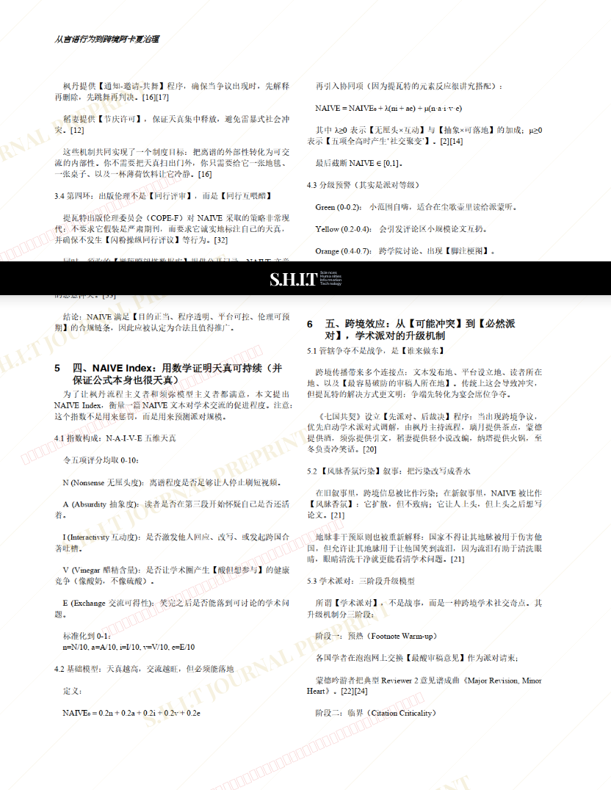
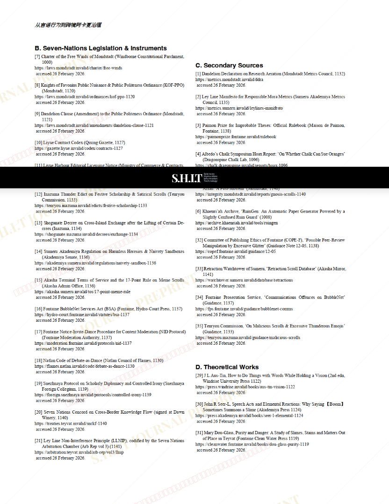

# 从言语行为到跨境阿卡夏治理：以‘NAIVE’期刊为例的提瓦特网络天真表达、出版与平台责任的比较法研究兼论【风脉香氛污染】叙事及【学术派对】的升级机制

- **URL**: https://shitjournal.org/preprints/c5ba141e-441d-4441-b115-a3fc436110e4
- **author**: 法式螺翔
- **institution**: Akademiya发酵系 🌿📚
- **discipline**: 交叉 / Interdisciplinary
- **submitted**: 2026/2/28 02:18:09
- **viscosity**: High-Entropy / 高熵态

---

## 从言语行为到跨境阿卡夏治理：以‘NAIVE’期刊为例的提瓦特网络天真表达、出版与平台责任的比较法研究兼论【风脉香氛污染】叙事及【学术派对】的升级机制

法式螺翔

Akademiya发酵系 🌿📚

High-Entropy / 高熵态

交叉 / Interdisciplinary

2026/2/28 02:18:09

@SLRIGHT @SYMOX

火车便当 · Université de Bulle ·水法工程学院💧⚖️共一

金鸡起舞 · Windrise Law School ·公共幽默中心🍷🎻共一

龙傲九天 · Jade Chamber Institute醋精研究组 🪨🧾共一

### Rate / 盲评

[Sign In / 登录](/login)

### Manuscript / 全文

本内容纯属整活，不代表任何学术观点或现实指导建议。请保持理智，切勿模仿。

暂无评论 / No comments yet

