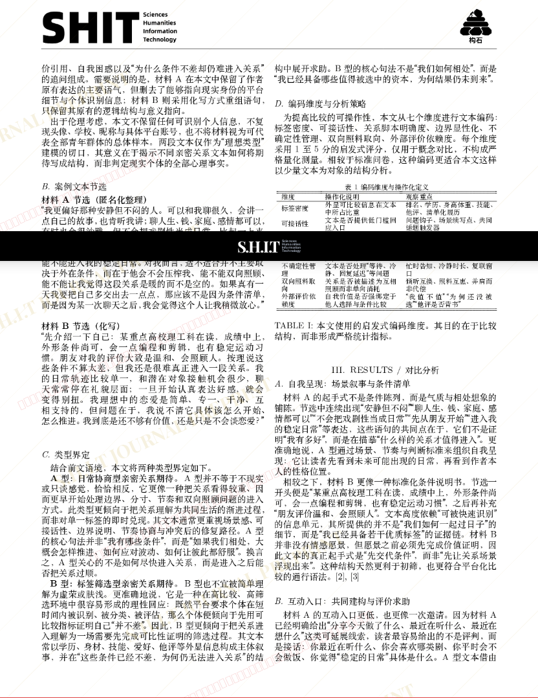
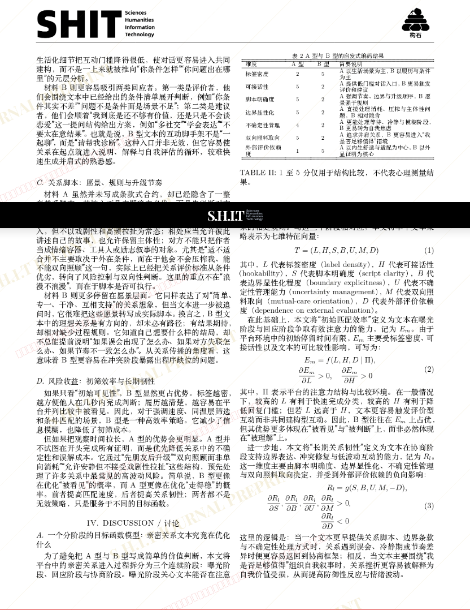
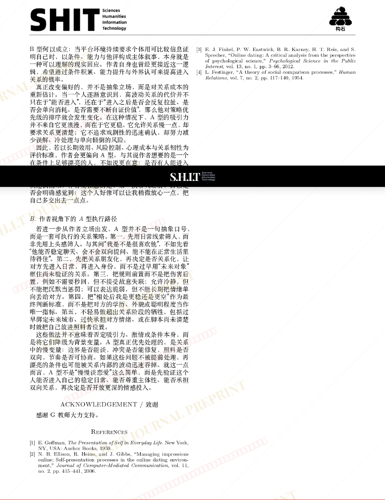

# 平台化社交中的两种亲密关系进入逻辑：日常协商型与标签筛选型比较研究 ——基于平台文本、关系脚本与风险收益模型的分析

- **URL**: https://shitjournal.org/preprints/c65a5af0-80e4-4587-8c95-2cf03831f901
- **author**: 我草莓招了
- **institution**: 情感研究院
- **discipline**: 交叉 / Interdisciplinary
- **submitted**: 2026/3/3 13:07:26
- **viscosity**: Stringy / 拉丝型

---

## 平台化社交中的两种亲密关系进入逻辑：日常协商型与标签筛选型比较研究 ——基于平台文本、关系脚本与风险收益模型的分析

我草莓招了

情感研究院

Stringy / 拉丝型

交叉 / Interdisciplinary

2026/3/3 13:07:26

G教授 · 情感研究院

### Rate / 盲评

[Sign In / 登录](/login)

### Manuscript / 全文

本内容纯属整活，不代表任何学术观点或现实指导建议。请保持理智，切勿模仿。

暂无评论 / No comments yet

