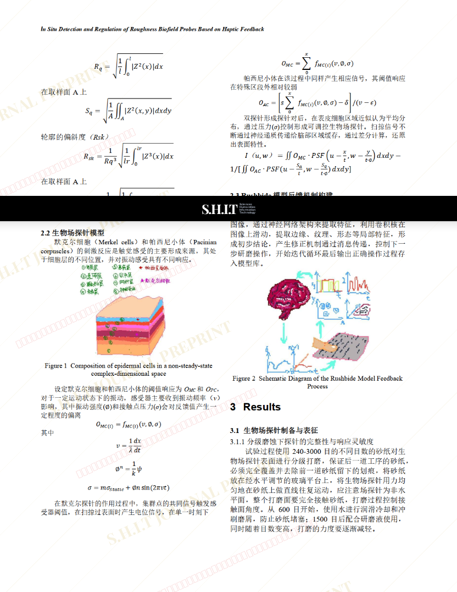

# 基于触感反馈的粗糙度生物场探针原位检测及调控 In Situ Detection and Regulation of Roughness Biofield Probes Based on Haptic Feedback

- **URL**: https://shitjournal.org/preprints/c777f933-acb5-4ac0-8f28-0ce99c27ea94
- **author**: Shitwill Find Itsway
- **institution**: Sichuan Habber Institute of Technology
- **discipline**: 交叉 / Interdisciplinary
- **submitted**: 2026/2/27 05:22:25
- **viscosity**: Stringy / 拉丝型

---

## 基于触感反馈的粗糙度生物场探针原位检测及调控 In Situ Detection and Regulation of Roughness Biofield Probes Based on Haptic Feedback

Shitwill Find Itsway

Sichuan Habber Institute of Technology

Stringy / 拉丝型

交叉 / Interdisciplinary

2026/2/27 05:22:25

Goldlike-Swift Baby on Erxian Bridge

### Rate / 盲评

[Sign In / 登录](/login)

### Manuscript / 全文

本内容纯属整活，不代表任何学术观点或现实指导建议。请保持理智，切勿模仿。

暂无评论 / No comments yet

