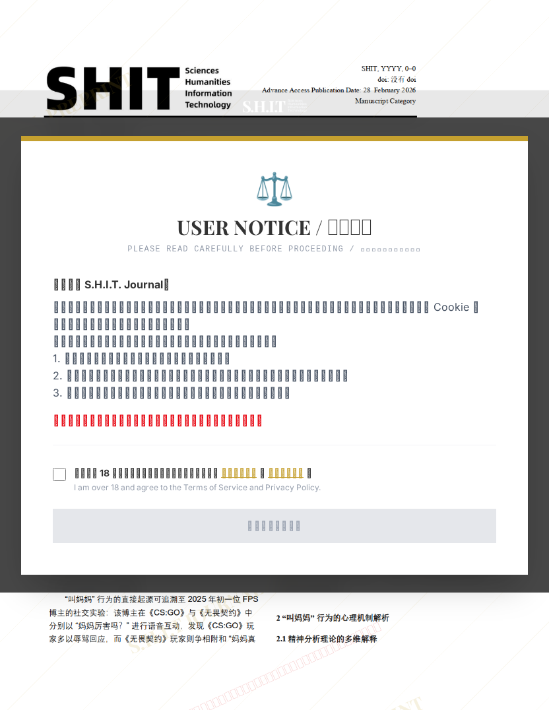

# 数字场域中的情感实践：《无畏契约》“叫妈妈”行为的亚文化研究

- **URL**: https://shitjournal.org/preprints/c84765f3-93ad-4c23-aca4-2bd8db9eb121
- **author**: 拉屎通畅
- **institution**: 辽宁警察学院
- **discipline**: 交叉 / Interdisciplinary
- **submitted**: 2026/2/28 10:39:19
- **viscosity**: Semi-solid / 半固态

---

## 数字场域中的情感实践：《无畏契约》“叫妈妈”行为的亚文化研究

拉屎通畅

辽宁警察学院

Semi-solid / 半固态

交叉 / Interdisciplinary

2026/2/28 10:39:19

### Rate / 评价

[Sign In / 登录](/login)

### Manuscript / 全文

本内容纯属整活，不代表任何学术观点或现实指导建议。请保持理智，切勿模仿。

有理有据 好屎

祝大家都拉屎通畅

