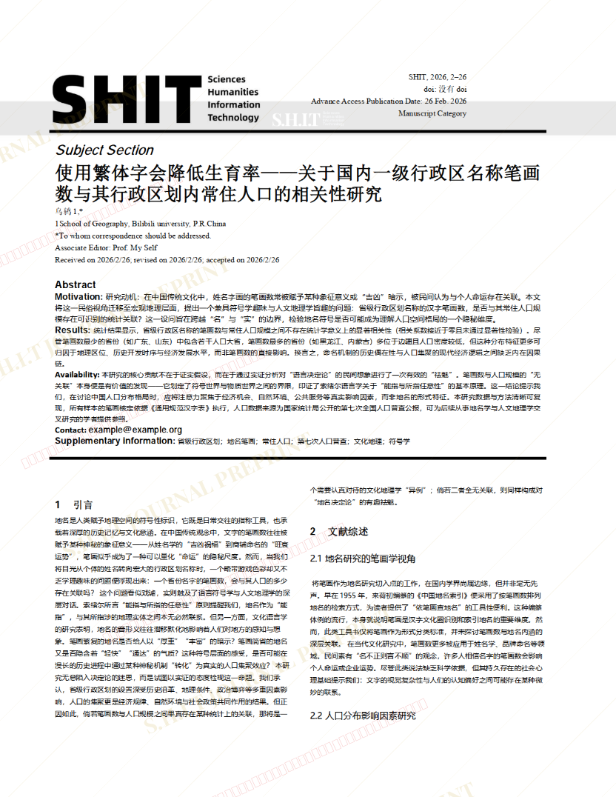
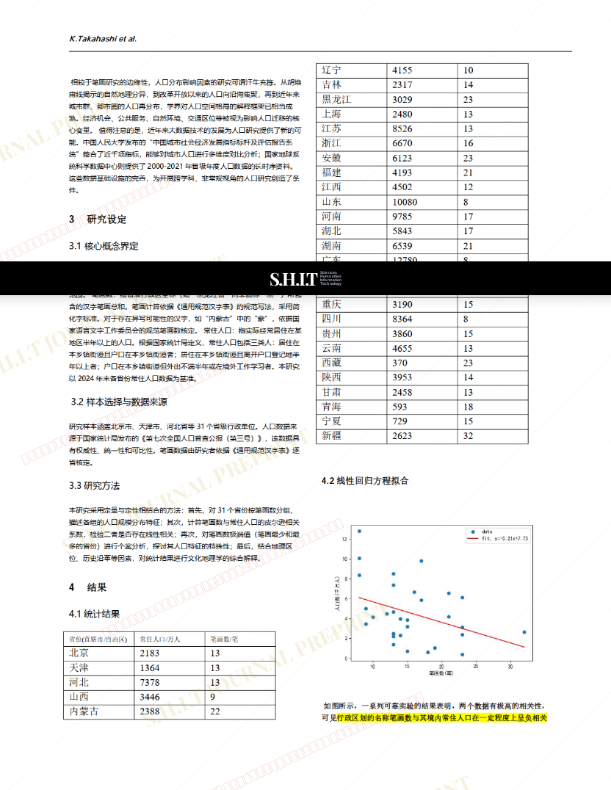

# 使用繁体字会降低生育率——关于国内一级行政区名称笔画数与其行政区划内常住人口的相关性研究

- **URL**: https://shitjournal.org/preprints/cbc0e37b-fad5-4763-9342-35b76ad85347
- **author**: 乌鸫
- **institution**: 哔哩哔哩大学
- **discipline**: 交叉 / Interdisciplinary
- **submitted**: 2026/2/26 06:10:19
- **viscosity**: Stringy / 拉丝型

---

## 使用繁体字会降低生育率——关于国内一级行政区名称笔画数与其行政区划内常住人口的相关性研究

乌鸫

哔哩哔哩大学

Stringy / 拉丝型

交叉 / Interdisciplinary

2026/2/26 06:10:19

### Rate / 盲评

[Sign In / 登录](/login)

### Manuscript / 全文

本内容纯属整活，不代表任何学术观点或现实指导建议。请保持理智，切勿模仿。

暂无评论 / No comments yet

