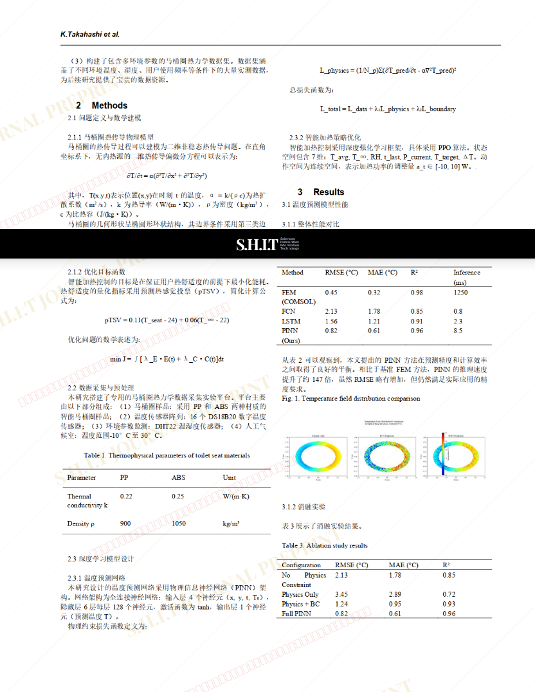
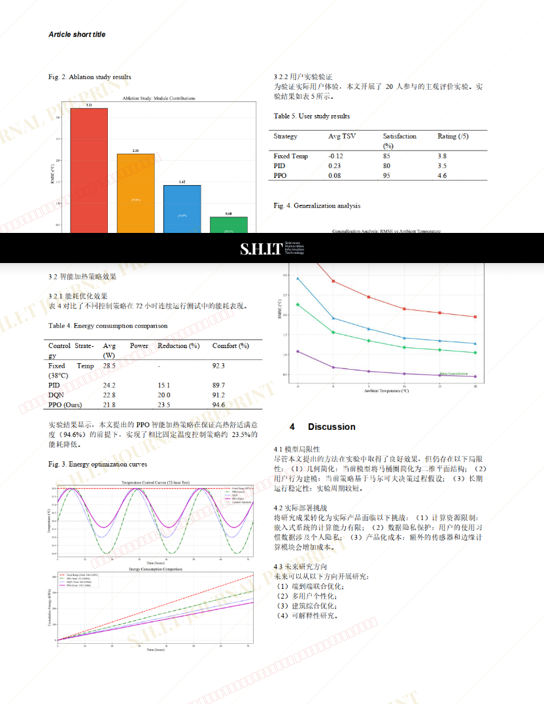
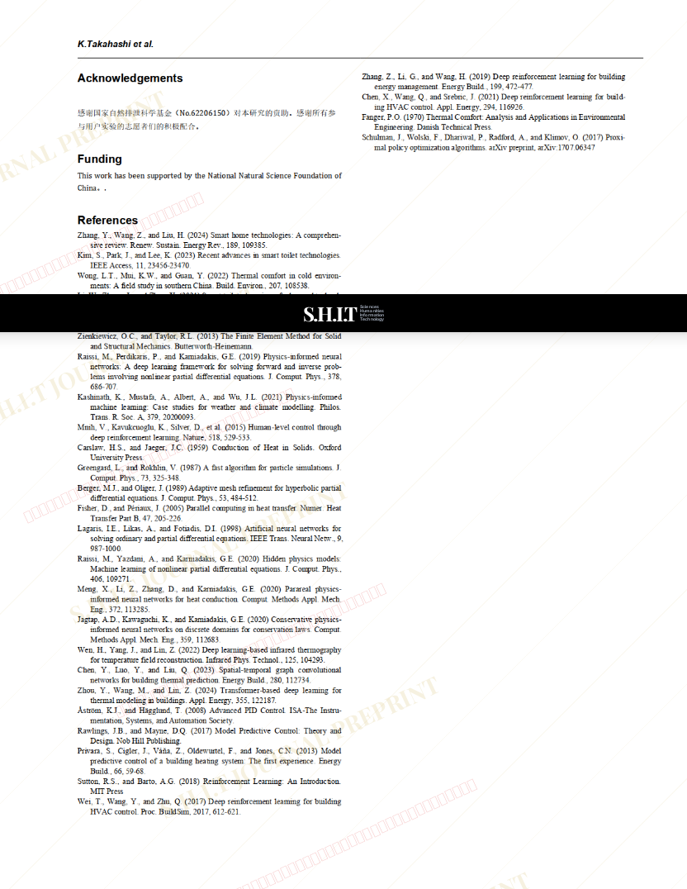

# 基于深度学习的冬季马桶圈热力学扩散模型研究：从温度场预测到智能加热策略优化

- **URL**: https://shitjournal.org/preprints/cdad08ce-b7d7-4504-a92b-c670d7e22ad0
- **author**: wey pee
- **institution**: 中国排泄科学院工程热物理研究所
- **discipline**: 工 / Engineering
- **submitted**: 2026/2/25 16:56:04
- **viscosity**: High-Entropy / 高熵态

---

## 基于深度学习的冬季马桶圈热力学扩散模型研究：从温度场预测到智能加热策略优化

wey pee

中国排泄科学院工程热物理研究所

High-Entropy / 高熵态

工 / Engineering

2026/2/25 16:56:04

抖音号/wl

### Rate / 盲评

[Sign In / 登录](/login)

### Manuscript / 全文

本内容纯属整活，不代表任何学术观点或现实指导建议。请保持理智，切勿模仿。

暂无评论 / No comments yet

