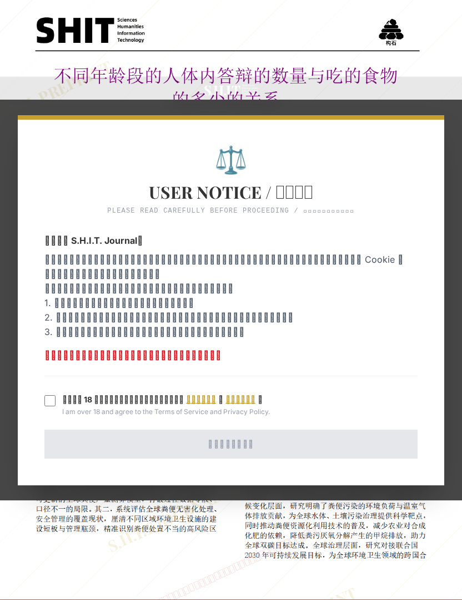

# 不同年龄段的人体内答辩的数量与吃的食物的多少的关系

## 元信息

- **作者**: 屎无潜力
- **机构**: 加利盾汉册大学
- **社交媒体**: 抖音：51957391220
- **分区**: septic
- **学科**: interdisciplinary
- **标签**: meme
- **提交时间**: 2026-03-03T21:36:30.877596Z
- **评分**: 4.28 / 5（32 人）

## 链接

- [网站原始文章](https://shitjournal.org/preprints/cddbde40-6f6b-4e5d-b355-515e89626b30)
- [PDF](https://files.shitjournal.org/cddbde40-6f6b-4e5d-b355-515e89626b30.pdf)
- [文章元信息](cddbde40-6f6b-4e5d-b355-515e89626b30.meta.json)

## 正文

