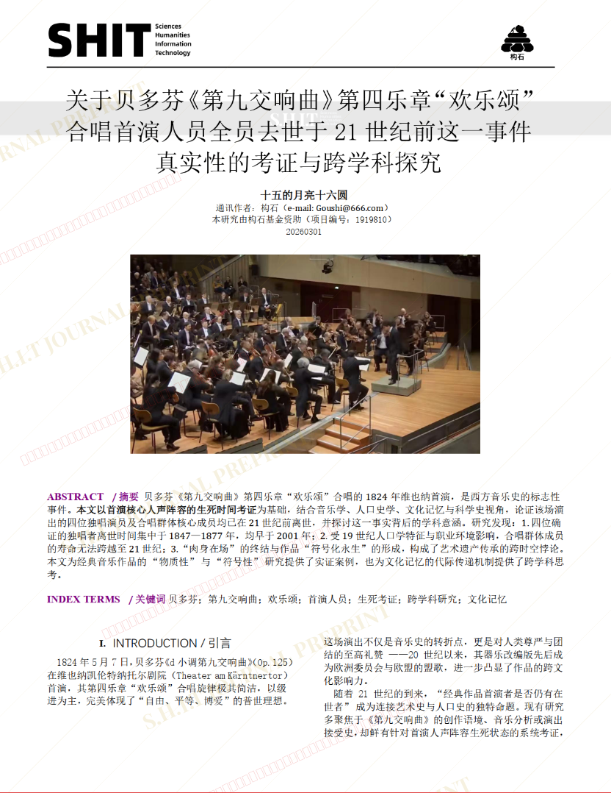
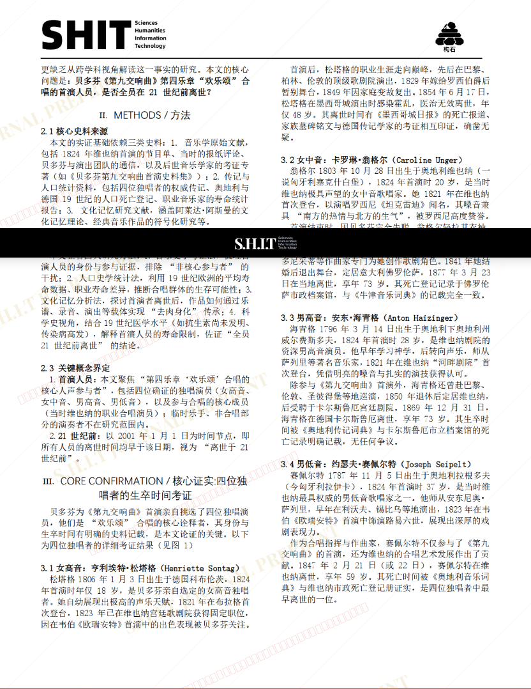
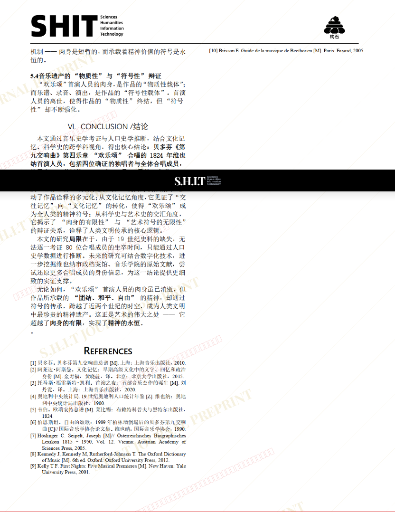

# 关于贝多芬《第九交响曲》第四乐章“欢乐颂”合唱首演人员全员去世于21世纪前这一事件真实性的考证与跨学科探究

- **URL**: https://shitjournal.org/preprints/cecd76ab-fd78-4f90-9d02-53ab9b6bf88f
- **author**: 十五的月亮十六圆
- **institution**: 排泄与生命调控大学University of Excretion and Life Regulation(UELR)
- **discipline**: 文 / Humanities
- **submitted**: 2026/2/28 14:59:36
- **viscosity**: Stringy / 拉丝型

---

## 关于贝多芬《第九交响曲》第四乐章“欢乐颂”合唱首演人员全员去世于21世纪前这一事件真实性的考证与跨学科探究

十五的月亮十六圆

排泄与生命调控大学University of Excretion and Life Regulation(UELR)

Stringy / 拉丝型

文 / Humanities

2026/2/28 14:59:36

WXID:wxid_0i9tpfdufka312

### Rate / 盲评

[Sign In / 登录](/login)

### Manuscript / 全文

本内容纯属整活，不代表任何学术观点或现实指导建议。请保持理智，切勿模仿。

暂无评论 / No comments yet

