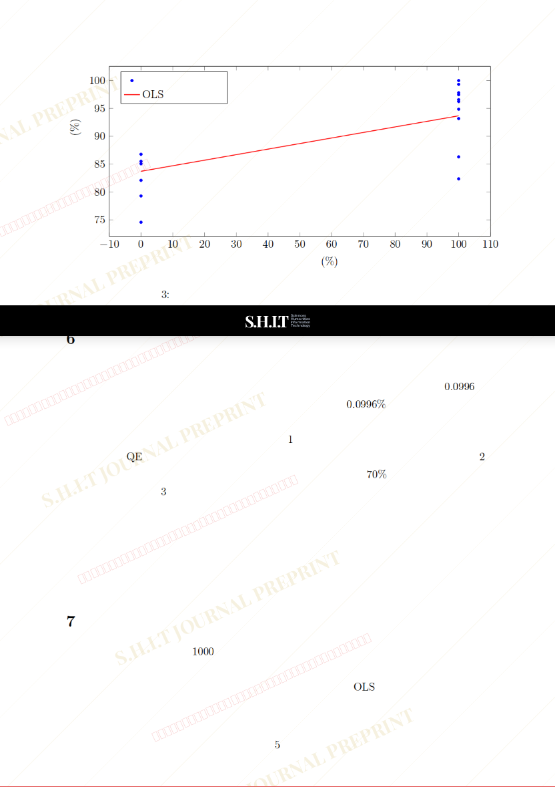

# 弗雷尔卓德规则怪谈的“瓶盖经济学”：崩飞频率 与兄弟义气相关性分析

- **URL**: https://shitjournal.org/preprints/d0b3e98e-890f-4825-8845-20c98c5b6c7a
- **author**: 大哲学家Minacle
- **institution**: 弗雷尔卓德社会科学研究院
- **discipline**: 交叉 / Interdisciplinary
- **submitted**: 2026/2/24 23:43:34
- **viscosity**: Semi-solid / 半固态

---

## 弗雷尔卓德规则怪谈的“瓶盖经济学”：崩飞频率 与兄弟义气相关性分析

大哲学家Minacle

弗雷尔卓德社会科学研究院

Semi-solid / 半固态

交叉 / Interdisciplinary

2026/2/24 23:43:34

### Rate / 盲评

[Sign In / 登录](/login)

### Manuscript / 全文

本内容纯属整活，不代表任何学术观点或现实指导建议。请保持理智，切勿模仿。

暂无评论 / No comments yet

