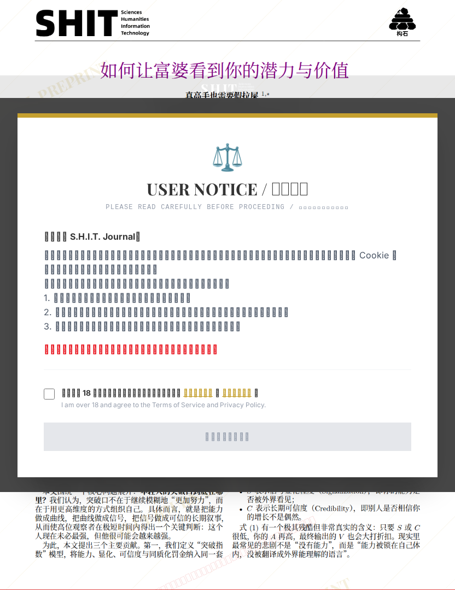

# 如何让富婆看到你的潜力与价值

- **URL**: https://shitjournal.org/preprints/d2841233-418d-4d05-9ce5-38249e85c05f
- **author**: 真高手也需要假拉屎
- **institution**: University of Everywhere
- **discipline**: 交叉 / Interdisciplinary
- **submitted**: 2026/3/2 15:36:06
- **viscosity**: High-Entropy / 高熵态

---

## 如何让富婆看到你的潜力与价值

真高手也需要假拉屎

University of Everywhere

High-Entropy / 高熵态

交叉 / Interdisciplinary

2026/3/2 15:36:06

142776494

### Rate / 评价

[Sign In / 登录](/login)

### Manuscript / 全文

本内容纯属整活，不代表任何学术观点或现实指导建议。请保持理智，切勿模仿。

大家可以看看我第一篇文章: 人类通过假装拉屎来提高社会参与感与忙碌性，祝我进去构实殿堂

全部读完，从shit的角度来说，不够shit，不像是shit；但从思辨的角度来说，本文在shit的出现正对应了文中表达的“被看见”。
不折不扣的佳作。

少有的、纯粹的科研

我以前简直是在乱努力

很好的思辨角度，而且人们擅长书山找shit，shit里找书，亦如劝风尘女上岸，良家下海。但是总归是被迫吸收学习了，还是让我这个石头人动了凡脑，你的问题很大，五坨糊你脸上。

