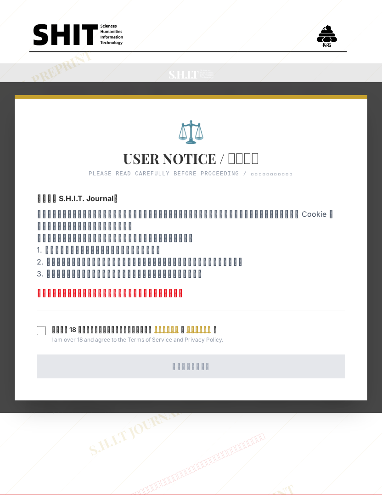

# 情绪资产定价：基于女主人的“在吗”冲击下的舔狗资格风险测度

## 元信息

- **作者**: 无敌铁头娃
- **机构**: 
- **分区**: stone
- **学科**: interdisciplinary
- **标签**: meme
- **提交时间**: 2026-02-28T19:11:40.740593Z
- **评分**: 4.63 / 5（122 人）

## 链接

- [网站原始文章](https://shitjournal.org/preprints/d70a60a4-7d6c-419e-b205-01e82dcadac0)
- [PDF](https://files.shitjournal.org/d70a60a4-7d6c-419e-b205-01e82dcadac0.pdf)
- [文章元信息](d70a60a4-7d6c-419e-b205-01e82dcadac0.meta.json)

## 正文

