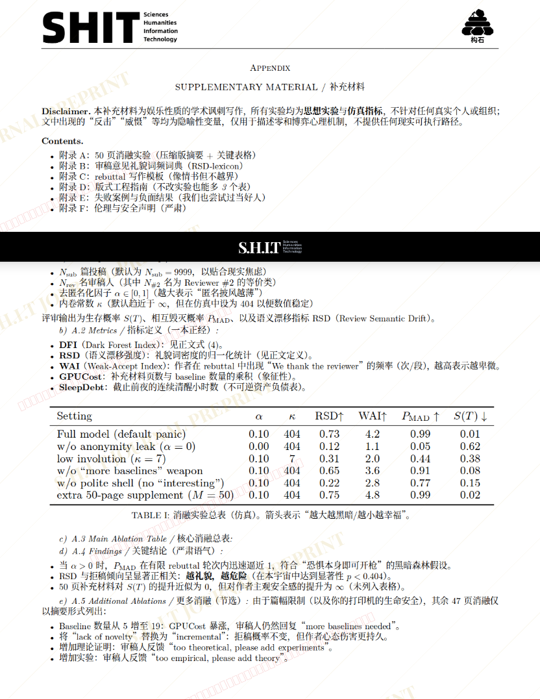

# 论学术圈的黑暗森林法则：基于OpenReview去匿名化事件的博弈分析

- **URL**: https://shitjournal.org/preprints/d76322ac-cf4d-4cb6-91c7-84e58e8bd372
- **author**: SHIT_FELLOW
- **institution**: 宇宙社会学系防脱发实验室
- **discipline**: 交叉 / Interdisciplinary
- **submitted**: 2026/2/28 06:26:05
- **viscosity**: High-Entropy / 高熵态

---

## 论学术圈的黑暗森林法则：基于OpenReview去匿名化事件的博弈分析

SHIT_FELLOW

宇宙社会学系防脱发实验室

High-Entropy / 高熵态

交叉 / Interdisciplinary

2026/2/28 06:26:05

### Rate / 盲评

[Sign In / 登录](/login)

### Manuscript / 全文

本内容纯属整活，不代表任何学术观点或现实指导建议。请保持理智，切勿模仿。

暂无评论 / No comments yet

