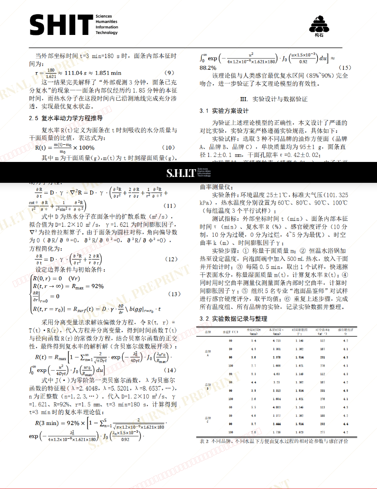

# 方便面复水过程中的时空弯曲效应——兼论“泡面三分钟”的相对论解释

- **URL**: https://shitjournal.org/preprints/d8740df2-0d33-44c2-b4de-027677946d25
- **author**: 摸鱼学终身教授兼学术糟粕提纯工程师
- **institution**: 赛博摆烂学术糟粕文化传承与创新院
- **discipline**: 交叉 / Interdisciplinary
- **submitted**: 2026/3/4 08:16:10
- **viscosity**: Semi-solid / 半固态

---

## 方便面复水过程中的时空弯曲效应——兼论“泡面三分钟”的相对论解释

摸鱼学终身教授兼学术糟粕提纯工程师

赛博摆烂学术糟粕文化传承与创新院

Semi-solid / 半固态

交叉 / Interdisciplinary

2026/3/4 08:16:10

B.C. · 赛博摆烂学术糟粕文化传承与创新院共一

义和团第五天王兼国际知名学术裁缝 · 赛博摆烂学术糟粕文化传承与创新院

### Rate / 盲评

[Sign In / 登录](/login)

### Manuscript / 全文

本内容纯属整活，不代表任何学术观点或现实指导建议。请保持理智，切勿模仿。

暂无评论 / No comments yet

