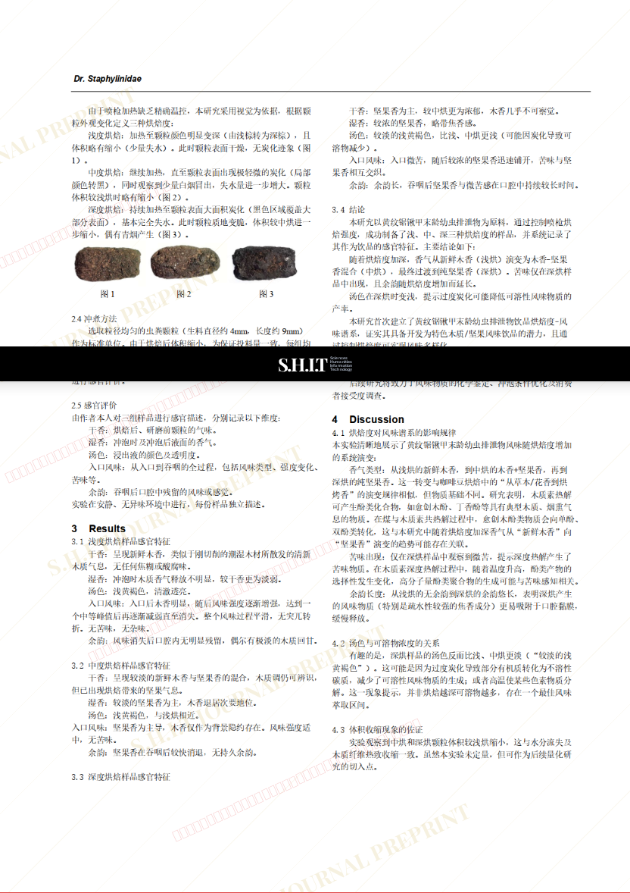

# 黄纹锯锹甲末龄幼虫排泄物的热处理及其浸出液的风味物质研究——一种非传统咖啡的制备与感官分析

- **URL**: https://shitjournal.org/preprints/da3d23e3-26d3-4f9a-839f-b7b2b4be1fd9
- **author**: Dr. Staphylinidae
- **institution**: Coleptera University
- **discipline**: 交叉 / Interdisciplinary
- **submitted**: 2026/2/25 10:33:05
- **viscosity**: Stringy / 拉丝型

---

## 黄纹锯锹甲末龄幼虫排泄物的热处理及其浸出液的风味物质研究——一种非传统咖啡的制备与感官分析

Dr. Staphylinidae

Coleptera University

Stringy / 拉丝型

交叉 / Interdisciplinary

2026/2/25 10:33:05

### Rate / 盲评

[Sign In / 登录](/login)

### Manuscript / 全文

本内容纯属整活，不代表任何学术观点或现实指导建议。请保持理智，切勿模仿。

暂无评论 / No comments yet

