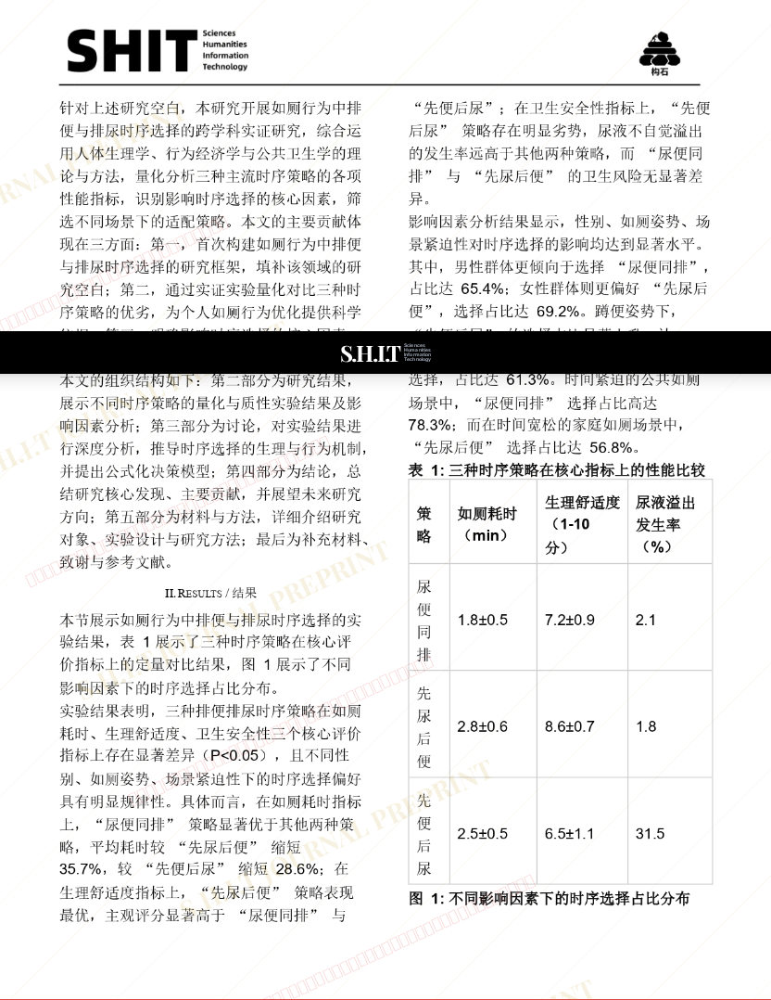

# 如厕行为中排便与排尿时序选择的跨学科实证研究

- **URL**: https://shitjournal.org/preprints/dafb3000-0688-42b3-b377-cf9f652606e5
- **author**: 第四届广播体操
- **institution**: 深圳星系纸业激素大学
- **discipline**: 交叉 / Interdisciplinary
- **submitted**: 2026/3/3 13:02:31
- **viscosity**: Semi-solid / 半固态

---

## 如厕行为中排便与排尿时序选择的跨学科实证研究

第四届广播体操

深圳星系纸业激素大学

Semi-solid / 半固态

交叉 / Interdisciplinary

2026/3/3 13:02:31

### Rate / 盲评

[Sign In / 登录](/login)

### Manuscript / 全文

本内容纯属整活，不代表任何学术观点或现实指导建议。请保持理智，切勿模仿。

暂无评论 / No comments yet

