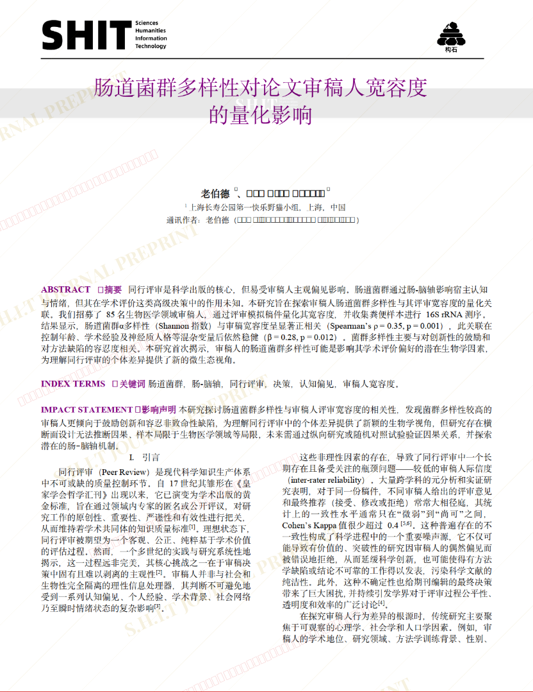
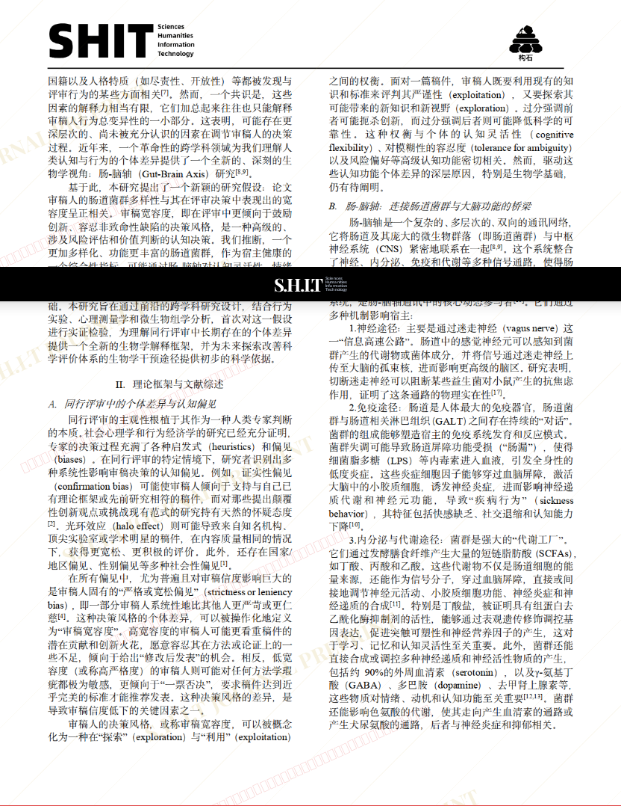
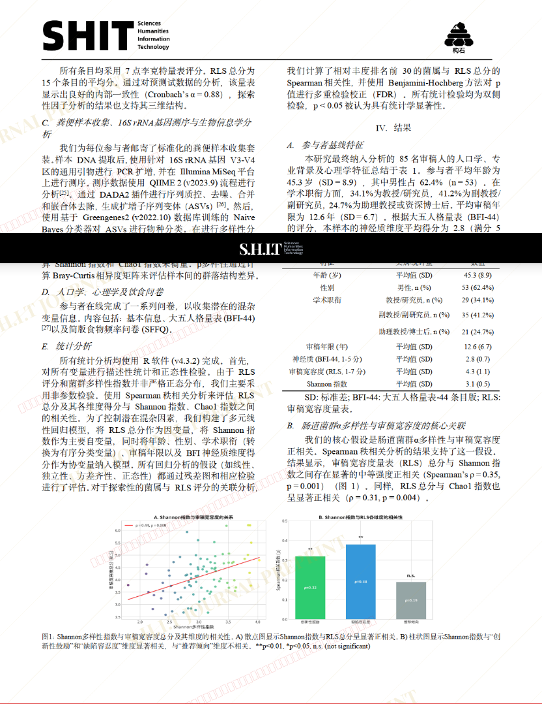
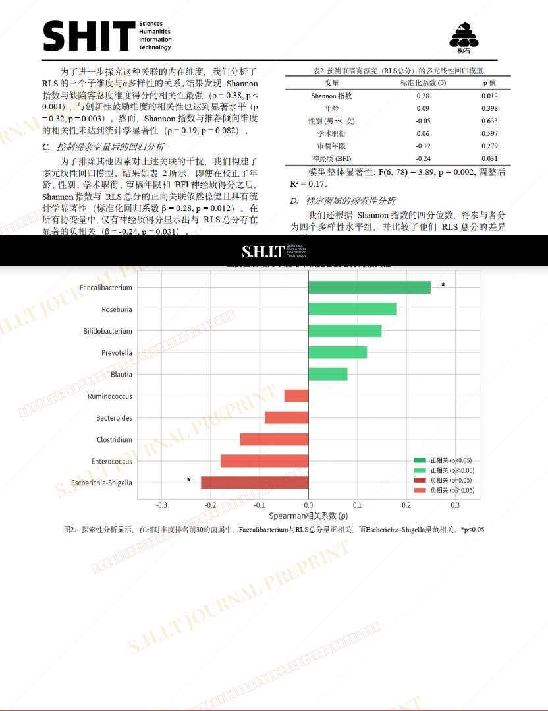

# 肠道菌群多样性对论文审稿人宽容度的量化影响

- **URL**: https://shitjournal.org/preprints/dc065958-d64d-4286-bf06-6405af542950
- **author**: 老伯德
- **institution**: 上海长寿公园第一快乐野猫小组
- **discipline**: 交叉 / Interdisciplinary
- **submitted**: 2026/2/28 11:58:56
- **viscosity**: Semi-solid / 半固态

---

## 肠道菌群多样性对论文审稿人宽容度的量化影响

老伯德

上海长寿公园第一快乐野猫小组

Semi-solid / 半固态

交叉 / Interdisciplinary

2026/2/28 11:58:56

小红书：老伯德

Red Crab Beauty · 上海长寿公园第一快乐野猫小组共一

### Rate / 盲评

[Sign In / 登录](/login)

### Manuscript / 全文

本内容纯属整活，不代表任何学术观点或现实指导建议。请保持理智，切勿模仿。

暂无评论 / No comments yet

