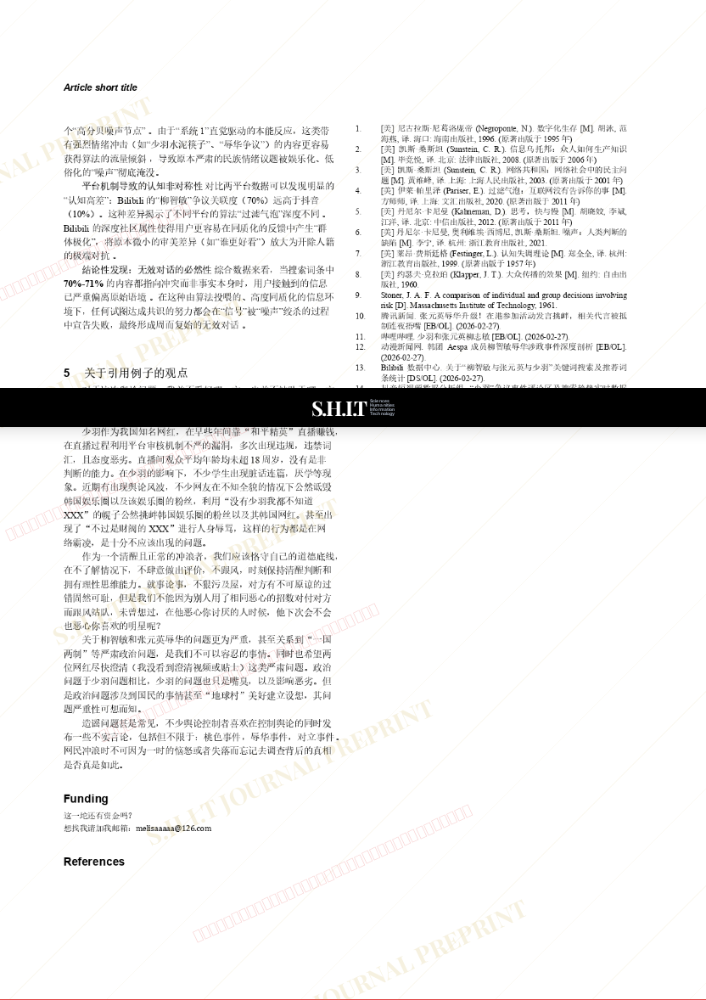

# 关于网络舆论与信息茧房，无效对话与认知不对等的问题

- **URL**: https://shitjournal.org/preprints/de18981b-c541-41dd-a53b-32877a2333e0
- **author**: 白菜对我笑
- **institution**: 喵喵大学
- **discipline**: 交叉 / Interdisciplinary
- **submitted**: 2026/2/27 11:38:52
- **viscosity**: Stringy / 拉丝型

---

## 关于网络舆论与信息茧房，无效对话与认知不对等的问题

白菜对我笑

喵喵大学

Stringy / 拉丝型

交叉 / Interdisciplinary

2026/2/27 11:38:52

没有呢喵

### Rate / 盲评

[Sign In / 登录](/login)

### Manuscript / 全文

本内容纯属整活，不代表任何学术观点或现实指导建议。请保持理智，切勿模仿。

暂无评论 / No comments yet

