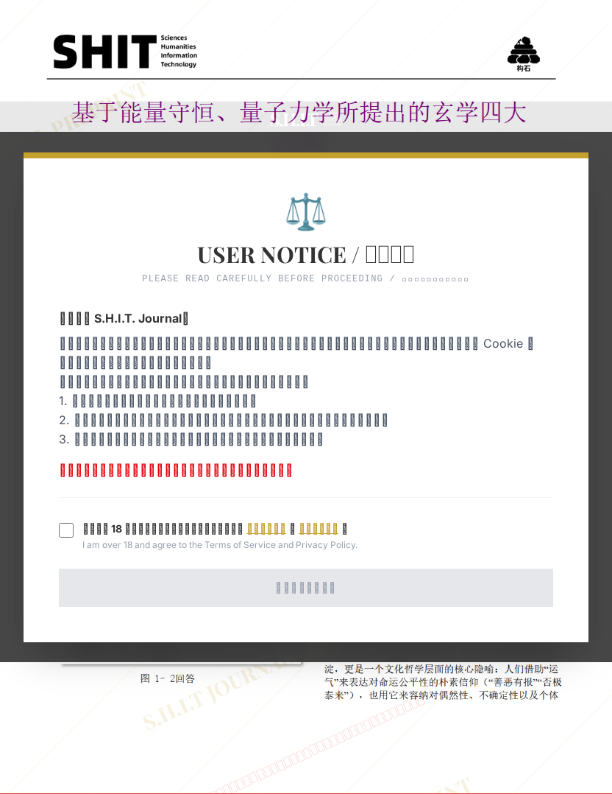

# 基于能量守恒、量子力学所提出的玄学四大定律

## 元信息

- **作者**: lazy dog
- **机构**: Daydream
- **社交媒体**: 抖音请联系ZDD5281341
- **分区**: septic
- **学科**: interdisciplinary
- **标签**: meme
- **提交时间**: 2026-03-03T18:29:22.824774Z
- **评分**: 3.97 / 5（34 人）

## 链接

- [网站原始文章](https://shitjournal.org/preprints/de250b75-8c62-4dd4-ab34-e71e989f19b4)
- [PDF](https://files.shitjournal.org/de250b75-8c62-4dd4-ab34-e71e989f19b4.pdf)
- [文章元信息](de250b75-8c62-4dd4-ab34-e71e989f19b4.meta.json)

## 正文

